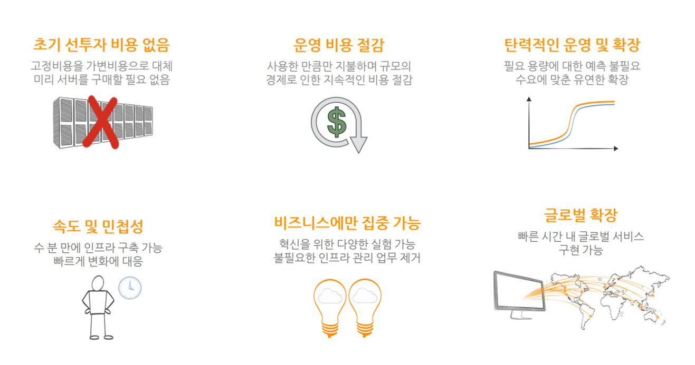

### 클라우드 컴퓨팅이란 ?
- 인터넷(“클라우드”)을 통해 서버, 스토리지, 데이터 베이스, 네트워킹, 소프트웨어, 분석, 인텔리전스 등 의 컴퓨팅 서비스를 제공하는 것
- IT 리소스를 인터넷을 통해 온디맨드로 제공(On- demand)
- 사용한 만큼만 비용을 지불(Pay as you go)
- 사용자가 물리적 데이터 센터와 서버를 구입, 소유 및 유지 관리하지 않음(No Capex)
- 클라우드 공급자로부터 필요에 따라 컴퓨팅 파워, 스토리지, 데이터베이스와 같은 기술 서비스에 액세 스

### 클라우드 컴퓨팅의 이점 1

### 클라우드 컴퓨팅의 이점 2

보안(Security)
- 광범위한보안 정책집합,기술및컨트롤을제공하여데이터,앱및인프라를잠재적인위협으로부터보호 안정성(Reliability)
- 클라우드공급자네트워크의여러중복사이트에데이터를미러할수있으므로데이터백업,재해복구및비즈니스연속성을더쉽게제공
고가용성(High Availability)
- 클라우드 공급자의 여러 리전, 가용영역, 데이터센터를 활용하여 고가용성을 쉽게 설계 가능
- 고가용성설계를통해다운타임을최소화하면서장애를견딜수있는아키텍처설계가능
- 예를 들어 여러 가용영역(여러 데이터센터)에 Amazon EC2 인스턴스를 배치
탄력성(Elasticity), 확장성(Scalability)
- 더이상 어떤용량이 필요할지 추측할 필요가 없으며 사용자는 리소스용량에 대한 추측을 중지가능
- 사용자는 필요에 따라 컴퓨팅 용량을 프로비저닝하거나 해제가능하며 현재 수요를 처리하는데 필요한 양 의 리소스만 프로비저닝가능 + 수요변화에따라리 소스크기를 조정가능
- 매우 동적인 사용패턴(워크로드)을 지원하기위해 알림기능으로 자동확장 및 축소가능
민첩성(Agility)
- 프로비저닝 시간이 짧은즉시 사용가능한 리소스,확장가능한 컴퓨팅 용량제공
- 새로운 워크로드를 배포하는데 필요한 직원의시간 단축하여 애플리케이션 개발팀의 생산성 향상
- 개발자가IT 리소스를 사용할수 있도록하는데 필요한 시간 단축을 통해 혁신을 지원하는 능력제공
- 새로운 기능을 반복적인 방식으로 신속하게 제공하여 출시 시간을 최소화
- 예를 들어 스타트 업이 빠르게 시장에 출시해야하는 새로운 애플리케이션을 개발 하여 빠르게 클라우드에 배포 및 필요할 때마다 빠르게
조정 가능

### 클라우드 컴퓨팅의 이점 3

#### 사용한 만큼 지불하는 요금제 (Pay-as-you go pricing)
- 장기 계약이 필요하지 않은 종량제 모델을 사용
- 초기 고정 비용/자본 비용(CAPEX)를 변동 비용/가변 비용(OPEX)으로 대체할 수 있도록 하는 온디맨드 기술 서비스 사용
- 큰 자본 지출을 최소화 함으로써 총소유비용(TCO)을 어떻게 줄일수있음

#### 글로벌 도달 (Global Reach, Global FootPrint)
- 지연 시간이 짧은 높은 처리량과 중복성을 가진 네트워크로 연결된 여러 지역으로 구성된 클라우드 인프라를 배포
- 회사의 서비스를 빠르게 글로벌화할 수 있는 능력
- AWS 리전,가용 영역및 엣지 로케이션 네트워크를 통해 전세계 사용자에게 애플리케이션을 배포
- 데이터를 기본 사용자와 가깝게 저장 가능

#### 규모의 경제 (Economy of scale)
- AWS 등의 클라우드 회사에서 높은 구매량으로 인해 변동 비용을 낮출 수 있음
- AWS 클라우드 요금의 지속적인 감소
- 온-프레미스 데이터 센터를 구축하고 유지 관리하는 데 드는 많은 비용을 없애 줌

#### 기타 클라우드 컴퓨팅 이점
- 클라우드 업체에서 인프라를 관리하기에 사용자는 데이터 센터 유지 관리에 돈을 쓰지 않아도 됨
- 데이터센터 인프라는 클라우드 업체에서 관리하기에 사용자는 수익 창출(비즈니스) 활동에 집중할 수 있음
- AWS 관리형 서비스를 활용하면 사용자 관리가 최소화 되므로 AWS 클라우드에서 운영 효율성을 높일 수 있음
- 반복되는 애플리케이션 설치 및 설정을 돕기 위해 클라우드 업체의 엔터프라이즈 지원을 사용하여 효율을 높일 수 있음
