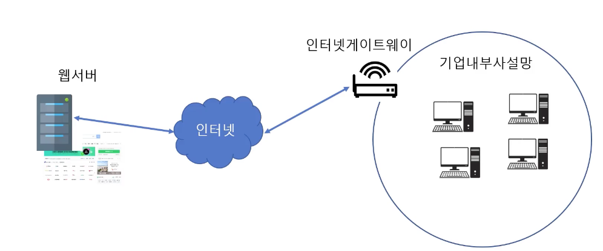

### Elastic Network Interface ( ENI )
- 가상 네트워크 인터페이스
- IP 주소, MAC 주소 등이 부여 됨
- 인스턴스에 연결되어 네트워크 통신을 하는 역할
- 인스턴스 생성시 기본 네트워크 인터페이스가 IP 주소 등의 정보 할당과, 함께 생성됨.
  - 인스턴스에 추가적으로 네트워크 인터페이스를 연결할 수 있음.
- EC2 에 추가로 여러 개의 네트워크 인터페이스 연겶 가능

### Public IP vs Private IP 
- Public IP: 인터넷 연결에 사용하는 IP
- Private IP: 회사나 집의 내부에서만 사용하는 IP
  - 직접적으로 인터넷 연결이 안되며, 인터넷 게이트웨이를 통해야 함

### 탄력적 IP ( Elastic IP )
- 인스턴스 생성시 자동으로 할당 받은 Public IP 는 인스턴스를 재시작 하면 다른 IP로 재할당 받기에 Public IP 주소가 변경됨
- Elastic IP 는 인터넷에 연결 가능한 고정적(정적)인 퍼블릭 IP 주소
- EC2 인스턴스의 ENI 에 IP 주소를 연결하면 EC2 인스턴스를 다시 시작해도 동일한 IP 주소로 접속할 수 있음
- 사용하지 않아도 IP 주소에 대한 비용이 청구 됨