### Elastic Block Store (EBS)

- EC2 에 연결하여 사용하는 블록 스토리지
- EC2 인스턴스 시작 시 AMI 가 설치 되는 EBS 루트 볼륨이 생성됨
    - 참고로 EBS 는 EC2 와 다른 스토리지 서비스다.
- EC2 종료 후 EBS 가 같이 삭제 되지 않으면 사용 비용이 청구됨
- 여러 개의 EBS 볼륨을 생성하여 EC2에 추가 연결 가능
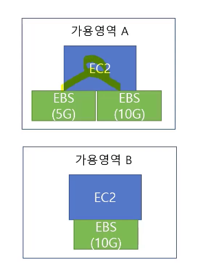
- EBS 와 EC2는 동일한 가용영역에 있어야 연결 가능
- 스냅샷(SnapShot) 기능을 통해 EBS 볼륨 백업 가능
- 수명 주기 관리자(Data Life Cycle Manager) 정책을 통해 스냅샷 생성 일정을 자동화 가능
- AWS Key Management Service (KMS) 를 통해 볼륨 암호화 가능

### EBS 볼륨 유형
- 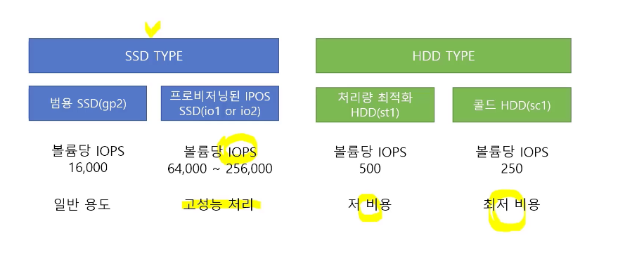

### 여기서 iops 란 ? 
- 아이옵스(Input/Output Operations Per Second) 또는 IOPS는 HDD, SSD, SAN 같은 컴퓨터 저장 장치를 벤치마크하는 데 사용되는 성능 측정 단위다. IOPS는 보통 인텔에서 제공하는 Iometer 같은 벤치마크 프로그램으로 측정된다.
- IOPS 측정값은 벤치마크 프로그램에 따라 다르다. 구체적으로는 임의 접근과 연속 접근 여부, 벤치마크 프로그램의 쓰레드 갯수와 큐의 크기, 데이터 블록 크기, 읽기 명령과 쓰기 명령의 비중 등에 따라 달라지며, 이외에도 많은 변수들이 있다.
- 일반적으로는 종합 IOPS, 임의 접근 읽기 IOPS, 임의 접근 쓰기 IOPS로 나누어 측정한다.
- 간단히 정리하면, 아이옵스(IOPS)는 메모리의 랜덤 쓰기 속도를 측정하는 방법으로 메모리와 전자기기 사이 초당 데이터 교환 횟수를 나타낸다.

### 계산법
- iops = 1000 (ms/s) / (average read seek time (ms) + (maximum rotational latency (ms) / 2))
- maximum rotational latency = 60,000 (ms/min) / rotational speed (rpm)

### 사용중인 EC2 에 볼륨 설정하기

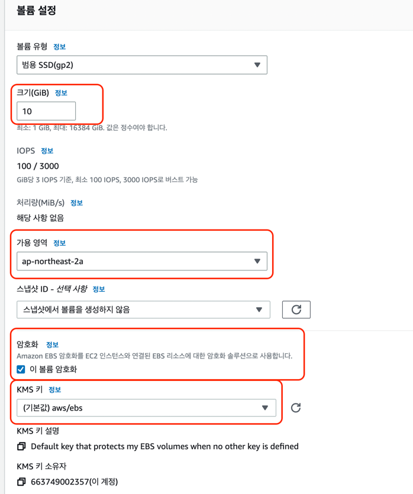
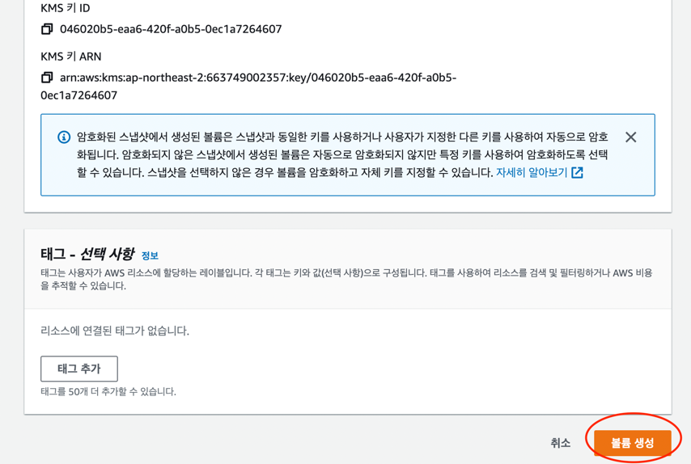
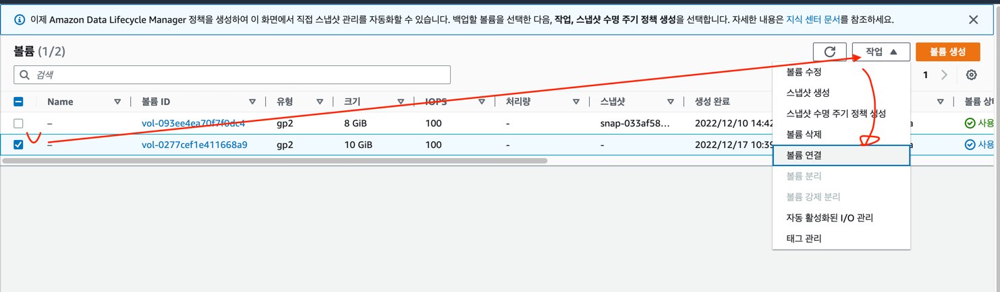
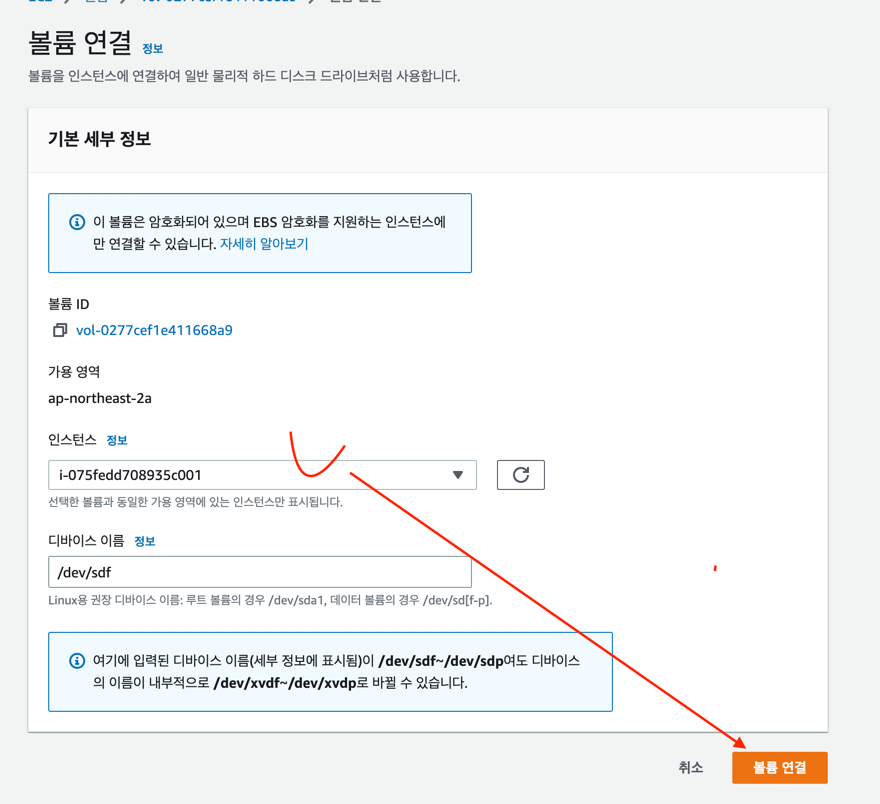
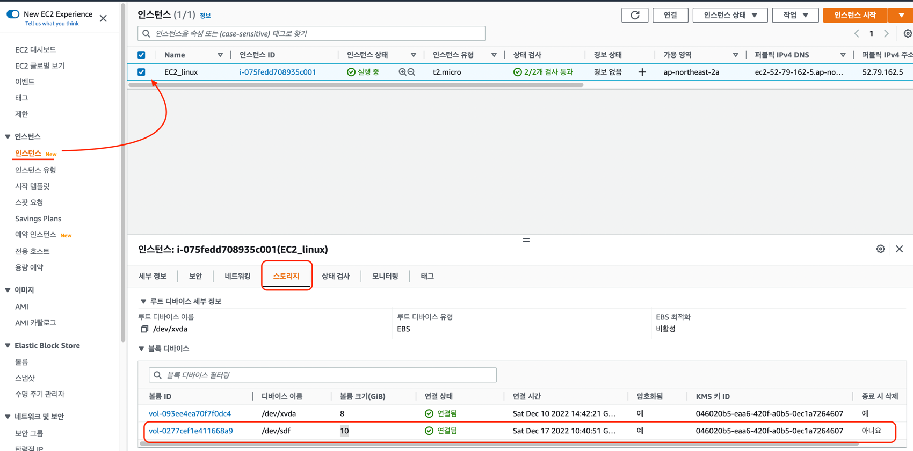

### 볼륨 분리하기
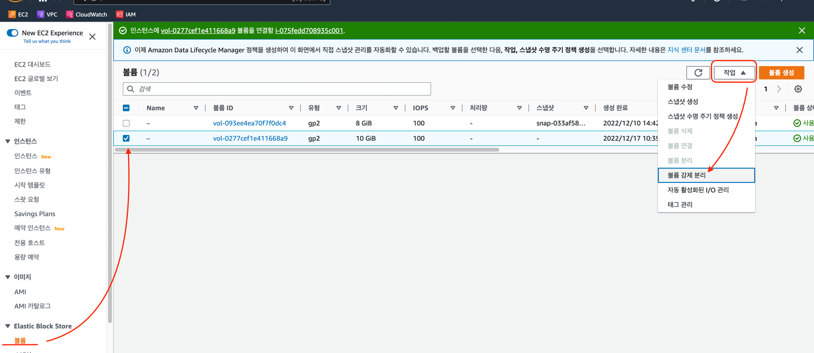
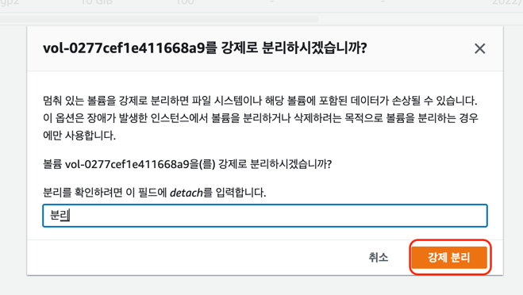
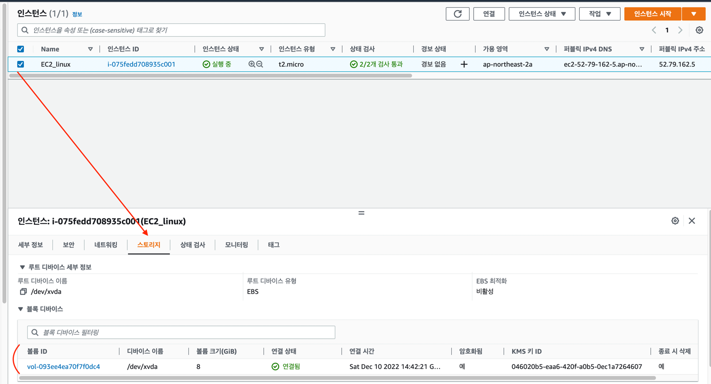

### 볼륨 삭제
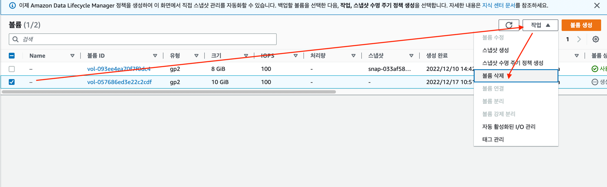

### 스냅샷 생성 (백업)
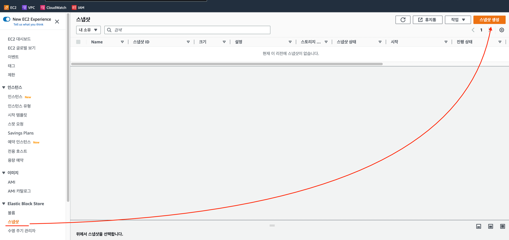
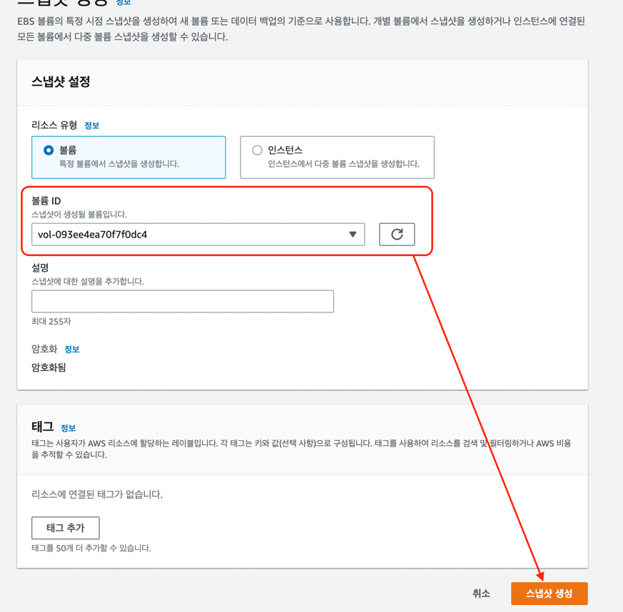
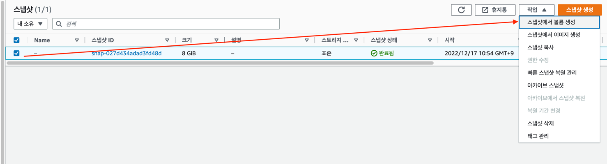
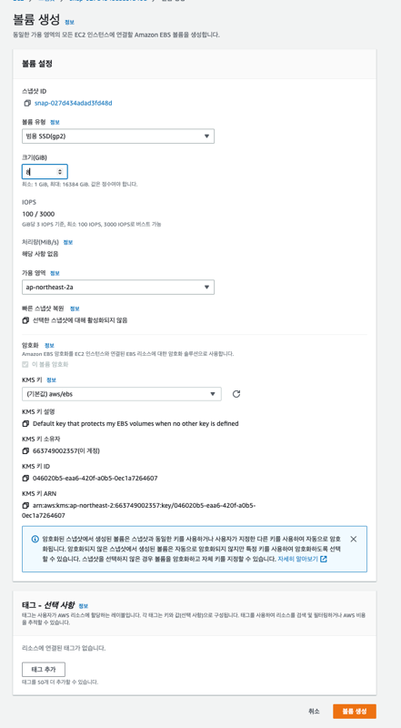
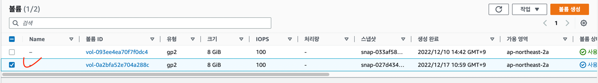
- 만약에 첫번째 볼륨에 문제가 생길시 2번째 백업된 볼륨에 EC2 를 연결해서 복원 할 수 있다.
- 삭제는 마찬가지로 작업 선택후 볼륨 삭제를 해주면 된다.