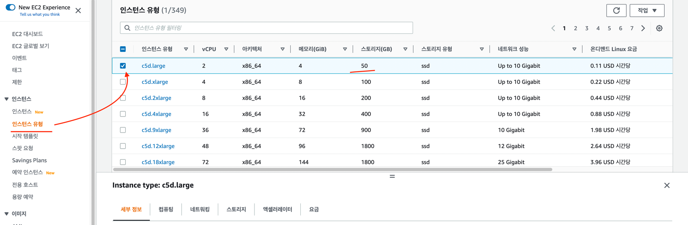
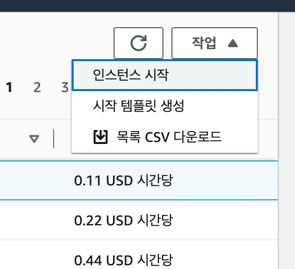
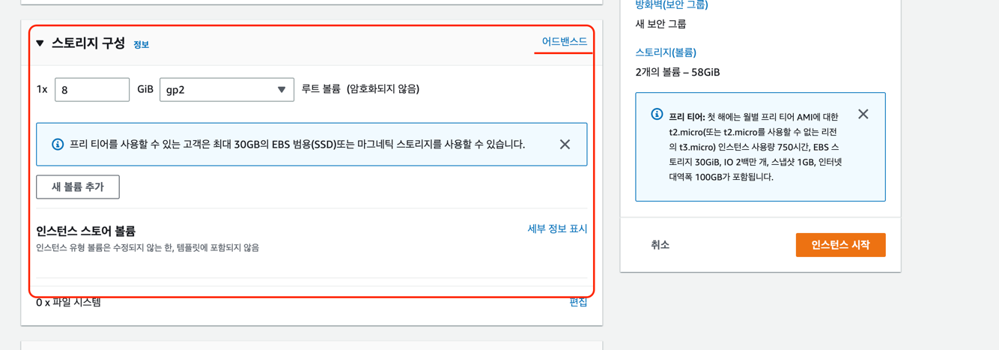
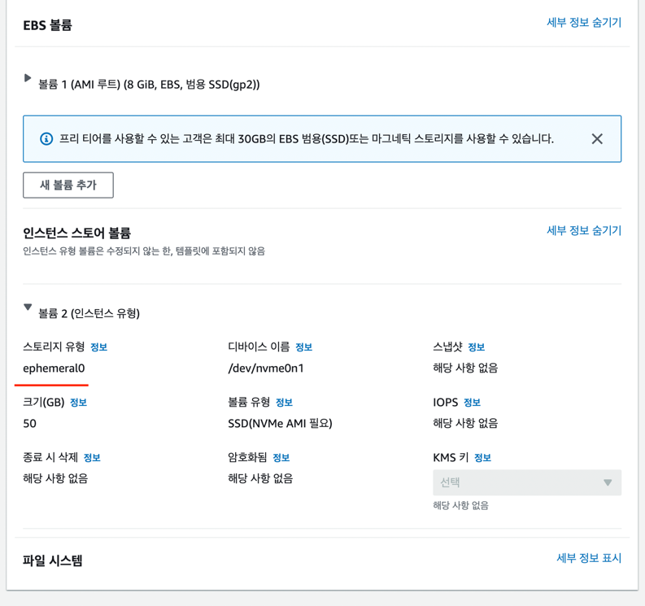
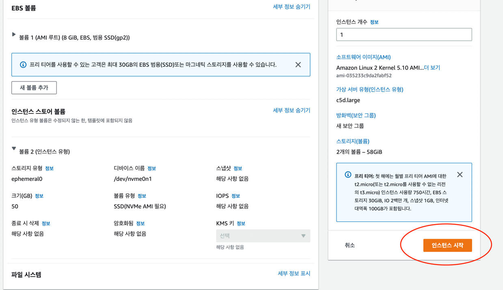

### Instance Store
- 블록 수준의 임시 스토리지
- 특정 인스턴스 유형은 Instance Store 라고 하는 스토리지를 갖고 있음.
- Instance Store 는 서버에 직접 장착되어 있는 물리적 SSD 또는 HDD 스토리지
- Instance Store 는 IOPS 성능이 매우 높은 고성능 스토리지
- 인스턴스를 중지하거나 최대 절전 모드로 전환하거나 종료하면 인스턴스 스토어의 모든 스토리지 블록이 리셋 (인스턴스 내의 모든 정보가 날아간다.)
- 임시 파일을 보관하는 가장 빠른 성능의 저장 옵션.
- Instance Store 는 EC2 인스턴스가 종료되면 데이터가 삭제되므로 영구적인 저장소가 아닌 고성능을 요구하는 애플리케이션의 임시 저장소로 적합.
- 예, 초당 수백만개의 트랜잭션을 지원하는 I/O 처리량이 높은 데이터 베이스의 데이터의 임시 스토리지 옵션으로 사용
- 중요한 장기 데이터의 경우 Instance Store 가 아닌 Amazon S3, Amazon EBS, Amazon EFS 등 의 데이터 스토리지를 사용.

### 루트볼륨 이외에 고성능 임시 스토리지인 Instance Store 볼륨을 추가해서 인스턴스를 사용 할 수 있다.

