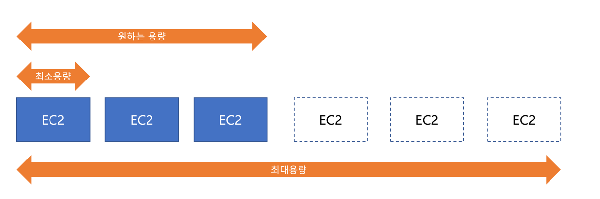
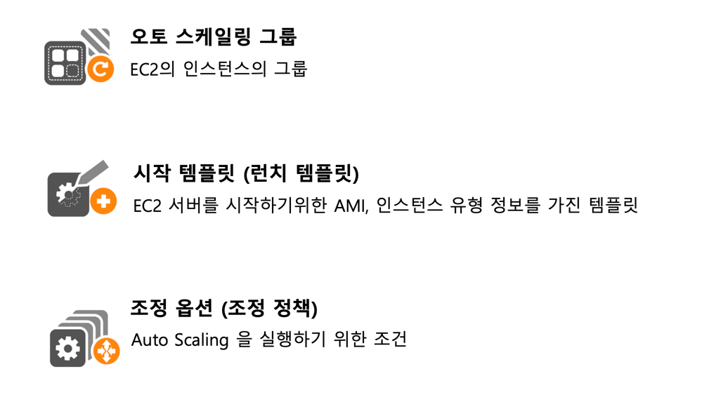
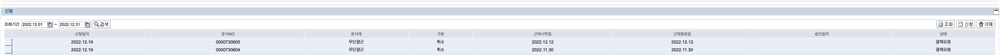

### EC2 Auto Scaling
- EC2 인스턴스를 자동으로 확장하고 축소하는 기능
- 사용자가 정의한 조정 정책에 따라 인스턴스 수가 증가 되거나 축소됨 
- [x] 예, 서버의 로드가 증가하면 EC2 인스턴스 개수가 추가 됨
- [x] 예, 서버의 로드가 감소하면 EC2 인스턴스 개수 줄어 듬

### EC2 Auto Scaling 구성 요소

### EC2 Auto Scaling - 조정 정책
- 항상 현재 인스턴스 수준 유지 관리
  - 지정된 수의 실행 인스턴스를 항상 유지하도록
  
  Auto Scaling 그룹을 구성
  - 인스턴스가 비정상 상태임을 확인하면 해당 인스턴스를 종료한 다음 새 인스턴스를 시작
- 수동 조정
  - 최대, 최소 또는 원하는 용량의 변경사항만 지정하는 경우 사용
- 일정을 기반으로 조정
  - 확장 작업이 시간 및 날짜함수 에 따라 자동으로 수행됨
  - 예, 매주 일요일에는 인스턴스 4대, 다른 요일에는 2대 실행
- 온디맨드 기반 조정
  - 수요 변화에 맞춰 Auto Scaling 그룹의 크기를 동적으로 조정
  - 예, CPU 사용량을 50%기준으로 하고 사용량 기준에 따라 EC2 인스턴스 수를 증가하거나 감소
- 예측 조정 사용 (Predictive Scaling)
  - 머신러닝을 사용하여 CloudWatch의 기록 데이터를 기반으로 용량 필요량을 예측

### 위에서 언급한 온디맨드 기반조정을 ( 동적 조정 ) 이라고 한다 [Dynamic Scaling)]
### EC2 Auto Scaling – 동적 조정 (Dynamic Scaling)
- 대상 추적 조정(Target Tracking Scaling)
  - 지정한 지표가 목표값을 초과할 때 한해서 Auto Scaling 그룹을 확장 하는 방식
  - 예, CPU 사용률 목표값을 50%로 설정한 후 Auto Scaling 그룹이 목표값을 초과하면 EC2 인스턴스 증가
  - CPU 평균 사용률, 네트워크 인터페이스에서 송/수신한 평균 바이트 수, 로드발란서 요청 수 등의 지표 사용 가능
- 단계 조정(Step Scaling)
  - CloudWatch alarm의 지표를 기반으로 Auto Scaling 그룹을 확장 하는 방식
  - 예, CPU 사용률이 60% 초과하면 Auto Scaling Group 10% 또는 2개 증가 CPU 사용률이 30% 이하면 Auto Scaling
- Group 10% 또는 2개 감소
  - 크기 조정 활동이 시작된 후 정책은 크기 조정 활동 또는 상태 확인 교체가 완료되고 휴지 기간(Cooldown Period)이
  끝날 때까지 기다린 후 추가 경보에 응답
- 단순 조정(Simple Scaling)
  - CloudWatch alarm의 지표를 기반으로 Auto Scaling 그룹을 확장 하는 방식
  - 예, CPU 사용률이 60% 초과하면 Auto Scaling Group 10% 또는 2개 증가 CPU 사용률이 30% 이하면 Auto Scaling
  Group 10% 또는 2개 감소
  • 크기조정 활동 또는 상태확인 교체가 진행중인 동안에도 정책이 추가경보에 계속 응답
