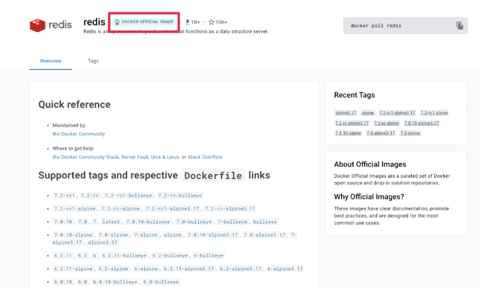
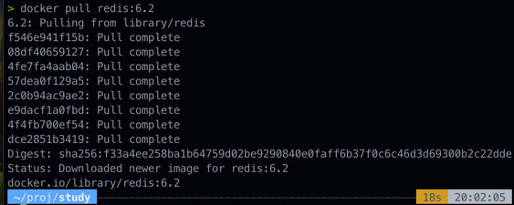
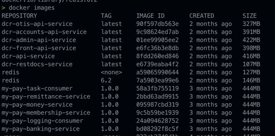
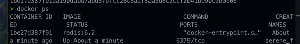

### 설치

- docker image 로 설치해보자
- 
- 이렇게 다운로드 된 이미지는 아래 명령어로 확인 할 수 있다.
- docker images
  - 
  - 겁나 많네 ...
- 실행을 시켜보자
  - $ docker run --rm [IMAGE:VERSION]
    - 단점은 터미널 끄면 같이 종료된다.
  - $ docker run --rm -it -d redis:6.2
    - 터미널 꺼도 계속 실행되게 데모나이저 명령어를 붙여 백그라운드에서도 실행되게 해보자.
- 실행된 redis 를 확인해보자
  - $ docker ps
  - 
- 외부 네트워크에서도 격리된 상태이다.
  - docker run --rm -it -d -p [PORT:PORT] [IMAGE:VERSION]
  - docker run --rm -it -d -p 6379:6379 redis:6.2
- 종료 명령어
  - docker kill [CONTAINER_ID]
