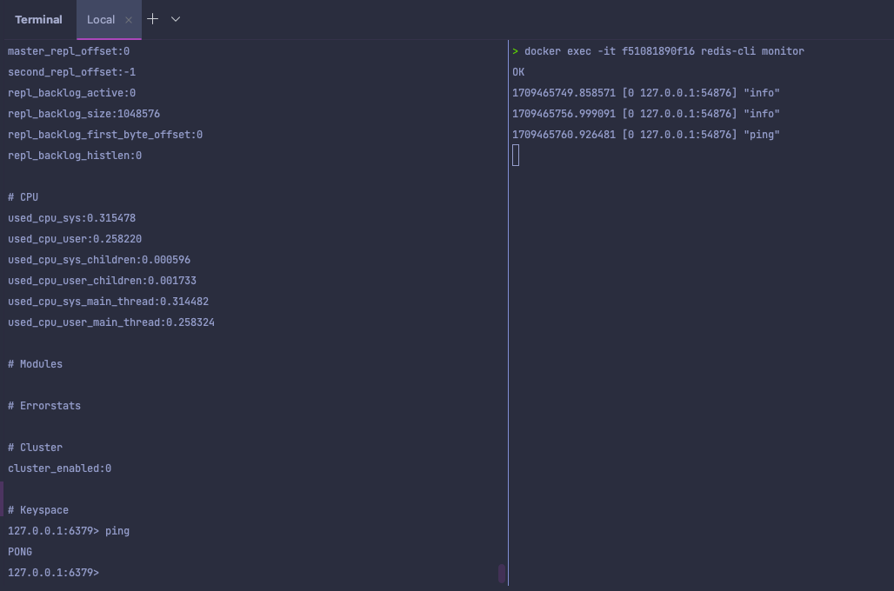

### redis cli
- 레디스 에서는 redis cli 라는 인터페이스를 제공한다.
- 해당 cli 를 통해 데이터를 저장, 조회가 가능하다.
- cli 실행 명령어
  - docker exec -it [redis container_id] redis-cli
    - ping : 응답
    - info : 통계 자료, 메모리 사용률, persistent 옵션들 등등

### 유용한 명령어
- redis-cli monitor
  - docker exec -it [redis container_id] redis-cli monitor
  - 
  - 싫제로 실행된 명령어 들이 출력된다.
- 벤치마크 툴 ( 현재 redis 의 성능 )
  - docker exec -it [redis container_id] /bin/bash
  - $ redis-benchmark 
    - 현재 개발환경에서 어느정도 성능이 나오는지 꼭 확인해보자.

