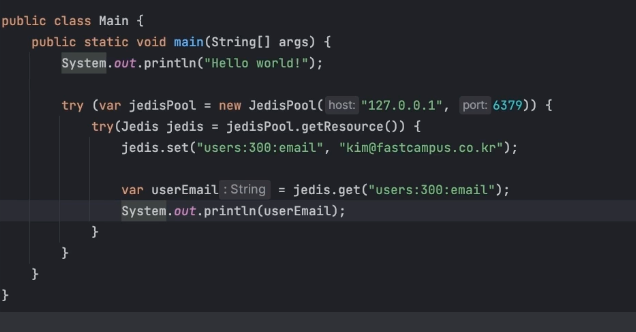

### Strings
- 가장 기본 타입으로 text, byte 를 저장
- 증가 감소에 대한 원자적 연산(increment/decrement)
  - command
    - SET
    - SETNX
    - GET
    - MGET
    - INC
    - DEC

### 사용자 정보 100 번 중에서 이름은 greg 임
- SET users:100:name greg
- SET users:100:email greg@naver.com
- GET users:100:name
  - greg
- GET users:100:email
  - greg@naver.com
- MGET users:100:name users:100:email (성능 우위)
  - "greg"
  - "greg@naver.com"
- SETNX users:100:email greg2@naver.com
  - 0 <- 이미 값이 있는경우라 1 이 안나옴
- SETNX users:200:email greg2@naver.com
  - 1 <- 존재하지 않은 값이라 1 이 나옴
- SET users:200:email greg2@naver.com NX
  - nil <- 해당 키가 이미 존재한다면 설정하지 않는다 라는 명령어다.
- INCR counter
  - key 에 대한 value 를 0 으로 만들고 1을 증가한 값을 응답한다.
    - 키가 준비되지 않아도 바로 숫자를 만들어주고 
- DECR counter
  - 역시 INCR 의 반대로 동작한다.
    
### 자바 (Jedis) 가이드
- https://redis.io/docs/connect/clients/java/
- $ implementation 'redis.clients:jedis:4.3.1'

