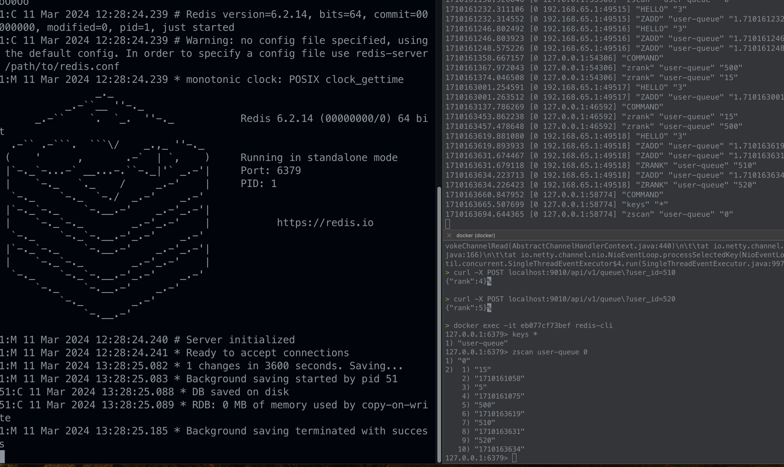

### 실습..

- 1번 터미널에 도커 띄우기 (optional) docker run -it --rm -p 6379:6379 redis:6.2
- 2번 cli monitor 모드로 띄우기 docker exec -it [CONTAINER_ID] redis-cli
- 3번 curl 혹은 postman 으로 날릴준비 해보기
- zscan users:queue:default:proceed 0

# shell script 로 모니터링 테스트 

> 1. [ 사전 작업 ] docker ps 로 pid 가져오기
> 2. [ 사전 작업 ] docker exec -it [CONTAINER-ID] redis-cli monitor
> 3. [ 사전 작업 ] docker exec -it [CONTAINER-ID] /bin/bash
> 4. [ 사전 작업 ] docker exec 터미널에 들어가기
> 5. [ 해당 터미널에서 shell script 작성 ] while [ true ]; do date; redis-cli zcard users:queue:default:wait; redis-cli zcard users:queue:default:proceed; sleep 1; done;

# jmeter 설치 ( 애플 실리콘 m 시리즈 )
> 홈브류 없는경우:  /bin/bash -c "$(curl -fsSL https://raw.githubusercontent.com/Homebrew/install/HEAD/install.sh)"
(echo; echo 'eval "$(/opt/homebrew/bin/brew shellenv)"') >> /Users/nohacking/.zprofile
eval "$(/opt/homebrew/bin/brew shellenv)"

- brew install jmeter
- open /opt/homebrew/bin/jmeter
