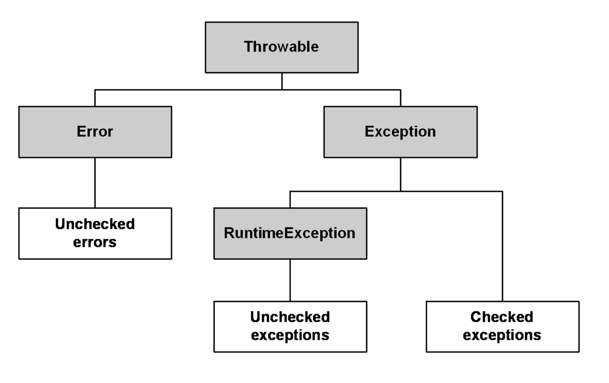

# 자바에는 있는데 코틀린엔 없는기능
### 체크드 익셉션(Checked Exception)
- 자바의 익셉션 계층 
- Throwable : 예외 계층의 최상위 클래스
- Error : 시스템에 비정상적인 상황이 발생 예측이 어렵고 기본적으로 복구가 불가능 함
  - e.g) OutOfMemoryError, StackOverflowError, etc
- Exception : 시스템에서 포착 가능하여 etc (try-catch) 복구 가능
  - 예외 처리 강제 IOException, FileNotFoundException, 
  - @Transactional 에서 해당 예외가 발생하면 기본적으론 롤백이 동작하지 않음 
    - rollbackFor: 를 사용해야함
- RuntimeException 
  - 런타임시에 발생하는 예외 예외 처리를 강제하지 않음
  - e.g ) NullPointerException, ArrayIndexOutOfBoundsException, etc



- java 에서 체크드 익셉션은 무조건 try catch 로 감싸줘야 하거나 throw 라는 키워드로 예외를 전파하지 않으면 컴파일 에러가 발생.
```java
try {
    Thread.slepp(1);
} catch (InterrupedException e) {
    // 예외처리    
}
```
- kotlin 에서는 체크드 익셉션을 강제 하지 않는다.
  - 그러나 원한다면 가능하다.
  - 자바에서 의미없는 체크드 exception 을 지양하는듯해.

### 기본 자료형
- 자바는 원시 자료형을 지원하며 객체로된 레퍼런스 타입도 지원한다.
```java
int i = 0;
Integer ii = 0;
String str = ii.toString();
```
- 코틀린은 레퍼런스 타입만 지원한다.
```kotlin
val i: Int = 0;
val str: String = i.toString();
```

- 코틀린의 레퍼런스 타입은 최적화된 방식으로 컴파일 한다.
```kotlin
int i = 0;
String str = String.valueOf(i);
```

--
### 정적멤버
- 자바는 static 키워드로 정적멤버를 선언한다.
```java
public class JavaClass {
    static int i = 0;
    
    public static void staticMethod() {
        // ...
    }
}
```
- 코틀린은 companion object 로 대체
```kotlin
class KotlinClass {
    companion object {
        val i: Int = 0;
        fun function() {
            // ...
        }
    }
}
```

### 3항 연산자
- 자바
```java
String animalSound = "호랑이".equals(animal) ? "어흥" : "야홍";
```
- 코틀린은 if else 로 대체한다.
```kotlin
val animalSound: String = if ("호랑이" == animal) "어흥" : "야홍";
```
-- 

### 세미콜론
- 자바는 무조건 ; 세미콜론이 붙지만 코틀린은 안붙는다.
```java
Boolean isAdmin = userService.isAdmin(userId);
```

```kotlin
val isAdmin: Boolean = userService.isAdmin(userId)
```

# 코틀린에는 있는데 자바에는 없는기능
### 확장
- 개발자가 임의로 객체의 함수나 프로퍼티를 확장해서 사용할 수 있다.

```kotlin
fun String.first(): Char {
    return this[0]
}

fun String.addFirst(char: Char): String {
    return char + this.substring(0)
}

fun main() {
    println("ABCD".first()) // 출력 A
    println("ABCD".addFirst('Z')) // 출력 ZABCD 
}
```

### 데이터 클래스
- 데이터를 보관하거나 전달하는 목적을 가진 불변 객체로 사용

```kotlin
data class Person(val name: String, val age: Int) {
    // hashCode(), equals(), toString() 자동생성됨
    // 이외에도 copy(), componentN 도 유용함.
}
```

- 기존 자바에선 주로 lombok 을 사용

```java
@Getter
public class Person {
    private final String name;
    private final int age;
}
```

```kotlin
// jdk 15 에선 record 라는 이름이 추가됨
public record Person(String name, int age) {
    
}
```
--

# 문자열 템플릿
- 문자열에 변수를 사용하거나 여러행으로 된 텍스트 블록을 사용 할 수 있다.
```kotlin
val text = "World"
val greeting = "Hello, ${text}"

println(greeting) // Hello, World

//  문자열 템플릿 기반의 다이나믹 쿼리
fun sql(nameIncluded: Boolean) =
        """
          SELECT id, name, email, age 
          FROM users 
          WHERE id = :id ${
                if (nameIncluded) {
                  """
                  AND name = :name
                  """ 
                } else ""
            }
        """
```

### 기타
- 스마트 캐스트 실드 클래스 (Jdk15 추가)
- 위임
- 중위 표현식
- 연산자 오버로딩
- 코루틴
- etc