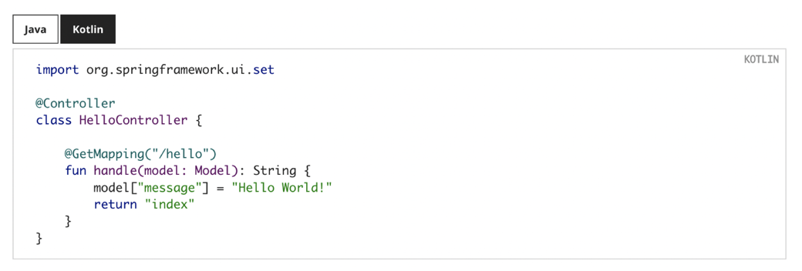

# 공식문서
- https://docs.spring.io/spring-framework/reference/web/webmvc/mvc-servlet.html
- 공식 문서의 샘플 코드를 보면 kotlin 탭을 제공



# Spring initializr
- 기본 언어로 코틀린을 선택할 수 있고 코틀린인 경우 Gradle Project를 선택하면 빌드 설정 을 기반으로 생성해준다
- Spring initialzr 를 통해 생성된 build.gralde.kts

```gradle
import org.jetbrains.kotlin.gradle.tasks.KotlinCompile

plugins { 
    id("org.springframework.boot") version "2.6.7" 
    id("io.spring.dependency-management") version "1.0.11.RELEASE" 
    kotlin("jvm") version "1.6.21" 
    kotlin("plugin.spring") version "1.6.21"
}

group = "com.example"

version = "0.0.1-SNAPSHOT"

java.sourceCompatibility = JavaVersion.VERSION_11

repositories { 
    mavenCentral() 
}

dependencies { 
    implementation("org.springframework.boot:spring-boot-starter") 
    implementation("org.jetbrains.kotlin:kotlin-reflect") 
    implementation("org.jetbrains.kotlin:kotlin-stdlib-jdk8") 
    testImplementation("org.springframework.boot:spring-boot-starter-test") 
}

tasks.withType<KotlinCompile> { 
kotlinOptions { 
        freeCompilerArgs = listOf("-Xjsr305=strict") jvmTarget = "11" 
    } 
}

tasks.withType<Test> { 
    useJUnitPlatform() 
}
```


- 코틀린 스프링 프로젝트에서 필수적인 플러그인
  - kotlin("plugin.spring")

- 코틀린 스프링 프로젝트에서 필수적인 의존성
  - org.jetbrains.kotlin:kotlin-reflect
  - org.jetbrains.kotlin:kotlin-stdlib

이외에도 plugin.jpa, jackson-module-kotlin 등 프로젝트를 구성하면서 필요한 플러그인 과 <br/> 
코틀린 의존성이 있고 Springinitialzr에서 프로젝트를 구성할 경우 자동으로 세팅해준다

# 스프링 부트
```
@SpringBootApplication class DemoApplication

// fun 탑- 레벨 함수이므로 클래스 바깥에서{ 호출
main(args: Array<String>) {
    runApplication<DemoApplication>(*args)
}
```

### @ConfigurationProperties
- 스프링 애플리케이션에 지정한 설정을 기반으로 설정 클래스를 만들때, <br/> 
@ConstructorBinding 을 사용하면 setter가 아닌 생성자를 통해 바인딩 하므로 <br/> 
불변 객체를 쉽게 생성할 수 있다.

```kotlin
@ConstructorBinding
@ConfigurationProperties("example.kotlin") 

data class KotlinExampleProperties(
                val name: String,
                val description: String,
                val myService: MyService
                ) {

data class MyService(
            val apiToken: String,
            val uri: URI
        )

}
```

### 테스트 지원
- 기본 제공되는 Junit5 기반의 테스트를 특별한 설정 없이 그대로 사용이 가능하다 
- 모의 객체를 만들어 테스트하려면 Mockito 대신 MockK를 사용할 수 있다