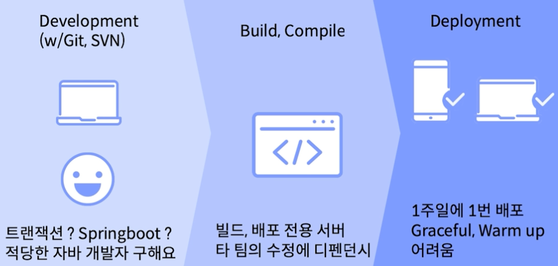

# 모놀리식 아키텍처 ()
- MSA 라는 용어가 생기기 전까지 는 존재하지도 않았다.
- 기본적으로 모든 종류의 서비스가 하나의 어플리케이션으로 구성되어 있는 아키텍처를 의미해

# 특징
- 하나의 주요 프로세스로 구성
- 모든 서비스가 하나의 DB endPoint 를 사용해
- 단 한줄의 코드 수정이 되더라도, 모든 어플리케이션의 재배포가 필요
- 싱글 혹은 멀티 모듈로 구성할 수는 있지만 CI 의 단위가 달라질 뿐, CD(배포) 의 범위는 여전히 전체

### Easy
- 개발하고 빌드 (강타입 - 컴파일) 하고 그렇게 나온 Output 서버에서 Run ! 

### No Time, No Human Resource
- 고려할 게 그렇게 많지 않아
- 서버 리소스의 효울적인 활용이 가능해

### IDC . Server/DB is very Expensive
- IDC 가 일반적 이었고, 굉장히 비싼 자원이었어.
- HVAC (항온 항습) 일정한 온도 일정한 습도가 있다는 말 
  - 관리하는 사람이 항상 필요해

