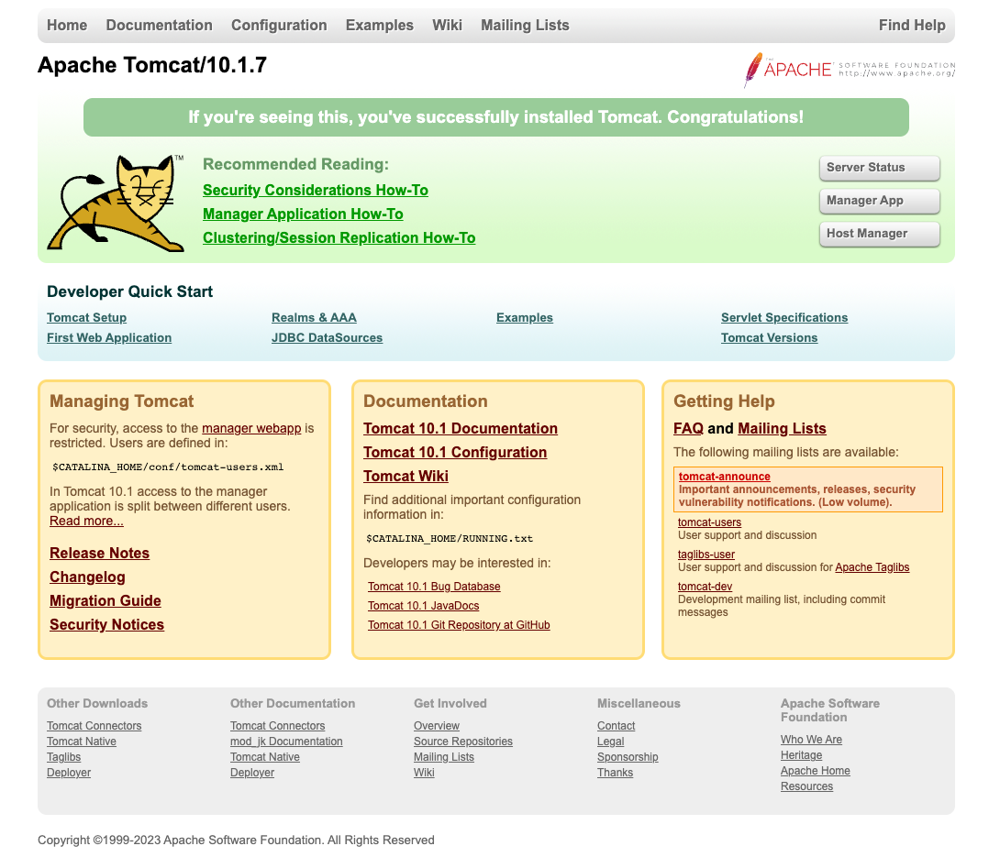
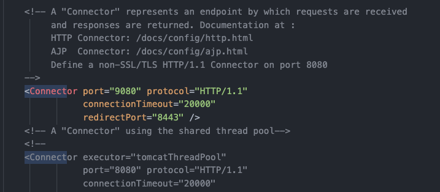
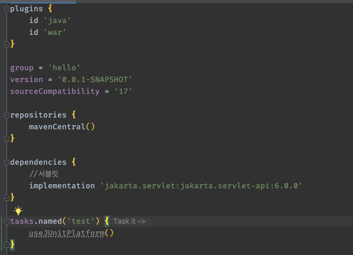

# 톰캣 설치
https://tomcat.apache.org/download-10.cgi

톰캣 실행 설정 MAC, 리눅스 사용자
1. 톰캣폴더/bin 폴더로 이동 권한 주기: chmod 755 * 
2. 실행: ./startup.sh 
3. 종료: ./shutdown.sh

# 실행후 localhost:8080 접속

# 8080 말고, 다른 서버 포트를 바꾸고싶다
- 톰캣폴더/conf/server.xml 파일에서 8080 을 원하는 포트로 변경

# 왜 설치해야하나 ?
1. 스프링 부트가 얼마나 편리한지 모르고 지금껏 고맙게도 WAS 내장되어 있어서 톰캣을 설치할 필요가 없었다.
2. 고마운 기능을 사용하다보니, spring 에선 어떻게 동작하는지 궁금해졌다.
3. 스프링 부트를 사용하지 않는 환경에서는 톰캣을 설치해야하고, WAR 가 무었이고, 톰캣 위에 우리가 작성한 코드가 어떻게 매핑되고 동작하는지 알아보자.
4. source : https://github.com/hyungkishin/server

# 빌드
- ./gradlew build
  - 실패시 -> https://stackoverflow.com/questions/69696321/intellij-invalid-source-release-17
- 성공 

# plugins
- id 에 war 라고 입력하면 자동으로 build 결과물이 war 로 만들어진다. 

