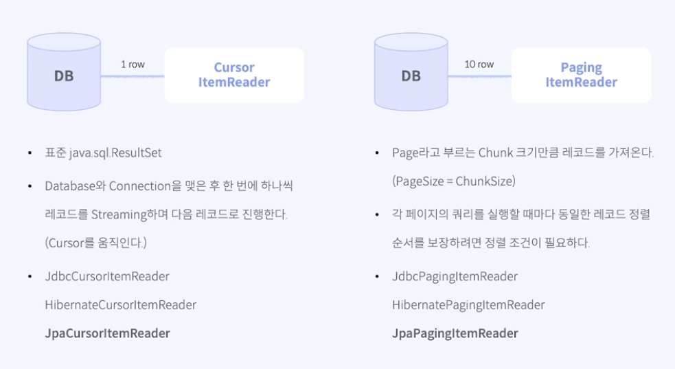
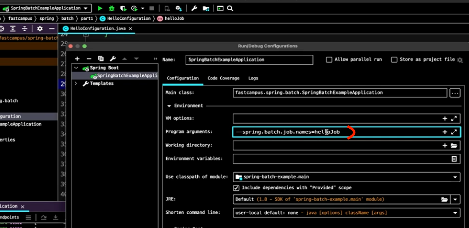
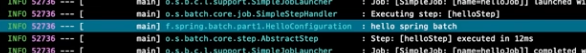
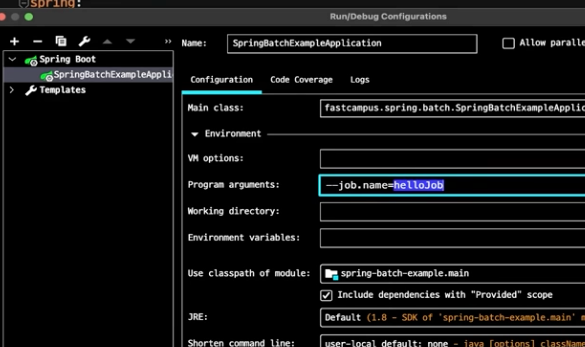

### Step : 스텝은 배치 처리를 정의하고 제어하는 독립된 작업의 단위를 말한다
- 순차적으로 이루어지는 작업을 캡슐화한 도메인 객체로 생각하면 된다.
- 스텝은 task 기반의 스텝, chunk 기반의 스텝으로 나뉜다. ( 방식이 다름 )
- task 기반의 스텝은 *하나의 작업* 을 처리하는데 사용되며, chunk 기반의 스텝은 *하나 이상의 작업* 을 처리하는데 사용된다.

### Step 들의 구성

### Job 의 구성
- 유일 하고, 순서를 가진 여러 스텝들의 목록이며, 외부 의존성에 영향을 받지 않고 실행이 가능한 독립적인 작업

### Job Repository 

- JobRepository 는 Job 실행에 필요한 정보를 저장하고 관리하는 저장소이다.
- JobRepository 는 JobInstance, JobExecution, StepExecution, ExecutionContext 등의 정보를 저장한다.

