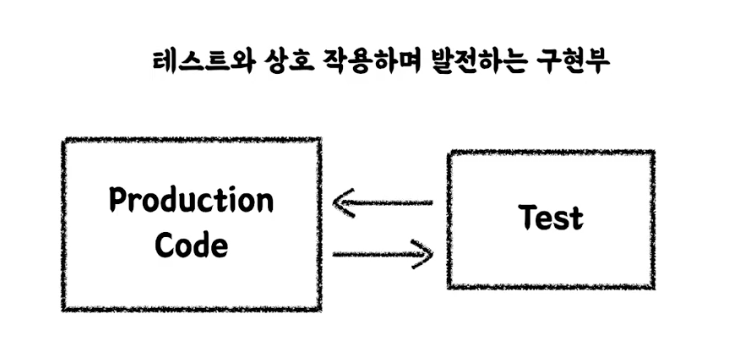

# Why TDD

### 선 기능 후 테스트 작성
- [x] 테스트 자체의 누락 가능성
- [x] 특정, 테스트 (해피 케이스) 만 검증 할 가능성
- [x] 잘못된 구현을 다소 늦게 발견할 가능성

### 선 테스트 후 기능 구현
- [x] 복잡도가 낮은, 테스트 가능한 코드로 구현할 수 있게 한다.
- [x] 쉽게 발견하기 어려운 엣지 (Edge) 케이스를 놓치지 않게 해준다.
- [x] 구현에 대한 빠른 피드백을 받을 수 있다.
- [x] 과감한 리펙토링이 가능해진다.

### TDD: 관점의 변화

