Favorite 과 관련있는 객체
- 즐겨찾기를 설계할때 누가 추가했는가
- 어떤 역들을 즐겨찾기 했는가

- 두 도메인을 의존해야 되는 상황

### 모든 의존성을 객체 참조로 구현하면 ?
- 객체간의 결합도가 높아짐
- 다른 객체로 탐색이 가능해짐
- 디비에서 조회하거나 ORM 사용시 복잡도 증가

> 객체가 다른객체 를 타고 또 타고 를 객체 탐색이라고 함

### 객체 탐색을 피하려면 ?
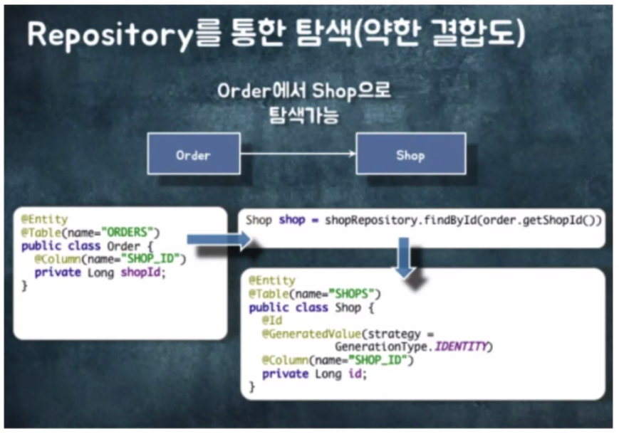

- 객체 도메인의 식별자만 떄와서 의존관계를 맺어주자

### 어떤 상황에 객체 참조를 사용할까 ? 
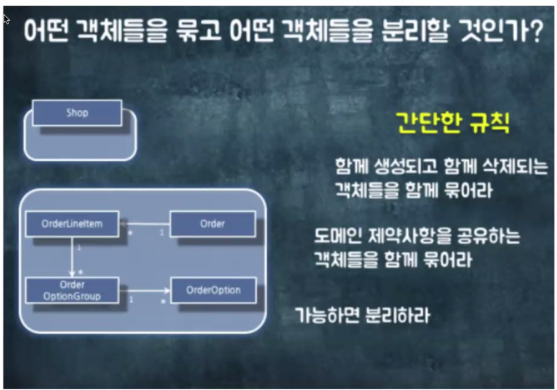

### 테스트 하기 어려운 코드

[정진욱 님의 테스트 하기 쉬운 코드 세미나](https://youtu.be/Cz_a2gQp63c)
- 외부 상태를 변경하는 코드
- 같은 입력에 항상 다른 결과를 반환하는 코드
- 외부 상태를 변경하는 코드

### 테스트 하기 쉬운 코드
- 외부 상태를 변경하지 않는 코드
- 같은 입력에 항상 같은 결과를 반환하는 코드
- 이부분 을 자동 테스트로 검증하기

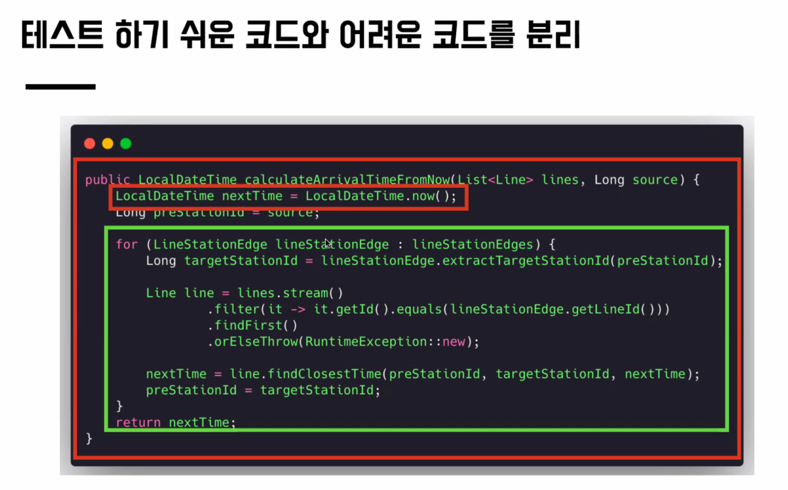
- 빨간 네모가 테스트하기 어려운 코드
- 파란색 네모가 항상 같은 응답을 내기 떄문에 테스트 하기 쉬운 코드

## 테스트하기 쉬운 코드와 어려운 코드를 분리해야 한다
- 테스트하기 쉬운 코드는 테스트를 먼저 작성하고 구현을 진행
- 테스트하기 어려운 코드는 테스트를 먼저 작성하지 않고 구현을 진행

## 분리한 결과
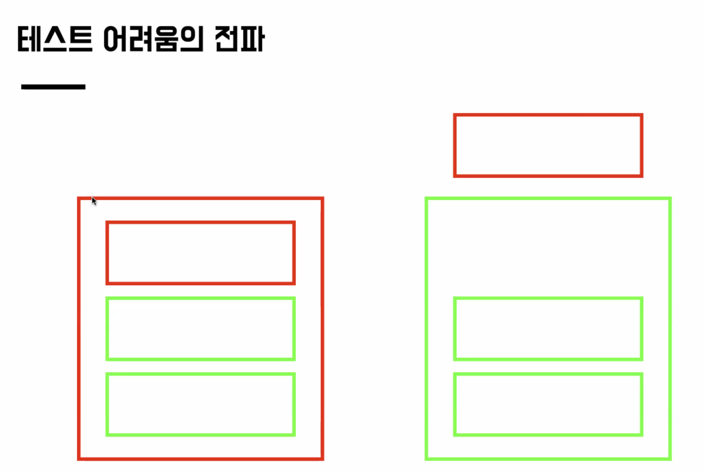

## 이것도 똑같음
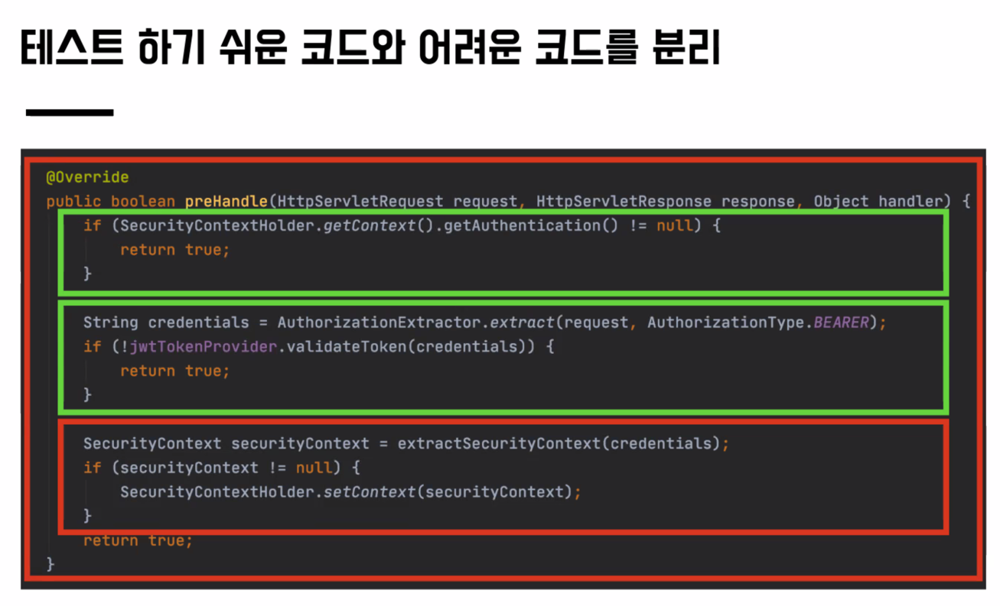

## 되도록이면 바깥에서 만나게 하라
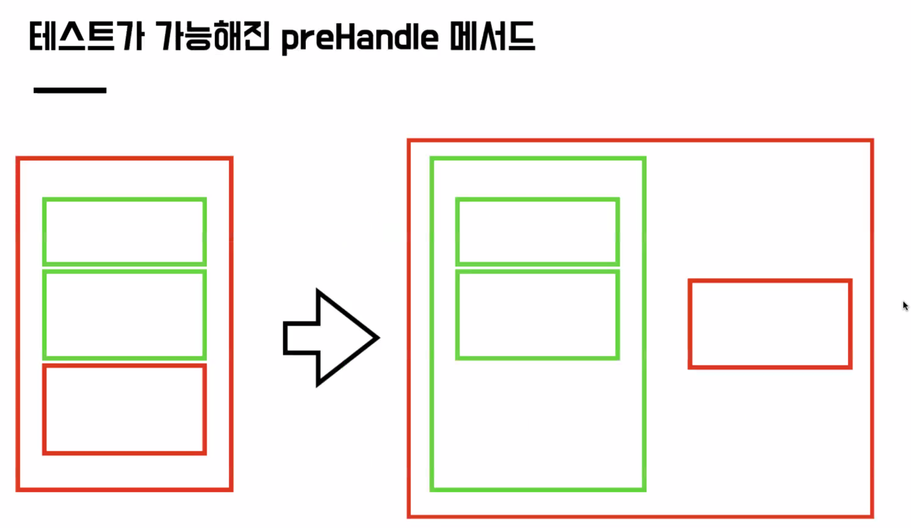

## 빨간 부분 어떻게 테스트해요 ? 
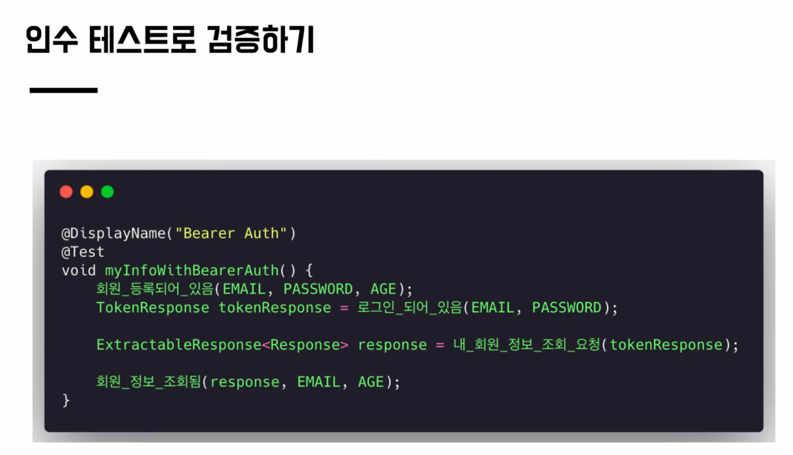

> 블랙박스 테스팅으로 검증해라.

### 외부서버 mocking ? 
[참고 URL](https://tecoble.techcourse.co.kr/post/2020-09-30-mocking-server/)

### 인수 테스트에 대한 궁금증

### 방법 2
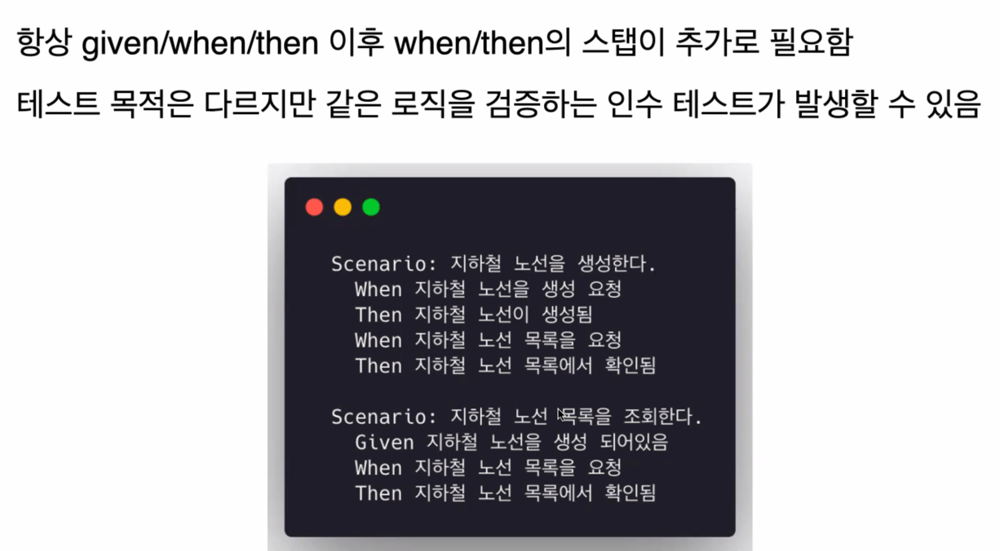

### 중복 검증 ? 
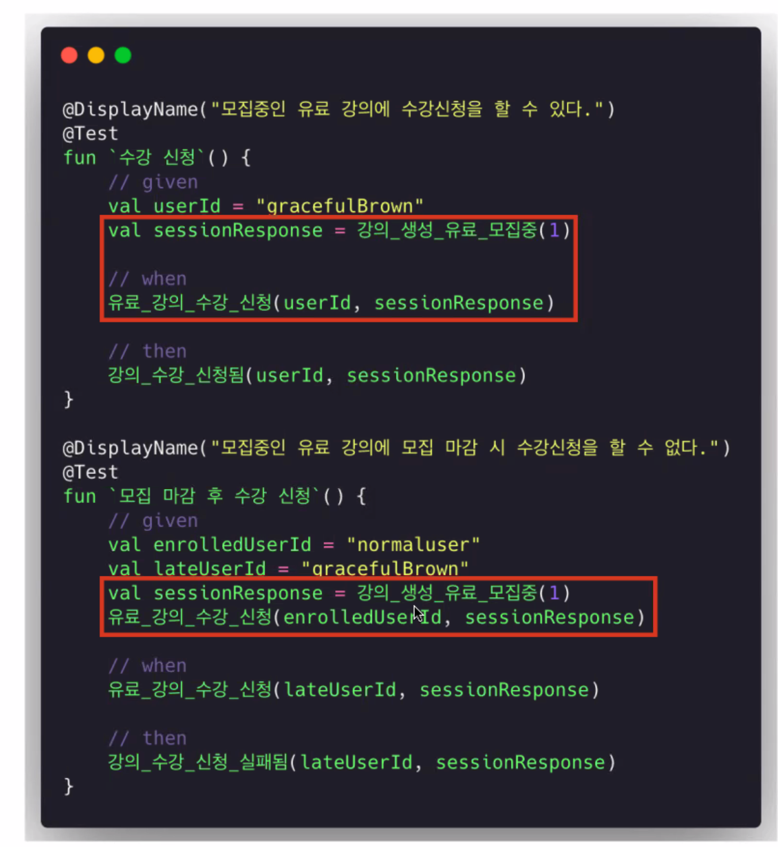

### 하나의 작업 메서드로 묶어버리는 방법이 있다. (재사용)
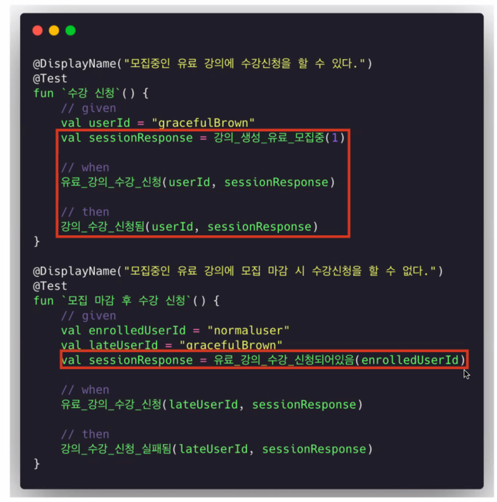

### 각각의 단계를 한번 더 거치는것은 동일한데... 좀더 효율적인 방법은 없을까 ?
- 즐겨찾기와 관련된 행위들을 시나리오로 풀어서 검증하는 방법이 있다.

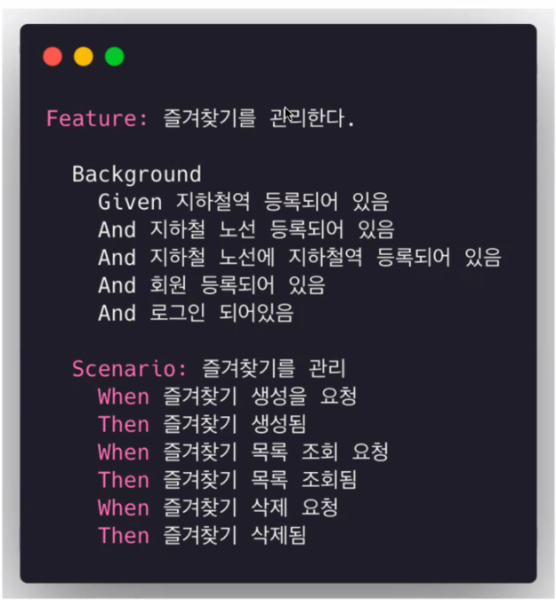

### 인수테스트시 우려되는 점
- 하나의 테스트를 구현하는데 너무 개빡센게 아닌가 ?
- 모든 기능을 묶어서 하라는 맥락이 아니라, 이미 아는건 건너건너 뛰고, 새로운 기능을 구현하면서 테스트를 작성하라는 맥락이다.
- 검증 하려고 하는 대상의 관점이 중요하다.

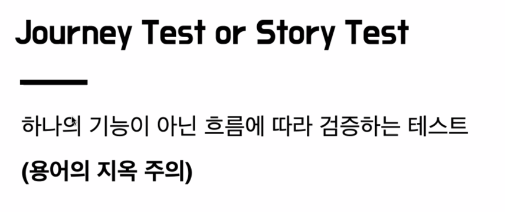
- 수동테스트 -> 페이지 클릭클릭
- 자동테스트 -> API 호출 ? 

### 인수 테스트 통합 시 장점
- 테스트를 빠르게 실행할 수 있다.

### 인수 테스트 통합 방법
- 기존 처럼 따로 만든 다음 하나로 통합하기
- 처음부터 하나의 테스트 메서드로 한 스텝씩 검증하면서 구현하기

### 레거시 리펙터링 시 (한다 라고 하면 !)
- 인수 테스트 있음 vs 인수 테스트 없음

### 리펙토링을 맘껏 할 수 있을때
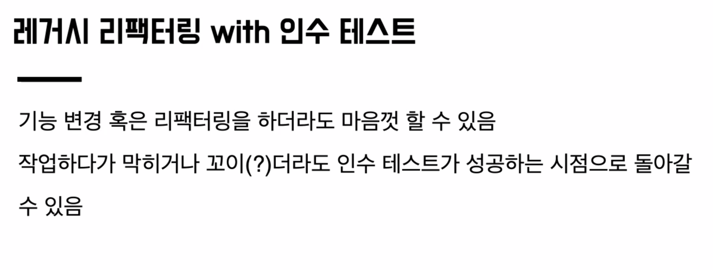

- 세이브 포인트로 이용 할 수 있다.

### 레거시 리팩터링 without 인수 테스트
- 인수 테스트를 먼저 만들고 시작
- 세부 구현에 의존하지 않는 블랙 박스 테스트이기 때문에 구현이 변경되더라도 검증 가능

### 오케이 인수테스트 먼저 만든다음 리펙토링 하는거 알겠어 스텝은 ? 
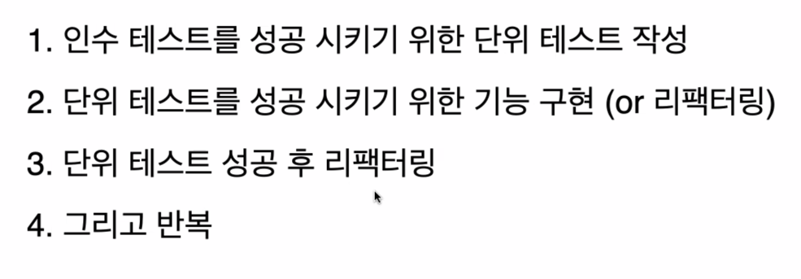

### 기존 코드를 바로 수정하면 ?
- 변경한 부분을 의존하는 부분에서 빨간불 
- 기존 테스트 코드 모두 실패

### 테스트, TDD 는 비효율적인가 ?
- TDD 나 테스트 작성을 꺼려하는 사람들의 가장 큰 이유
- 관리할 코드가 두배가 되어 버린다.
- 좆된상황 아닌가 ?

### 1. 새로운 테스트 만들기
- 반드시 기존 테스트와 프로덕션 코드는 그대로 두기

### 2. 기능구현하기 + 전략
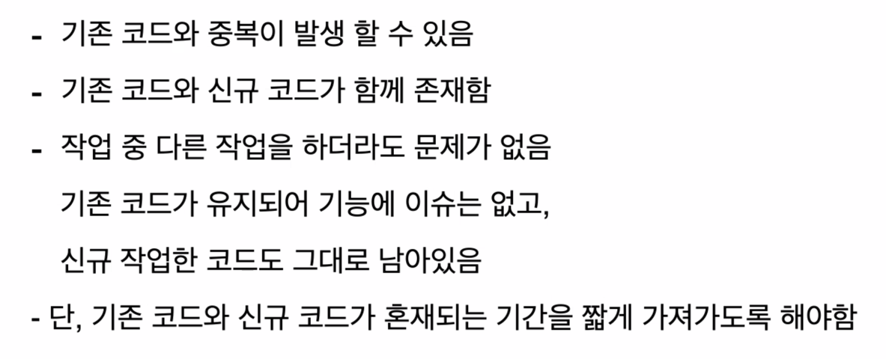

### 3. 테스트 성공 후 리펙터링 (인수테스트가 있다는 전재하에)
- 리펙터링은 테스트 코드가 검증 할 수 있는 범위 내에서 시도

### 4. 스트렝귤러 패턴 (새로운걸로 확 바꾸는게 아니라, 스물스물 야금야금 바꿔가는것)
- 기존 코드를 대체할 수 있을 때 대체
- 기존 프로덕션 코드와 테스트 코드 제거

### 레거시 리펙토링 중 시간적 여유가 없을때 
- 만약에 시간 여유가 없어서 인수 또는 단위 중 1개의 테스트 코드만 작성할 수 있다고 하면 어떤걸 더 중점적으로 보는게 좋을까 ?
- 환경에 따라서 인수테스트를 짜는 데 시간이 엄청 들어갈 수도 있어서 단위 테스트를 먼저 짜는게 좋을 수도 있다.
- 인수테스트는 블랙박스 테스트 이기 때문에 구현에 크게 의존하지 않는다.

# 문서 자동화 && 테스트 도구
### Junit5
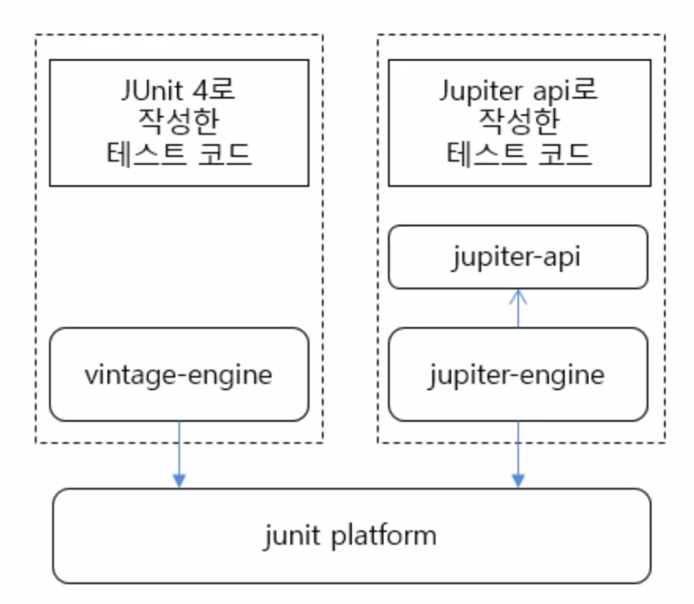

### 채워넣기 (강의보고)
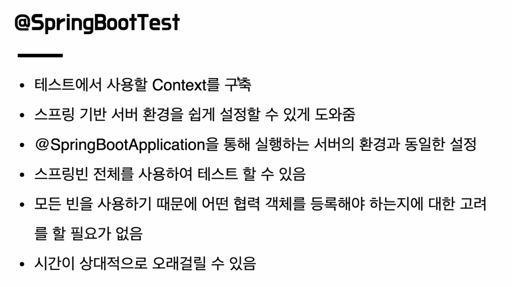
### 채워넣기 (강의보고)
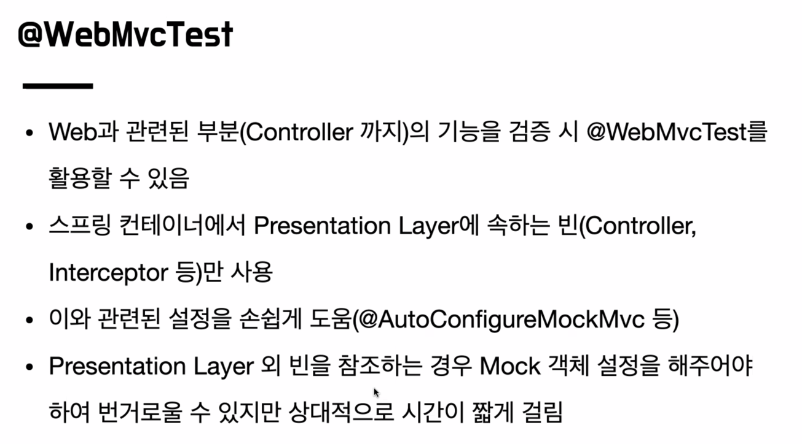

### 레포지토리만 검증하고 싶을때
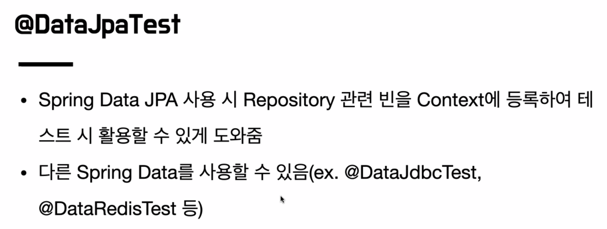

### Atdd 개발 Cycle
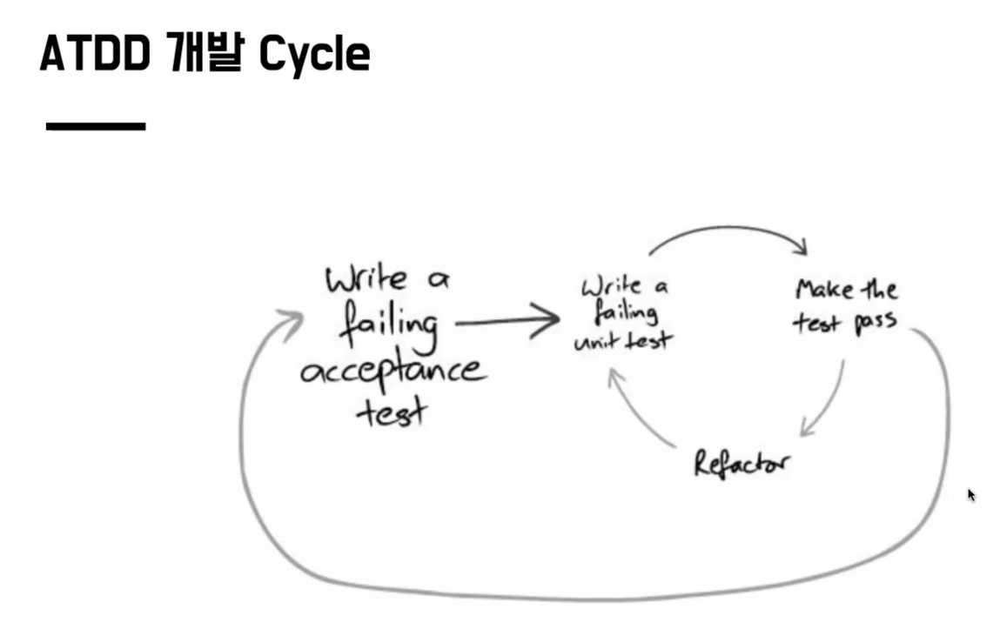

### 협업 시 이득 부분
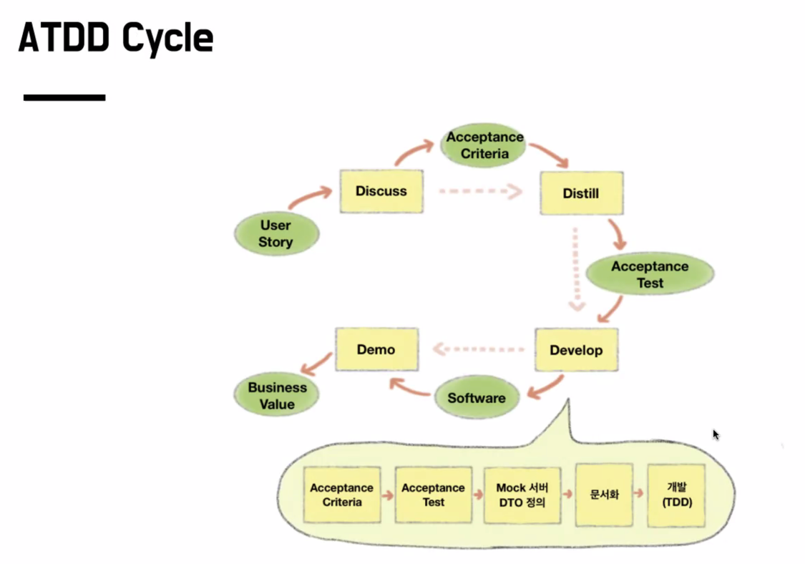

### 문서화 ? 
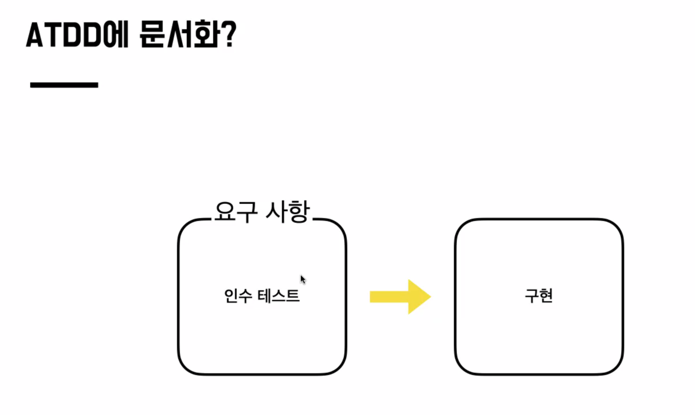

### 개발하기 전 문서화 장점 ?
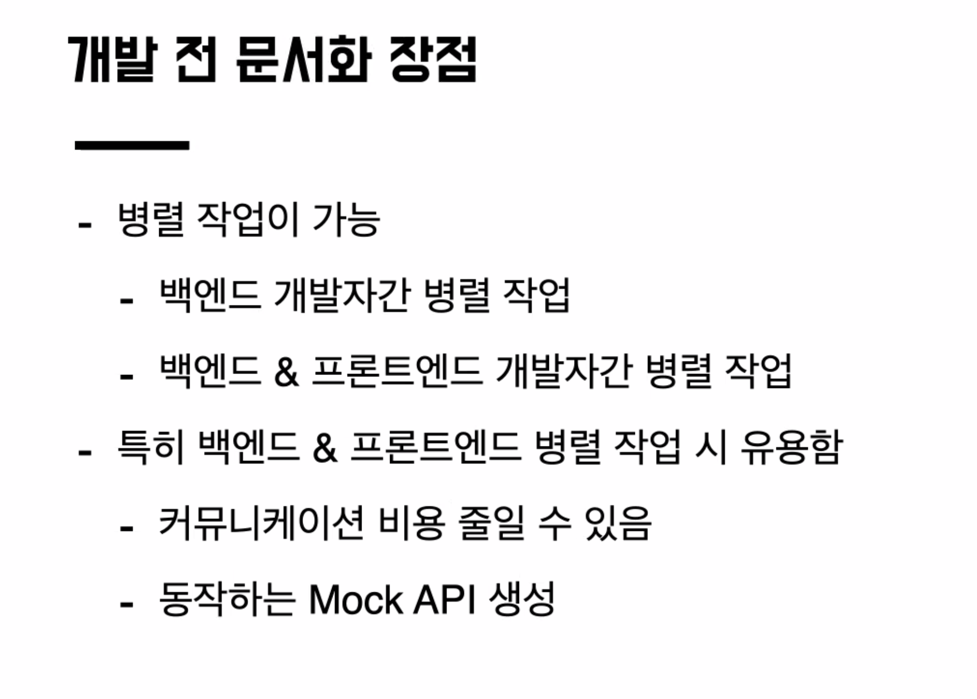