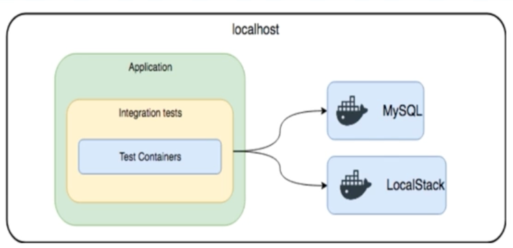
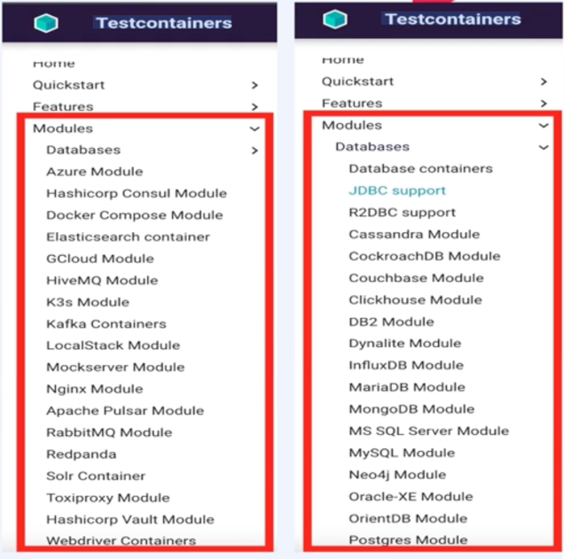

# JPA 이용하여 CRUD 테스트 코드를 작성할 때 어떤 DB 환경이 좋을까?
- https://www.testcontainers.org/
- 운영환경과 유사한 스펙의 DB(개발 환경 DB) 사용하기
- 인메모리 DB(ex H2) 사용하기
- Docker 이용하기
Application
- TestContainers 를 이용하기
Integration tests
- *TestContainers 는* 운영환경과 유사한 DB 스펙으로 독립적인 환경에서 테스트 코드를 작성하여 테스트가 가능하다.




TestContainers 는 Java 언어만으로 docker container를 활용한 테스트 환경 구성
- 도커를 이용하여 테스트할 때 컨테이너를 직접
- Testcontainers 관리해야 하는 번거로움을 해결 해주며, 운영환경과 유사한 스펙으로 테스트 가능
- 즉, 테스트 코드가 실행 될 때 자동으로 도커 컨테이너를 실행하여 테스트 하고, 테스트가 끝나면 자동으로 컨테이너를 종료 및 정리
- TestContainers는 다양한 모듈이 존재



# MariaDB와 Redis를 독립된 환경에서 테스트 코드 작성을 위해 TestContainers 적용
- https://www.testcontainers.org/modules/databases/jdbc/
- build. gradle에 의존성 추가
- testimplementation.org.testcontainers:spock:1.17.1'
- testimplementation.org.testcontainers:mariadb:1.17.1
- 테스트를 위한 testresources/application.yml 파일 생성

```yml
spring:
datasource:
driver-class-name: org.testcontainers.jdbc.ContainerDatabaseDriver
url: idbc:tc:mariadb:///
```

# 공식문서
• https://www.testcontainers.org/quickstart/spock_quickstart/ ( Spock)
• https://www.testcontainers.org/modules/databases/mariadb/ (MariaDB)
• https://www.testcontainers.org/test_framework_integration/manual_lifecycle_control/ (Manual lifecycle control)
• https://www.testcontainers.org/features/creating_container/ (GenericContainer)
• https://www.testcontainers.org/modules/databases/jdbc/ (jdbc support )