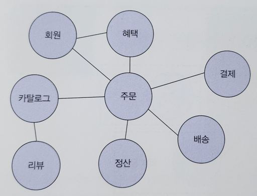
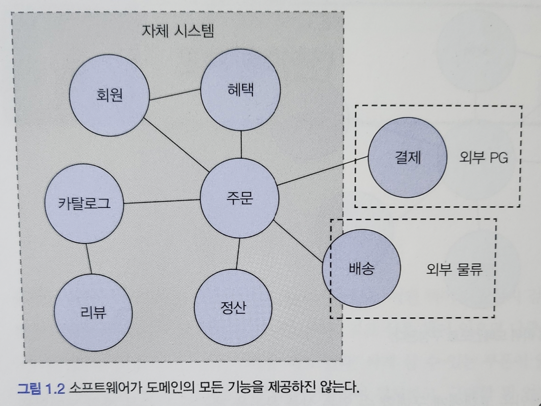

### 도메인이란

- 이 책 에서는 온라인 서점 도메인을 기준으로 설명한다.

### 한도메인 에서 하위 도메인으로

- 도메인은 여러 하위 도메인으로 구성된다.

### 잠깐 셋길...
> 회사에서 리뷰 도메인을 리뉴얼 할때 였다.  
> 동료 개발자들과 Back-end 를 제대로 시작한지 어언 1년 하고도 반년이 지난시점.  
> 각자 비즈니스 로직을 개발하면서의 어느 안티패턴, 그리고 좋은 사례들로 예쁘게 코드를 작성하는 방법으로  
> 점진적인 성장이 가능했는데, 도메인으로써 분리하고 설계하는 방법에 대해서는 "누가 설계해 주었으면"  
> 라는 바램이 있었다. 그만큼 도메인을 "잘" 설계 하는 방식에 대해서는 어느것을 기준으로 체계적으로 나아갈지에 대한   
> 방향성이 아쉬웠다  
> 다 읽고나서 도메인에 대해 바라보는 개발적 주관과, 시야가 이전보다 나아졌음 좋겠다.

### 하위 도메인의 관계
카탈로그 하위 도메인을 보면, 고객에게 구매할 수 있는 상품 목록을 제공하고, 주문하위 도메인은 고객의 주문을 처리한다.  
해택 하위도메인은 쿠폰이나 특별 할인과 같은 서비스를 제공하고.  
배송하위 도메인은 고객에게 구매한 상품을 전달하는 일련의 과정을 처리한다.  
한 하위 도메인은 다른 하위 도메인과 연동하여 완전한 기능을 제공한다.  
예를 들어 고객이 물건을 구매하면 주문, 결제, 배송, 해택 하위 도메인의 기능이 엮이게 된다  

### 모든 도메인을 구현해야 하나?
꼭 그런것만은 아니다.
많은 온라인 쇼핑몰에서, 배송 시스템을 구축하기 보다는 외부 배송업체와 연동하는 방식을 택한다.  
결제 시스템도 마찬가지다. 자체적으로 구축하기 보다는 결제 대행업체를 이용해서 처리할 때가 많다  
- 그림 참조

### 하위 도메인을 어떻게 구성할지 여부는 상황에 따라 달라진다.
소규모의 기업의 경우 정산 도메인을 엑셀로 처리 할 수도 있고  
기업 고객을 대상으로 대형 장비를 판매하는 곳은 온라인으로 카탈로그를 제공하고 주문서를 받는 정보만 필요할것이다.  
온라인 결제나 배송 추적과 같은 기능을 제공할 필요가 없다.  

반면에 의류나 엑세서리 처럼 일반 고객을 대상으로 물건을 판매한다면 카탈로그, 리뷰, 주문, 결제, 배송, 회원 기능 등이 필요한것이다.  
