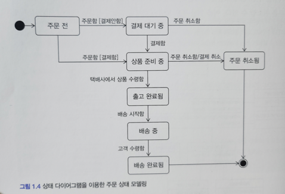

### 도메인 모델
- 도메인 모델에는 다양한 정의가 존재하는데, 기본적으로 도메인 모델은 특정 도메인을 개념적으로 표현한 것이다.
- 주문 도메인을 생각해 보자.
- 온라인 쇼핑몰에서 주문을 하려면 상품을 몇개 살지 선택하고 배송지를 입력한다.
- 선택한 상품 가격을 이용해서 총 지불 금액을 계산하고 금액 지불을 위한 결제 수단을 선택한다.
- 주문한 뒤에도 배송 전이면 배송지 주소를 변경하거나 주문을 취소할 수 있다.
- 이를 위한 주문 모델을 객체 모델로 구성하면 아래와 같다.

### 객체 다이어그램

이 모델은 도메인의 모든 내용을 담고 있지는 않지만 이 모델을 보면 주문 은 주문번호와 지불할 총 금액이 있고, 배송정보를 변경 할 수 있음을 알 수 있다.  
또한 주문을 취소 할 수 있다는 것도 알 수 있다.  
도메인 모델을 사용하면 여러 관계자들이 동일한 모습으로 도메인을 이해하고 도메인 지식을 공유하는데 도움이 된다.  

객체를 이용한 도메인 모델은 도메인이 제공하는 기능과 도메인의 주요 데이터 구성을 파악해야 하는데,  
이런 면에서 기능과 데이터를 함께 보여주는 객체 모델은 도메인을 모델링하기에 적합하다.  

### 상태 다이어그램

도메인을 이해하려면 도메인이 제공하는 기능과 도메인의 주요 데이터 구성을 파악해야 하는데,  
이런 면에서 기능과 데이터를 함께 보여주는 객체 모델은 도메인을 모델링하기에 적합하다.  
도메인 모델을 객체로만 모델링 할수 있는 것은 아니다.  

### 가장 중요한건 도메인에 대한 부분을 "표현하는" 구간
예를 들어 계산 규칙이 중요하다면 , 수학 공식을 활용해서 도메인 모델을 만들 수도 있다는 것이다.  
클래스 다이어그램이나 상태 다이어그램과 같은 UML 표기법만 사용해야 하는 것 이 아니라는 이야기다.  

### 약간 감잡았어.
> 아 그러면. 우리가 정통적인 도메인을 이해하는 표현 방식만을 고집해야 하는게 아니라,  
> 해당 도메인을 잘 이해하는데 (여러 이해 관계자들이 이해 할 수 있는) 효과적인 방법을 찾아서 표현하면 된다는 것이로군?  
> 그러면 이제 도메인을 이해하는데 효과적인 방법을 찾아서 표현하면 된다는 것이로군?  

### 하위 도메인과 모델
- 도메인은 다수의 하위 도메인으로 구성된다.
- 각 하위 도메인이 다루는 영역은 서로 다르기 때문에 같은 용어라도 하위 모데인 마다 의미가 달라질 수 있다.
- 예를 들어 카탈로그 도메인의 상품이 상품가격. 상세 내용을 담고 있는 정보를 의미한다면 배송 도메인의 상품은 고객에게 실제 배송되는 물리적인 상품을 의미한다.
  도메인에 따라 용어 의미가 결정되므로 여러 하위 도메인을 하나의 다이어그램에 모델링하면 안 된다.
- 카탈로그와 배송 도메인 모델을 구분하지 않고 하나의 다이어그램에 함께 표시한다고 가정해 보자.
- 이 경우 다이어그램에 표시한 상품은 카탈로그의 상품과 배송의 상품 의미를 함께 제공하기에, 카탈로그 도메인의 상품을 제대로 이해하는데 방해가 된다.

> 모델의 각 구성 요소는 특정 도메인으로 한정할 때 비로소 의미가 완전해지기 떄문에 각 하위 도메인마다 별도로 모델을 만들어야 한다.  
> 결과적으로 카탈그 하위 도메인 모델과 배송 하위 도메인 모델을 따로 만들어야 한다는것을 뜻한다.
