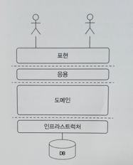

### 도메인 모델 패턴
- 일반적인 애플리케이션의 아키텍처는 아래와 같이 네 개의 영역으로 구성된다.




### 아키텍처 구성
| 영역              | 설명                                                                                |
|-----------------|-----------------------------------------------------------------------------------|
| 사용자 인터페이스 또는 표현 | 사용자의 요청을 처리하고 사용자에게 정보를 보여준다. <br /> 여기서 사용자는 소프트웨어를 사용하는 사람뿐만 아니라 외부 시스템일 수도 있다. |
| 응용              | 사용자가 요청 한 기능을 실행한다. <br/> 업무 로직을 직접 구현하지 않으며 도메인 계층을 조합해서 기능을 실행한다.               |
| 도메인             | 시스템이 제공할 도메인 규칙을 구현한다.                                                            |
| 인프라 스트럭처        | 데이터베이스나, 메시징 시스템과 같은 외부 시스템과의 연동을 처리한다.                                           |


### 자 이제 신나는 빌드업
- 도메인 계층은 도메인의 핵심 규칙을 구현한다.

> 주문 도메인의 경우 "출고 전에 배송지를 변경 할 수 있다" 라는 규칙과, <br/>
> "주문 취소는 배송 전에만 할 수 있다" 라는 규칙을 구현한 코드가 도메인 계층에 위치하게 된다. <br/>
- 이런 도메인 규칙을 객체 지향 기법으로 구현하는 지겹게 이론서적에서 말하는 패턴이 "도메인 모델 패턴" 이다

### 예제코드 가즈아!!!

```java

public class Order {
    
    private OrderState state;
    
    private ShippingInfo shippingInfo;
    
    public void changeShippingInfo(ShippingInfo newShippingInfo) {
        if (!state.isShippingChangeable()) {
            throw new IllegalStateException("can't change shipping in " + state);
        }
        this.shippingInfo = newShippingInfo;
    }
    
    // --
}

```

```java

public enum OrderState {
    PAYMENT_WAITING {
        public boolean isShippingChangeable() {
            return true;
        }
    },
    PREPARING {
        public boolean isShippingChangeable() {
            return true;
        }
    },
    SHIPPED, DELIVERING, DELIVERY_COMPLETED;
    
    public boolean isShippingChangeable() {
        return false;
    }
}

```

이 코드는 주문 도메인의 일부 기능을 도메인 모델 패턴으로 구현한 것이다. <br />
주문 상태를 표현하는 OrderState 는 배송지를 변경할 수 있는지를 검사할 수 있는 isShippingChangeable() 메서드를 제공하고 있다. <br />

코드를 보면 주문 대기중 (PAYMENT_WAITNG) 상태와 상품 준비중 (PREPARING) 상태의 isShippingChangeable() 메서드는 true 를 리턴하고 있다.
즉 OrderState 는 주문 대기 중이거나 상품 준비 중에는 배송지를 변경할 수 있다는 도메인 규칙을 구현하고 있다.

실제 배송지 정보를 변경하는 Order 클래스의 changeShippingInfo() 메서드는 OrderState 의 isShippingChangeable() 메서드를 이용해서 변경 가능한 경우에만 배송지를 변경한다.

큰 틀에서 보면 OrderState 는 Order 에 속한 데이터이므로 배송지 정보 변경 가능 여부를 판단하는 코드를 Order 로 이동할 수도 있다.
다음은 Order 클래스에서 판단하도록 수정한 코드를 보여주고 있다.

```java
public class Order {
    
    private OrderState state;
    
    private ShippingInfo shippingInfo;
    
    public void changeShippingInfo(ShippingInfo newShippingInfo) {
        if(!isShippingChangeable()) {
            throw new IllegalStateException("can't change shipping in " + state);
        }
        this.shippingInfo = newShippingInfo;
    }
    
    private boolean isShippingChangeable() {
        return state == OrderState.PAYMENT_WAITING || state == OrderState.PREPARING;
    }
    
    // ...
}

public enum OrderState {
    PAYMENT_WAITING, PREPARING, SHIPPED, DELIVERING, DELIVERY_COMPLETED;
}

```

> 배송지 변경이 가능한지를 판단할 규칙이 주문 상태와 다른 정보를 함께 사용한다면 OrderState 만으로는 배송지 변경 가능 여부를 판단할 수 없으므로 Order 에서 로직을 구현해야 한다.
> 
> 배송지 변경 가능 여부를 판단하는 기능이 Order 에 있든 OrderState 에 있든 중요한 점은 주문과 관련된 중요 업무 규칙을 주문 도메인 모델인 Order 나 OrderState 에서 구현해야 한다는 점이다.
> 
> 핵심 규칙을 구현한 코드는 도메인 모델에만 위치하기 때문에 규칙이 바뀌거나 규칙을 확장해야 할 때 다른 코드에 영향을 덜 주고 변경 내역을 모델에 반여할 수 있게 된다.

### 잠깐
이쯤 되면 헷갈리는 포인트가 <br /> 
"도메인 모델" 이라는 용어는 도메인 자체를 표현하는 개념적인 모델을 의미하지만, <br />
도메인 계층을 구현할 때 사용하는 "객체 모델" 을 언급할 때에도 도메인 모델이라는 용어를 사용한다. <br />

즉, 개념 모델과 구현모델 두가지 모두 도메인 모델이라고 표현하는것 이 핵심
하나는 : 도메인 자체를 표현하는 개념적인 모델 -> 도메인 모델
둘은 : 도메인 계층을 구현할 때 사용하는 객체 모델 -> 도메인 모델

### 더 깊게 들어가면 개념 모델은 순수하게 문제를 분석한 결과물이다. 

개념 모델은 아래와 같이 
- 데이터베이스
- 트랜잭션 처리
- 성능
- 구현 기술

과 같은 것을 고려하고 있지 않기 때문에 실제 코드를 작성할 때 "개념 모델" 을 있는 그대로 사용할 수 없다.

그래서 개념 모델 을 구현 가능한 형태의 모델로 전환하는 과정을 거치게 된다. <br />

### 개념 모델을 만들 때 
처음부터 완벽하게 도메인을 표현하는 모델을 만드는 시도를 할 수 있지만 실제로 이것은 불가능 하다. <br />
소프트웨어를 개발하는 동안 개발자와 관계자들은 해당 도메인을 더 잘 이해하게 된다. <br /> 
프로젝트 초기에 이 해한 도메인 지식이 시간이 지나 새로운 통찰을 얻으면서 완전히 다른 의미로 해석되는 경우도 있다.
프로젝트 초기 에 완벽한 도메인 모델을 만들더라도 결국 도메인에 대한 새로운 지식이 쌓이면서 모델을 보완하거나 변경하는 일이 발생한다. <br />
따라서 처음부터 완벽한 개념 모델을 만들기보다는 전반적인 개요를 알 수 있는 수준으로 개념 모델을 작성해야 한다. <br />
프로젝트 초기에는 개요 수준의 개념 모델로 도메인에 대한 전체 윤곽을 이해하는 데 집중하고, <br /> 
구현하는 과정에 서 개념 모델을 구현 모델로 점진적으로 발전시켜 나가야 한다. <br />

### 그러니까
subQuery 를 처음부터 완벽하게 짜는 사람이 없듯이.
큰 틀은 (결과물) 은 윤곽을 잡되, 만들면서 점진적으로 보완시켜 나아가라. 가 핵심이다. <br />

### 씁 ... 그러면 만들었던 경험치가 졸라 많아야 될것 같은데 ?
그래서 많이 모델링 해보고 많이 만들어 봐야 하나보다... 쓰읍... <br />
이런 경험치를 쌓기 위해서는 빠르게 실패하고 빠르게 배우는 것이 중요한것 같.애.요. <br />
