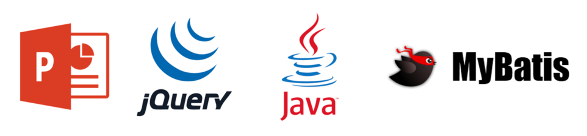
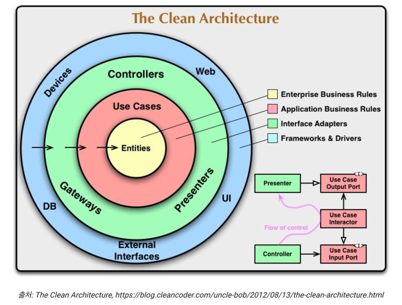
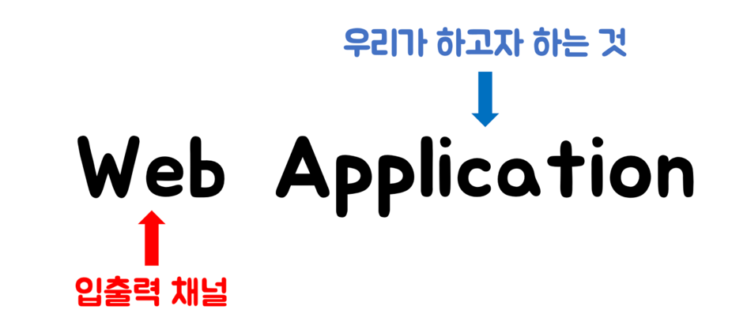
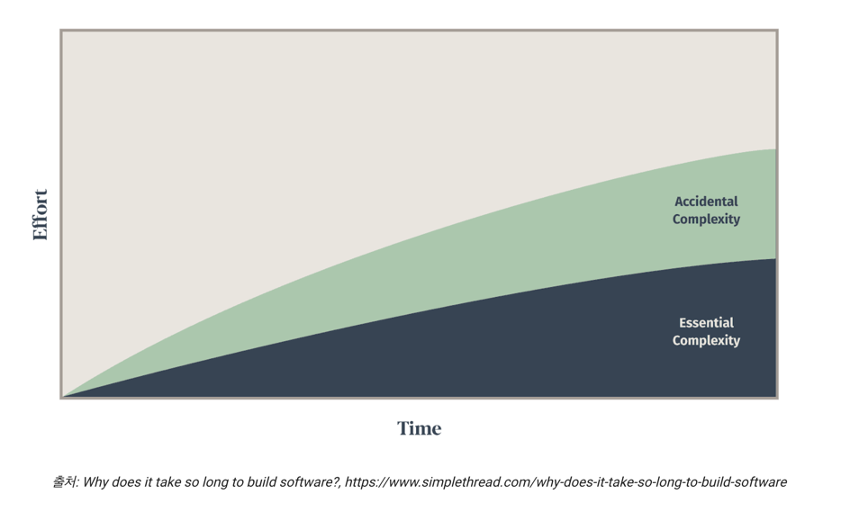
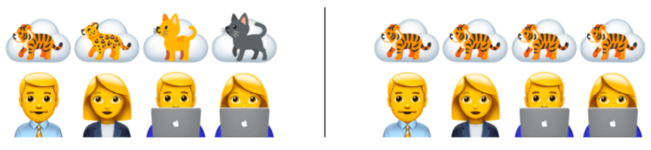
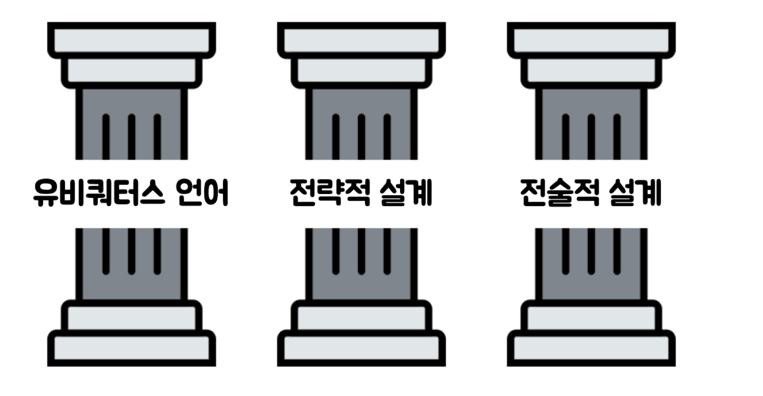
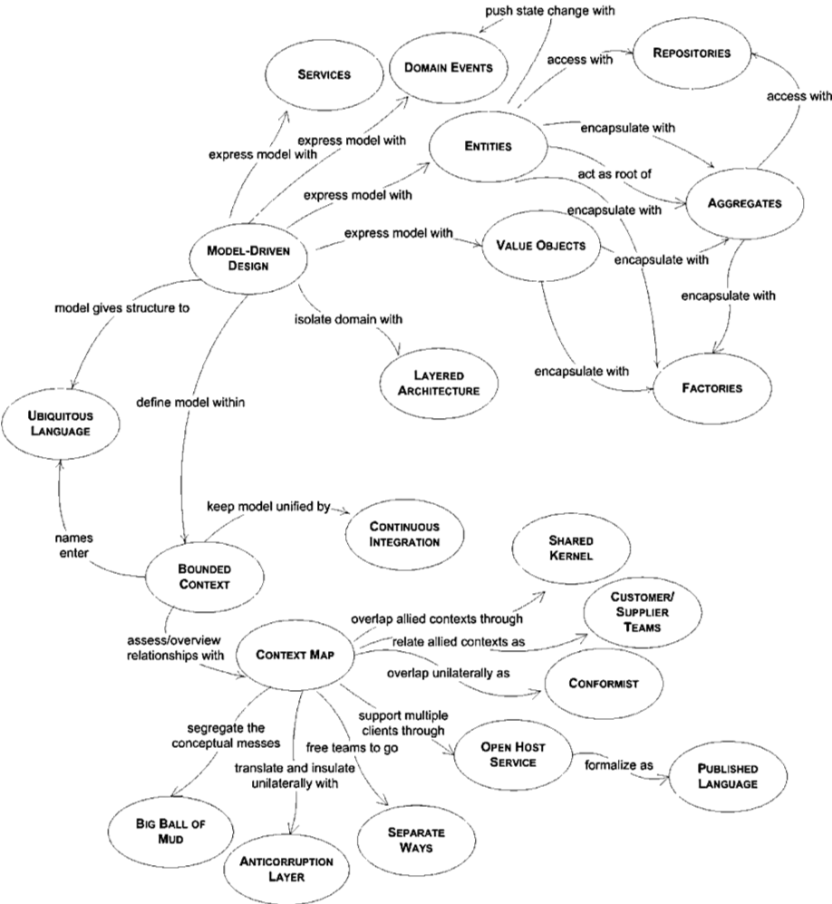

# 📖 도메인 주도 설계 등장 배경

### 나는 왜 DDD를 하고 있는가?

### 클린 아키텍처
신입 개발자였을 때 이야기다. 그 당시 천 줄이 넘는 메서드를 가진 컨트롤러 코드를 보았고, 존재 이유를 모르는 오류 검사 코드와 수많은 분기문이 있었다. 이 메서드는 새로운 요구 사항이 추가되거나 버그가 발생할 때마다 4~5줄씩 증가했다. 메서드를 고칠 때마다 코드도 분석해야 했지만, 기존 코드가 이렇게 동작하고 있다는 것을 기획자가 알고 있는지 매번 확인까지 해야 했다.

코드의 양은 많았지만, 기획자가 실제로 알고 있던 것과 다른 부분도 있었다. 기획자가 알고 있는 비즈니스 규칙은 자바뿐만 아니라 자바스크립트와 SQL에도 구현되어 있으며, 코드가 아닌 운영 정책으로 존재하기도 했다.

>리포트에서 소수점 정책을 구현한 위치가 대표적인 예이다. 리포트마다 달랐다.

어떻게 하면 좋을지 고민하기 시작했고, 예전에 모바일 애플리케이션을 개발한 경험을 바탕으로 '이걸 모바일 앱으로 구현하면 어떻게 하면 될까'라는 생각을 하였다. 결론은 '비즈니스 규칙을 한곳에 모아야겠다'였다. 나만 이런 고민이 있는 것은 아니라고 생각하고 다양한 아키텍처와 아키텍처 패턴을 찾기 시작했고 마침내 클린 아키텍처를 발견하게 되었다. 그렇게 해서 나는 로버트 C. 마틴의 클린 아키텍처에 빠지기 시작했다.

--------
|이름|설명|
|--|--|
|프레임워크 독립성|아키텍처는 다양한 기능의 라이브러리를 제공하는 소프트웨어, 즉 프레임워크의 존재 여부에 의존하지 않는다. 이를 통해 이러한 프레임워크를 도구로 사용할 수 있으며, 프레임워크가 지닌 제약사항 안으로 시스템을 욱여 넣도록 강제하지 않는다.|
|테스트 용이성|업무 규칙은 UI, 데이터베이스, 웹 서버, 또는 여타 외부 요소가 없이도 테스트할 수 있다.|
|UI 독립성|시스템의 나머지 부분을 변경하지 않고도 UI를 쉽게 변경할 수 있다. 예를 들어 업무 규칙을 변경하지 않은 채 웹 UI를 콘솔 UI로 대체할 수 있다.|
|데이터베이스 독립성|오라클이나 MS SQL 서버를 몽고DB, 빅테이블, 카우치DB 등으로 교체할 수 있다. 업무 규칙은 데이터베이스에 결합되지 않는다.|
|모든 외부 에이전시에 대한 독립성|실제로 업무 규칙은 외부 세계와의 인터페이스에 대해 전혀 알지 못한다.|

### 도메인 주도 설계
> 엔티티는 가장 일반적이며 고수준인 규칙을 캡슐화한다. - 클린 아키텍처

이제 나의 관심사는 복잡한 비즈니스 규칙을 다루는 엔티티와 유스케이스를 어떻게 설계하는가로 바뀌게 되었고, 자연스럽게 에릭 에반스의 도메인 주도 설계라는 책을 읽기 시작했다.

### 왜 도메인 주도 설계인가?
### 기존의 개발
앞선 사례가 남의 일처럼 느껴지지 않을 것이다. 개발 과정과 관련된 예를 하나 더 들어보자.

1. 기획자와 심도 있는 논의를 거쳐 기획이 결정된다.
(또는 기획자가 일방적으로 결정한다.)
2. 기획서를 보고 데이터베이스 테이블을 설계한다.
3. 데이터베이스 테이블을 기반으로 모델을 만든다.
4. getter와 setter 메서드가 모델에 추가된다.
5. 서비스가 매우 커진다.

---
또 하나 더 들어보자.

1. 기획자와 심도 있는 논의를 거쳐 기획이 결정된다.
(또는 기획자가 일방적으로 결정한다.)
2. 기획서를 보니 데이터를 중복으로 관리하기보다는 기존 테이블에 새로운 컬럼 몇 개만 추가하면 될 것 같다.
3. 새로운 getter와 setter 메서드가 모델에 추가된다.
4. 서비스가 매우 커진다.

### 소프트웨어의 존재 가치
소프트웨어의 본질은 해당 소프트웨어의 사용자를 위해 관련 문제를 해결하는 능력에 있다. 아무리 기술적으로 정교하고 뛰어난 성능을 갖추더라도 당면한 문제를 해결하지 못하는 소프트웨어는 실패한 소프트웨어라고 할 수 있다. 얼마나 빠른지, 얼마나 많은 처리가 가능한지, 얼마나 많은 사람이 붙어 사용할 수 있는지는 나중 이야기이다.

소프트웨어를 만들려면 비즈니스를 이해하고, 관련 지식을 쌓고, 본질적 복잡성(essential complexity)과 우발적 복잡성(accidental complexity)을 구별하는 것이 매우 중요하다.

> 본질적 복잡성은 문제 자체에서 발생하며 문제의 범위를 줄이지 않고는 제거할 수 없다. 반면에 우발적 복잡성은 솔루션으로 인해 발생하며 프레임워크, 데이터베이스 또는 기타 인프라가 될 수 있다.

### 무엇이 문제인가?
고담 시내의 금융 지구 한가운데에는 얼마 전에 새로 지은 휘황찬란한 73층짜리 브론토사우루스 타워가 서 있다. 그런데 이 최고급 빌딩에 입주가 아직 끝나지도 않았는데 벌써 사무실 입주자들은 엘리베이터 서비스에 불만을 느끼고 있다. 실제로 몇몇 입주자는 엘리베이터 서비스를 하루빨리 개선하지 않는다면 그곳을 떠나겠다고 으름장을 놓고 있다.

'엘리베이터의 속도를 높인다', '업무 시간을 엇갈리게 배치하여 러시아워의 통행량을 분산시킨다', '빌딩 내로 들어오는 사람의 수를 제한한다'는 솔루션에 대해서만 설명한다. 심지어 엘리베이터 사용자 입장에서의 해결책이다. 건물주 입장에서 이야기하면 어떨까? 차라리 빌딩에 불을 질러서 태워버리고 보험금을 받는 것이 더 적절할 수 있다.

### 도메인

> 소프트웨어는 사람의 욕망과 욕구를 해결하려고 만든 창조물입니다. 사람들의 욕망과 욕구가 개발자에게 전달됐을 때 우리는 그것을 도메인이라고 부릅니다. - 조영호

그렇다면 도메인이란 무엇인가? 도메인이란 한마디로 '소프트웨어로 해결하고자 하는 문제 영역'이다. 소프트웨어를 사용하는 사용자의 활동이나 관심사와 관련되어 있다. 소프트웨어 산업은 다른 산업 내에서 발생하는 다양한 비즈니스 문제를 해결한다는 점에서 독특하다. 쇼핑몰을 구축할 때 도메인은 전자 상거래(e-commerce)이며, 사용자가 무엇에 대해 말하고 원하는지 이해하려면 전자 상거래에 대한 지식이 필요하다.

### 도메인 모델

모델이라는 단어에서 우리는 모델 하우스, 플라스틱 모델 등 다양한 것을 생각할 수 있다. 모델은 목적을 위해 현실 세계에 존재하는 것을 가공하고 편집하여 우리에게 정보를 제공한다. 도메인 모델은 특정 다이어그램이 아니라 다이어그램이 전달하려는 아이디어이자 목적을 가진 의사소통 수단이다. 이 의사소통 수단은 회의, 기획, 디자인, 개발에 사용되어야 한다

항공권 예약 시스템에서는 항공기, 승객 등 물리적으로 존재하는 것들을 모델링할 수 있고, 회계 시스템에서는 화폐, 금융 등 물리적으로 존재하지 않는 것들을 모델링할 수 있다. 도메인 모델을 사용하면 여러 이해관계자가 동일한 모습으로 도메인을 이해하고 도메인 지식을 공유하는 데 도움이 된다.

### 도메인 주도 설계

현실은 어떤가? 기획자가 생각하는 도메인 모델과 개발자가 생각하는 도메인 모델이 같을까? 개발자는 요구 사항을 기술 언어로 번역하고 솔루션에 집중해 문제를 숨기는 경향이 있다. 번역된 언어는 의사소통을 위해 언어를 다시 번역해야 하고 이 과정에서 많은 의사소통 비용이 낭비된다.

에릭 에반스의 동명의 책에서 유래한 DDD(Domain-Driven Design)는 도메인 모델의 적용 범위를 구현으로 확장하기 위해 도메인을 탐색하고 학습하기 위한 다양한 원칙과 패턴을 제안한다. 그러나 결코 "설계를 하라, 그 다음에 구축하라"가 아니다.

> 에릭 에반스는 익스트림 프로그래밍(eXtreme Programming, XP)의 열렬한 지지자이다. 익스트림 프로그래밍은 설계와 관련된 의사 결정의 중요성을 인정하면서도 선행 설계에 대해 단호히 반대한다. 그 대신 의사소통을 개선하고 프로젝트 방향을 빠르게 변경할 수 있는 능력을 향상시키는 데 큰 노력을 기울인다.

### 세 개의 기둥

출처: Eric Evans, Domain-Driven Design Reference

# 정리

---

### 유비쿼터스 랭귀지의 중요성
강의뿐만 아니라 모든 강의 책을 읽을 때 가장 바람직한 자세는 의심을 하면서 읽어야 함
ddd 의 기술 규칙이나 패턴이 실제 ddd 구현에 방해가 될 수가 있음
패턴 자체가 아니라 비즈니스 문제에 맞게 코드를 구성하고 동일한 비즈니스 용어, 유비쿼터스 랭귀지라는 것을 사용하는 것이 가장 중요함

### ddd 컨퍼런스
ddd 컨퍼런스는 유럽에서 많이 열리는데 참가비가 하루에 400만 원임
ddd 라는 단어는 돈 벌기 위해서 만든 단어가 아닌가 의심을 해야 됨
ddd 라는 단어는 프로젝트를 잘하는 방법인데 이론일 수도 있음
ded 는 절대적인 게 아닐 거라는 생각을 항상 해야 됨

### 개발자의 고충
신입 개발자 때 천 줄이 넘는 메소드를 가진 컨트롤러 코드를 보았음
존재 이유를 모르는 수많은 오류 검사 코드와 분기문 if, else if, else 혹은 스위치와 같은 수많은 분기물이 있었음
새로운 요구 사항에 대한 밸리데이션이 추가되면 네 다섯 줄씩 증가를 했음

### 자바스크립트와 sql의 비즈니스 규칙
기획자가 알고 있는 비즈니스 규칙들은 자바 코드뿐만 아니라 자바스크립트와 sql 에도 구현이 되어 있었고 심지어 코드가 아닌 운영 정책으로만 존재하는 경우가 있었음
기술 스택에 ppt를 넣었던 것은 가이드에 나와 있는 비즈니스 규칙을 한 곳에 모으기 위해서였음
비즈니스 규칙을 엔티티에 모아야겠다, 유스케이스에 모아야겠다 이런 생각들을 하게 됨

### 도메인 주소 설계
복잡한 비즈니스 규칙을 다루는 엔티티어 유스 케이스를 어떻게 설계할까에 대한 궁금증을 가지게 됨
도메인 주소 설계라는 책을 읽기 시작함
도메인 주도 설계에 대해 이야기하고 있음

### 소프트웨어의 존재 가치
소프트웨어의 존재 가치는 사용자를 위해 관련 문제를 해결하는 데 능력이 있음
소프트웨어를 만들려면 비즈니스를 이해하고 관련 지식을 쌓고 본질적 복잡성과 우발적 복잡성을 구별하는 것이 중요함

### 우발적 복잡성
클라우드 환경을 옮겨갔기 때문에 클라우드 환경에 대해서 공부를 해야 됨
우발적 복잡성은 도메인 범위가 늘어나지 않는 한 일정 범위 이상 올라가면 평행한 완만한 곡선을 그리는 특성이 있음
우발적 복잡성은 우리가 웹을 다루기 때문에 더 많은 사용자를 받으려고 하고 트래픽을 받으려고 하고 분산 처리를 하는 순간 기하급수적으로 복잡해짐
우발적 복잡성은 늘어날 수밖에 없음을 인정하는 대신에 본질적 복잡성을 제어하는 게 중요함

### 물품 재고 관리 시트
물품들의 재고가 몇 개가 남았는지를 확인할 수 있는 시트 다운로드 기능을 제공해달라고 요청함
왜 필요한지 생각해 봐야 함
물품이 부족할 때마다 채워줄 수가 있음

### 소프트웨어 산업의 특징
소프트웨어 산업은 소프트웨어를 잘 만드는 것에 대한 관심은 덜함
소프트웨어 산업은 다른 산업 내에서 발생하는 다양한 비즈니스 문제를 해결하려고 하는 면에서 굉장히 독특함
도메인 모델은 현실 세계에 존재하는 것을 가공하고 편집해서 우리에게 정보를 제공하는 목적을 가진 의사소통 수단임

### 도메인 모델의 개념
도메인 모델은 목적을 가진 의사소통 수단임
도메인 모델을 사용하면 여러 이해관계자가 동일한 모습으로 도메인을 이해하고 도메인 지식을 공유하는 데 도움이 됨
도메인 수조 설계는 현실은 기획자가 생각하는 도메인 모델과 개발자가 생각하는 도메인 모델이 다름

### 도메인 주소 설계의 세 가지 기둥
도메인 모델의 적용 범위를 구 설계에서 끝나는 게 아니라 구현으로 확장하기 위해 도메인을 탐색하고 학습하기 위한 다양한 원칙과 패턴을 제안함
도메인 주소 설계 자체가 절대 설계를 완벽하게 해라 설계를 하라 그다음에 구축하라가 아님
도메인 주소 설계에는 크게 세 가지 기둥이 있다고 생각함
첫 번째는 아까도 설명했던 유비쿼터스 언어가 있고 그다음에는 전략적 설계와 설계라는 개념이 있고 그다음에는 전술적 설계라는 개념이 있다고 생각함

