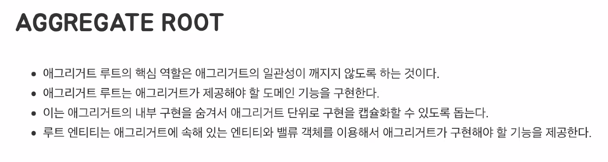

### 도메인 모델링

도메인 모델 패턴은 복잡한 비즈니스 로직을 다루기 위한 것이다.

CRUD 인터페이스 대신 복잡한 상태 전환, 항상 보호해야 하는 규칙과 불변성을 다룬다.

- 팀은 기술적이고 전술적인 모델링의 늪에 빠지길 원치 않았기 대문에 조심할 필요가 있었다. 문장은 팀 전체에 그 의미가 통해야 했다.  
- 요구사항을 완전히 다시 정리하고 다른 항목을 추가하고 더 분명하게 다듬는 일은 ,실제로 일어나는 일이 무엇인지 훨씬 더 정확하게 정의해준다.

### Value Object
- 모든 상태의 조합이 식별자
- 이중에 하나라도 바뀌게 된다면, 그것은 서로다른 객체이다.
- 

#### 생각해보자
- 메모리 관련 
  - 당신이 메모리를 걱정하는것보다, 불변객체가 주는 이점이 더 크다.
  - 그럼에도 불구하고, 메모리가 걱정이 된다면 clientWay 패턴을 도입하는게 낫다
  - 코틀린을 사용한다면, value Class
  - 우리의 몸값은 메모리보다 비싸기 떄문이다.
  - 스레드 안정성
    - 객체가 여러 스레드에서 동시에 
- DTO 
  - 엄밀히 말하면 달라
  - DTO 처럼 왜 사용할 수 있나 ?
  - 여러 계층에 퍼져있어도 값이 변하지 않기 때문

### 가변객체
- 

### 에그리거트
- 모든걸 valueObject 로 만든다 했고 
- 변화 관찰이 필요한 경우 엔티티로 만든다 했다
- 무수히 많은 값객체, 엔티티가 생겨나겠지
- 이것들을 묶어서 관리하고 싶은 욕구가 생긴다.
- 관계 있는 녀석 끼리 뫃아 놓은 것을 에그리 거트 라고 한다.
- 에그리거트 라는 것은 
  - 객체를 뜻하는 것은 아니고
  - 단위도 아니다.
  - 논리적 개념이다.
  - 에그리거트 루트를 말한다
- 왜 묶어서 보냐 ? 
  - 묶어서 보면 좀더 상위에서 묶어놓은 것들 끼리의 관계를 파악 할 수 있어서.
  - 묶는 기준은 동일한 라이프 사이클 끼리 묶는다.
  - 동일한 라이프 사이클 이라 하면 
    - 문장이 어렵다
    - 동일한 라이프 사이클 이라기 보단
    - 불변식 <- 을 관리 한다 라고 표현한다
    - 또는 비즈니스 규칙을 관리하는 녀석이다.
  

### 에그리거트 루트
- 반장
- 

### 왜 Order 가 반장이 되었을까 
- 외부에서 해당 엔티티를 바라보냐 안바라보냐 에 따라서 갈리게 된다.
- 다시 말하자면 선생님이 호출하는 녀석이 반장이 된다.
- 글로벌 식별자 라 불린다 ( 왜냐 ? 외부에 노출되는 식별자 니까 )
- 그외는 로컬 식별자 ( 에그리거트 안에서만 의미가 있음)
- 에그리거트는 전역 식별자

#### 또다른 예시
- 차량이 있다
- 차량엔 바퀴가 있어
- 차량 과 바퀴를 어떻게 식별할까 ?
  - 차량 번호
    - 차량 번호 의 왼쪽 바퀴 또는 오른쪽 바퀴
- 이렇게 외부에서 식별되는 것으로 반장 부반장 여부를 판별한다.

#### 조금더 난이도를 올려서 바퀴가 반장이 될수 있다면
- 상황에 따라서 달라질 수 있다
- 타이어센터 에서
  - 일련번호를 관리하고 있기 때문에 (마켓팅 수단)
  - 3년 혹은 5년 정도 지나면 ? (교체 주기)
  - 바퀴의 일련번호가 굉장히 중요하겠지 ? 
  - 그렇기 때문에 타이어센터 세계에선 루트 엔티티가 될 수 있다.
  - 이게 결국 컨텍스트가 분리 되었다고 볼 수 있다.

#### 어그리커드 일관성이 꺠지지 않도록 해야한다.
- ACID 라고 하는데
- 데이터 베이스를 보장해야 한다
  - 트랜잭션
- 이처럼 애플리케이션 (프로젝트) 레벨에서 보장해주는게
  - 에그리게이트다
- ACID 를 지키는것은 
  - 독립된 단위를 지키는 것이다.

### 도메인 서비스
- 어플리케이션 레벨의 서비스 말구 ? 
- 상태만 없고 행위만 있는 패턴
- 파사드 패턴을 따르고 있는 패턴
- 애플리케이션인데, 실시간으로 판매되고 있는
- 이런 서비스가 많은
  - 도메인 서비스 
- 방파제
  - 도메인 지식이나 도메인 로직이 에플리케이션 으로 나가는걸 막아주는 방파제
- 
### 결제 금액의 계산 로직
- 상품 에그리거트
  - 구매하는 상품의 가격
- 주문은 상품별로 갯수
