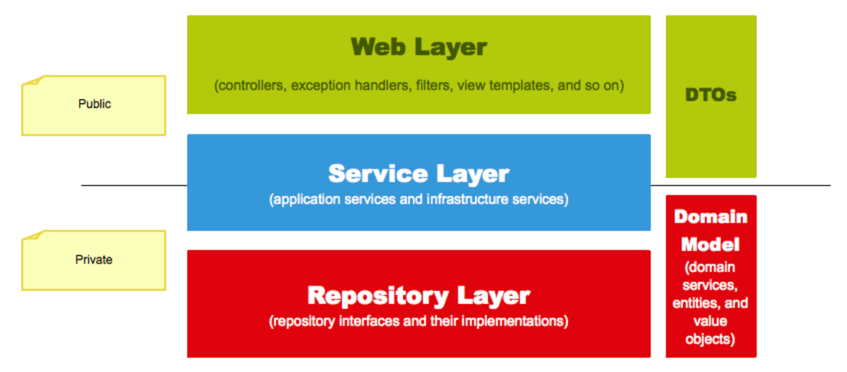

# 도메인 주도 설계 아키텍처

### 계층형 아키텍처
- 비즈니스 로직 수행 어느 곳에 하는 것이 좋을까 ?
  - 도메인 영역 

### 3 티어

### 4 티어


- 표현 영역 또는 UI 영역은 사용자의 요청을 받아 응용 영역에 전달하고 응용 영역의 처리 결과를 다시 사용자에게 보여주는 역할을 한다.
- 응용 영역은 시스템이 사용자에게 제공해야 할 기능을 구현한다.
- 도메인 영역은 도메인 모델을 구현한다.
- 인프라스트럭처 영역은 구현 기술에 대한 것을 다룬다.

### 표현 영역 (controller Layer)
- 사용자가 시스템을 사용할 수 있는 (화면) 흐름을 제공하고 제어
- 사용자가의 요청을 알맞은 응용 서비스에 전달하고 결과를 사용자에게 제공한다.
- 사용자의 세션을 관리한다.

하는일 (역할) : http 요청과 응답 을 받는 일

### 응용 서비스 (service Layer)
- 사용자의 요청을 처리하기 위해 리포지터리로부터 도메인 객체를 구하고, 도메인 객체를 사용한다.
- 로직을 직접 수행하기보다는 도메인 모델에 로직 수행을 위임한다.
- 도메인 객체 간의 실행 흐름을 제어
- 트랜잭션 처리
- 도메인 영역에서 발생시킨 이벤트를 처리

하는 일 : 도메인 모델의 로직 수행을 위임한다 

```java
public Result doSomeFunc(SomeReq req) {
    // 1. 리포지터리에서 애그리거트를 구한다.
    SomeAgg agg = someAggRepository.findById(req.getId());
    checkNull(agg);
    // 2. 애그리거트의 도메인 기능을 실행한다.
    agg.doFunc(req.getValue());
    // 3. 결과를 리턴한다.
    return createSuccessResult(agg);
}
```

### 도메인 서비스
- 도메인 로직이 에플리케이션 서비스로 넘치지 않는 방파제 역할을 한다.
아래 코드는 도메인 서비스 일까 응용 서비스 일까 ?

```java
public class TransactionValidator {
    public boolean isValid(Money amount, Account from, Account to) {
        if (!from.getCurrency().equals(amount.getCurrency())) {
            return false;
        }
        if (!to.getCurrency().equals(amount.getCurrency())) {
            return false;
        }
        if (from.getBalance().isLessThan(amount)) {
            return false;
        }
        if (amount.isGreaterThan(someThreshold)) {
            return false;
        }
        return true;
    }
}
```

- 에그리거트 루트 , 보내는이 , 받는이 
  - Money amount, Account from, Account to
- 계좌와 계좌 간 돈이 왔다갔다 하는 걸 비교하는 코드
- 정책 의 특성을 갖고있다.


### 응용 서비스의 구현

---

### 메서드 파라미터와 값 리턴
- 응용 서비스에 데이터로 전달할 파라미터가 두 개 이상 존재하면 데이터 전달을 위한 별도 클래스를 사용하는 것이 편리하다.
- 응용 서비스는 표현 영역에서 필요한 데이터만 리턴하는 것이 기능 실행 로직의 응집도를 높이는 확실한 방법이다.

### 값 검증
- 값 검증은 표현 영역과 응용 서비스 두 곳에서 모두 수행할 수 있다.
- 원칙적으로 모든 값에 대한 검증은 응용 서비스에서 처리한다.
- 표현 영역에서 필수 값과 값의 형식을 검사하면 실질적으로 응용 서비스는 아이디 중복 여부와 같은 논리적 오류만 검사하면 된다.
- VALUE OBJECT

```java
public class PhoneNumber {
    private final String phoneNumber;

    public PhoneNumber(String phoneNumber) {
        Objects.requireNonNull(phoneNumber, "phoneNumber must not be null"); // 
        var sb = new StringBuilder();
        char ch;
        for (int i = 0; i < phoneNumber.length(); ++i) {
            ch = phoneNumber.charAt(i);
            if (Character.isDigit(ch)) { // 
                sb.append(ch);
            } else if (!Character.isWhitespace(ch) && ch != '(' && ch != ')' && ch != '-' && ch != '.') { // 
                throw new IllegalArgument(phoneNumber + " is not valid");
            }
        }
        if (sb.length() == 0) { // 
            throw new IllegalArgumentException("phoneNumber must not be empty");
        }
        this.phoneNumber = sb.toString();
    }

    @Override
    public String toString() {
        return phoneNumber;
    }
}

```

### JSR 303 validation
```java
public class Customer {
    @NotNull
    private CustomerNo customerNo;

    @NotBlank
    @Size(max = 50)
    private String name;

    @NotNull
    private PostalAddress address;
}
```

### 인터페이스는 어느 시점에 생성하는 것이 적절한가?
[link]:(https://techblog.woowahan.com/2561/)
