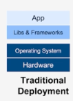
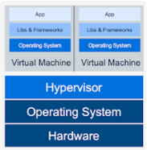
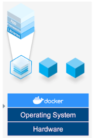
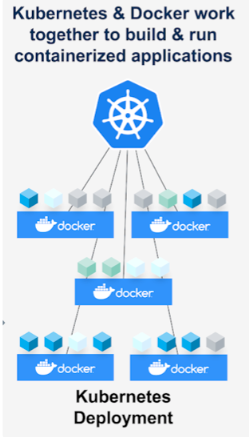

### 어떻게 서비스를 효율적으로 운영할 것이고, 비용 효율성을 ( 컴퓨팅 자원을 최대한 잘 쓸수 있게 ) 높일수 있을까 ?
1. 비용효율성 ( 유틸라이제이션 )
2. 컴퓨터가 가지고있는 cpu 와 memory 자원을 놀게 놔두지 않고 최대한 많이 활용하는것.

- 하나의 컴퓨터가 있다고 가정할때,
- App 1, App2,  App3 가 각각 의 공유하는 자원들에 의해 충돌하는 문제가 발생하자,
- 기업들은 많은 고민을 하게 되었다.
- 어떻게 하면 App1 ~ 3 을 서로 격리시킬지에 대한
- 한서버 안에서 여러서비스들을 최대한 격리된 환경에서 구동하며, 확장 할 수 있을까
- 이러한 고민을 통해 나온것이 “가상머신” 이다.

- 가상머신을 이용한 가상화 방법의 형태.
- 하드웨어 위에 운영체제가 올라가게 되고, 그위에 가상머신들을 관리하는
- 하이퍼 바이저 가 올라가게 된다. 그 위에 Guest Os   들이 올라가게 되고
- 이들은 각각의 독립성을 갖는다. 왼쪽 그림의 Virtual Machine 이 2개가 있는데
- 각각 컴퓨터 1대 라고 생각해도 된다.
- 1Vm 안에 1 App을 올려 배포하게 되면
- 의존성을 갖는 라이브러리나 프레임워크로 인해 두 Guest Os 가 충돌 할 일이 없는것이 장점이다. 그러나 단점 으로 인해 컨테이너 기술이 등장하게 되는데.

- 어떻게 하면 조금더 가상화 기술을 경량화 시키고, 성능을 좀 올리고 , 자원 오버헤드를 줄일 수 있을까 해서 나온게 컨테이너 기술이다.
- Docker 는 컨테이너 엔진 중 하나이다.
- docker 는 유일한 컨테이너 엔진도 아니고 처음에 만들어진 기술도 아니지만 ,메이저 하기 때문에 유명하다.
- 왼쪽 그림을 보면 하드웨어 위에 -> 호스트운영체제가 올라가고 → 도커엔진이 올라가 있는데 도커엔진이 각각의 (컨테이너 = process) 격리 기술들이 추가로 적용이된다.
- 컨테이너 기술은 호스트 운영체제 에서 실행시키는 프로세스 이다 보니까, 성능 효율성이 가상머신 보다 좋아지게 되었으며, 자원 오버헤드도 하드웨어를 에뮬레이팅 한게 아니다 보니 자원효율성도 가상머신 보다 올라가게 되고, 파일 시스템도 격리가 되다 보니 의존성 충돌도 거의 없게 됬다.

- 쿠버네티스는 Container Orchestration System 이라고 보면된다.
- docker 는 container Engine 이라고 했는데, 이는 하나의 서버위에서 컨테이너를 어떻게 관리 할 수 있을까 하는 관리 소프트 웨어 이고,
- Container Orchestration System 은 여러 서버로 구성된, 클러스터 환경에서 컨테이너들을 어떻게 하면 더 잘 관리 할 수 있을까 이런 클러스터 환경에서 컨테이너를 관리하는 소프트웨어 기술이라고 생각하면 된다.

컨테이너 기술의 발전 

 