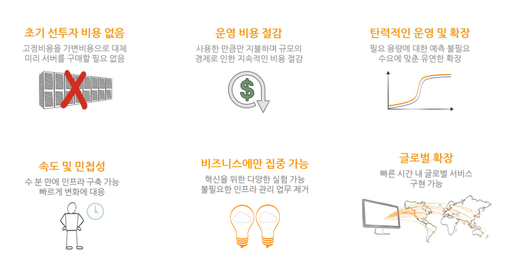

### 클라우드 컴퓨팅이란 ?
- 인터넷(“클라우드”)을 통해 서버, 스토리지, 데이터 베이스, 네트워킹, 소프트웨어, 분석, 인텔리전스 등 의 컴퓨팅 서비스를 제공하는 것
- IT 리소스를 인터넷을 통해 온디맨드로 제공(On- demand)
- 사용한 만큼만 비용을 지불(Pay as you go)
- 사용자가 물리적 데이터 센터와 서버를 구입, 소유 및 유지 관리하지 않음(No Capex)
- 클라우드 공급자로부터 필요에 따라 컴퓨팅 파워, 스토리지, 데이터베이스와 같은 기술 서비스에 액세 스

### 클라우드 컴퓨팅의 이점 1

### 클라우드 컴퓨팅의 이점 2

보안(Security)
- 광범위한 보안 정책 집합,기술및 컨트롤을 제공하여 데이터,앱 및 인프라 를 잠재적인 위협으로부터 보호 안정성(Reliability)
- 클라우드 공급자 네트워크의 여러 중복 사이트에 데이터를 미러 할 수 있으므로 데이터백업,재해복구 및 비즈니스 연속성을 더 쉽게 제공
고가용성(High Availability)
- 클라우드 공급자의 여러 리전, 가용영역, 데이터센터를 활용하여 고가용성을 쉽게 설계 가능
- 고가용성 설계를 통해 다운타임을 최소화하면서 장애를 견딜수있는 아키텍처 설계 가능
- 예를 들어 여러 가용영역(여러 데이터센터)에 Amazon EC2 인스턴스를 배치
탄력성(Elasticity), 확장성(Scalability)
- 더이상 어떤용량이 필요할지 추측할 필요가 없으며 사용자는 리소스용량에 대한 추측을 중지가능
- 사용자는 필요에 따라 컴퓨팅 용량을 프로비저닝하거나 해제가능하며 현재 수요를 처리하는데 필요한 양 의 리소스만 프로비저닝가능 + 수요변화에따라리 소스크기를 조정가능
- 매우 동적인 사용패턴(워크로드)을 지원하기위해 알림기능으로 자동확장 및 축소가능
민첩성(Agility)
- 프로비저닝 시간이 짧은즉시 사용가능한 리소스,확장가능한 컴퓨팅 용량제공
- 새로운 워크로드를 배포하는데 필요한 직원의시간 단축하여 애플리케이션 개발팀의 생산성 향상
- 개발자가IT 리소스를 사용할수 있도록하는데 필요한 시간 단축을 통해 혁신을 지원하는 능력제공
- 새로운 기능을 반복적인 방식으로 신속하게 제공하여 출시 시간을 최소화
- 예를 들어 스타트 업이 빠르게 시장에 출시해야하는 새로운 애플리케이션을 개발 하여 빠르게 클라우드에 배포 및 필요할 때마다 빠르게
조정 가능

### 클라우드 컴퓨팅의 이점 3

#### 사용한 만큼 지불하는 요금제 (Pay-as-you go pricing)
- 장기 계약이 필요하지 않은 종량제 모델을 사용
- 초기 고정 비용/자본 비용(CAPEX)를 변동 비용/가변 비용(OPEX)으로 대체할 수 있도록 하는 온디맨드 기술 서비스 사용
- 큰 자본 지출을 최소화 함으로써 총소유비용(TCO)을 어떻게 줄일수있음

#### 글로벌 도달 (Global Reach, Global FootPrint)
- 지연 시간이 짧은 높은 처리량과 중복성을 가진 네트워크로 연결된 여러 지역으로 구성된 클라우드 인프라를 배포
- 회사의 서비스를 빠르게 글로벌화할 수 있는 능력
- AWS 리전,가용 영역및 엣지 로케이션 네트워크를 통해 전세계 사용자에게 애플리케이션을 배포
- 데이터를 기본 사용자와 가깝게 저장 가능

#### 규모의 경제 (Economy of scale)
- AWS 등의 클라우드 회사에서 높은 구매량으로 인해 변동 비용을 낮출 수 있음
- AWS 클라우드 요금의 지속적인 감소
- 온-프레미스 데이터 센터를 구축하고 유지 관리하는 데 드는 많은 비용을 없애 줌

#### 기타 클라우드 컴퓨팅 이점
- 클라우드 업체에서 인프라를 관리하기에 사용자는 데이터 센터 유지 관리에 돈을 쓰지 않아도 됨
- 데이터센터 인프라는 클라우드 업체에서 관리하기에 사용자는 수익 창출(비즈니스) 활동에 집중할 수 있음
- AWS 관리형 서비스를 활용하면 사용자 관리가 최소화 되므로 AWS 클라우드에서 운영 효율성을 높일 수 있음
- 반복되는 애플리케이션 설치 및 설정을 돕기 위해 클라우드 업체의 엔터프라이즈 지원을 사용하여 효율을 높일 수 있음
