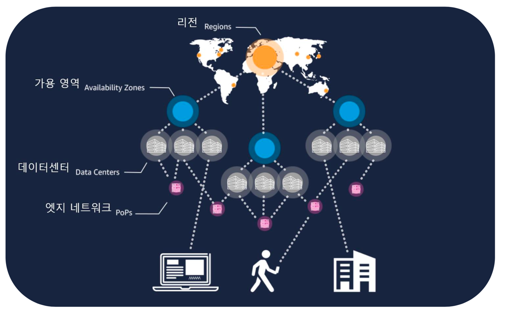
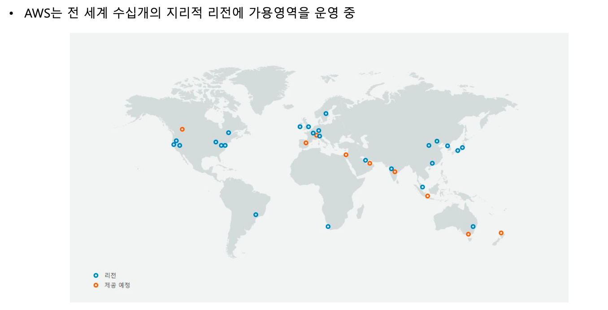
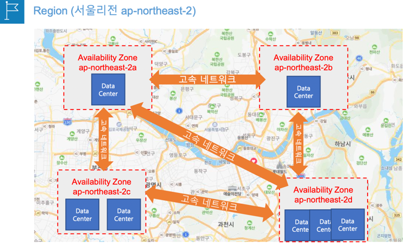
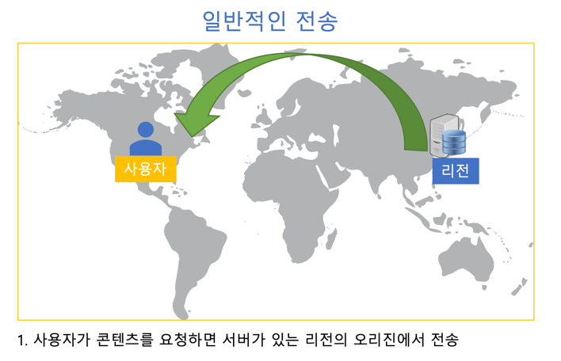
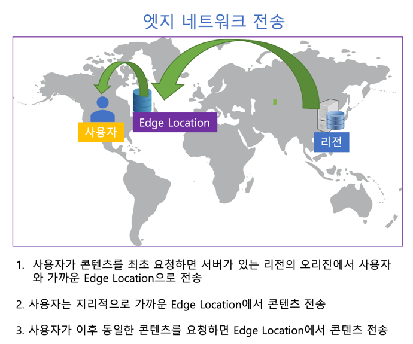

### 글로벌 인프라

---

---

### 리전 (Region)
- 데이터 센터를 클러스터링 하는 물리적 위치 (서울리전, 홍콩리전 등)
    - 클러스터링 이란 "여러대의 컴퓨터를 서로 연결하여 마치 하나의 컴퓨터처럼 사용하는 기술"
- 전세계 주요국가에 위치
- 1개 AWS 리전 = 2개이상의 가용영역으로 구성
- 대부분의 AWS 서비스는 리전을 선택 하여 시작 (예, EC2 서비스)
- 리전을 선택하지 않는 글로벌 서비스도 있음 (예, IAM 서비스)
- 재해복구(DR) 설계 = 2개이상의 리전에 시스템을 배치

### 가용 영역 (Availability Zone – AZ)
- 가용영역 = 하나 이상의 개별 데이터센터
- 1개의 리전은 2개이상의 가용영역으로 구성 (보통 3~4개의 가용영역으로 구성)
- 가용영역끼리는 물리적으로 떨어져 있고 고속 네트워크로 연결됨
- 고가용성 설계 = 다중 AZ (Multi-AZ), 2개이상의 가용영역에 시스템 배치

### 엣지 로케이션
- 엣지 로케이션에 콘텐츠(데이터)를 캐싱하여 사용자에게 더 짧은 지연 시간으로 콘텐츠를 전송
- 글로벌 배포서비스인 AWS CloudFront, Global Accelerator 에서 대표적으로 사용

### 일반적인 전송

### 엣지 네트워크 전송

### 엣지 로케이션(Edge Location)
- 전세계 수백개의 엣지 로케이션을 운영 중
- 엣지로케이션과 AWS 리전, 가용영역끼리는 고속 네트워크로 연결되어 있음

### IAM
- 계정관리 서비스
- AWS 리전과 가용영역에 상관없이 사용 가능
- 리전을 선택 할수 없고, 이유는 글로벌 서비스이기 때문이다. (리전에 속하지 않는 서비스)
