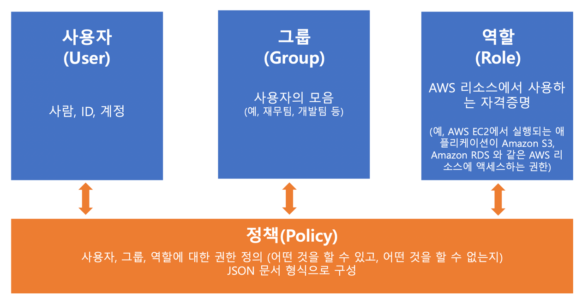
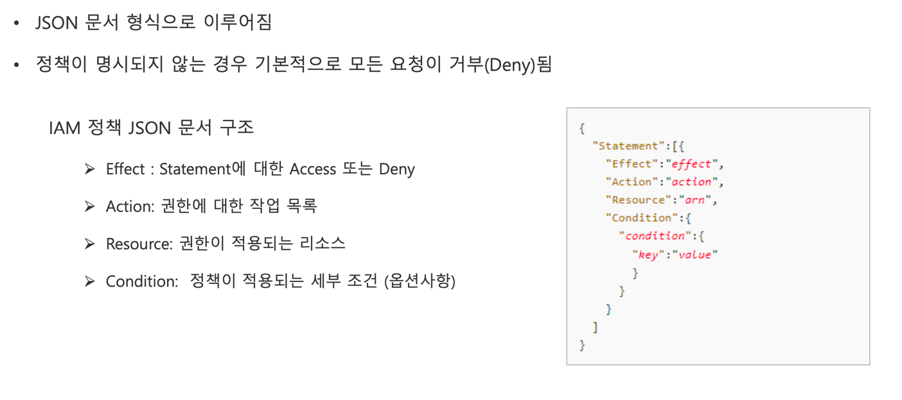

### AWS Identity and Access Management (IAM)

AWS 계정 및 권한관리 서비스
- AWS 서비스와 리소스에 대한 액세스 관리
- 사용자, 그룹, 역할, 정책으로 구성
- 리전에 속하는 서비스가 아닌 글로벌 서비스
- 계정보안강화를위해
- [x] 루트 계정(AWS 회원가입시 만들어지는 계정)은 최초 사용자 계정 생성 이후 가능하면 사용하지 말 것
- [x] 사용자 계정(IAM 계정)으로 서비스를 사용하고 사용자는 필요한 최소한의 권한만 부여(최소권한의 원칙) ✓ 루트계정과 개별 사용자 계정에 강력한 암호 정책과 멀티팩터 인증(MFA) 적용
- [x] 사용자의 암호에 대한 복잡성 요구 사항과 의무 교체 주기를 정의
- [x] 액세스 키(Access Key)는 공유하지 말 것

### IAM 루트 사용자 자격 증명을 요구하는 작업
- 계정설정을변경(계정이름, 이메일주소, 루트 사용자 암호 및 루트 사용자 액세스키). 연락처정보,결제 통화 기본설정 및 리전과 같은 기타 계정 설정에는 루트 사용자 자격 증명이 필요하지 않음
- IAM 사용자 권한을 복원. IAM 관리자가 실수로 권한을 취소하면 루트 사용자로 로그인하여 정책을 편집하고 해당 권한 을 복원
- Billing and Cost Management 콘솔에 대한 IAM 액세스 활성화
- 특정 세금 계산서를 조회
- AWS 계정을 닫음
- AWS 지원 플랜(Support Plan)을 변경하거나 AWS 지원 플랜을 취소
- 예약 인스턴스 마켓플레이스에 판매자로 등록
- MFA (멀티 팩터 인증) Delete 를 활성화하도록 Amazon S3 버킷을 구성
- 잘못된 VPC ID 또는 VPC 엔드포인트 ID가 들어 있는 Amazon S3 버킷 정책을 편집하거나 삭제
- GovCloud 등록

### IAM - 엑세스 관리

### IAM - 정책
#### AWS 리소스에 대한 액세스 권한을 정의한것
- 사용자, 그룹, 역할에 정책을 연결하여 사용
- 가능하면 정책을 개별 사용자에게 직접 부여하지 말고 사용자가 속한 그룹에 권한 부여
- IAM 정책 종류
  - [x] AWS 관리형 정책 : AWS 에서 생성 및 관리하는 정책
  - [x] 고객 관리형 정책 (사용자 지정 정책) : 사용자가 직접 생성 및 관리하는 정책 
  - [x] 인라인 정책 : 사용자, 그룹, 역할에 직접 생성하는 정책
  - [x] 대부분의 경우 관리형 정책을 사용하는 것을 권장

### IAM – 정책 문서 구조

### IAM - 역할
- AWS 리소스에서 사용하는 자격증명
- 특정 AWS 서비스가 다른 AWS 서비스에 액세스 하여 작업을 수행할때 필요한 권한
- 정책을 연결하여 IAM 역할에 작업 수행에 필요한 권한을 부여
- 만일, EC2에서 실행되는 애플리케이션이 AWS S3와 AWS RDS 액세스 권한이 필요할 때 역할 사용

### IAM 자격증명 보고서 (Credentials Report)
- 계정의 모든 사용자와 암호, 액세스 키, MFA 디바이스 등 이들의 자격 증명 상태를 나열하는 자격 증명 보 고서를 생성하고 다운로드
- 보고서내용
  - [x] 사용자의 표시 이름
  - [x] 사용자의 Amazon 리소스 이름(ARN)
  - [x] 사용자가 생성된 날짜 및 시간
  - [x] 사용자의 암호가 마지막으로 사용된 날짜 및 시간
  - [x] 계정에 암호 교체를 요구하는 암호 정책이 있는 경우, 사용자가 새 암호를 설정해야 할 때 이 필드에 날짜 및 시간 
  - [x] 사용자에 대해 멀티 팩터 인증(MFA) 디바이스를 사용하도록 설정되었는지 여부
  - [x] 사용자에게 액세스 키가 있고 액세스 키의 상태가 활성인지 여부
  - [x] 사용자의 액세스 키가 생성되었거나 마지막으로 변경된 날짜 및 시간
  - [x] 사용자의 액세스 키를 AWS API 요청 서명에 마지막으로 사용한 날짜 및 시간
  - [x] 액세스 키가 마지막으로 사용된 AWS 리전
  - [x] 액세스 키로 가장 최근에 액세스한 AWS 제품