EC2 원격접속
### Secure Shell Protocol(SSH)를 사용한 연결
- SSH 프로토콜을 이용해 Linux 인스턴스에 원격으로 연결
- SSH(Secure Shell Protocol)은 보안을 통해 원격으로 접속하기 위한 방식
- 아이디, 패스워드 방식이 아닌 Public Key와 Private Key를 이용해 접속
- 원격 접속 방법: MAC PC의 Terminal, Windows Powershell, Windows Putty 프로그램 등을 사용

### 원격 데스크톱 프로토콜(RDP)를 사용한 연결
  - RDP 프로토콜을 이용해 Windows 인스턴스에 원격으로 연결
  - RDP(Remote Desktop Protocol)은 Windows OS를 원격으로 접속하기 위한 방식
  - 아이디, 패스워드를 이용해 접속
  - 원격접속방법:윈도우의원격데스크톱연결프로그램사용

### EC2 Instance Connect를 사용한 연결
- EC2 Instance Connect를 사용하여 Linux 인스턴스에 연결

### AWS Systems Manager 세션 관리자(Session Manager)를 사용한 연결
- AWS System Manager 기능을 사용하여 Linux, Windows 인스턴스에 연결

### Linux 인스턴스 웹서버 생성 실습
- SSH 원격접속 후 리눅스 명령어 입력을 통한 웹 서버 생성
- 아래 명령어를 입력하기 전에 sudo su를 입력하여 root 계정으로 전환 후 아래 명령어 입력
- 웹 서버 생성 명령어
    - yum update -y
    - yum install httpd -y
    - service httpd start
    - chkconfig httpd on
    - cd /var/www/html
    - echo "Hello Inostudy. $(hostname -f)" > index.html

1. sudo su 명령어를 입력하여 root 계정으로 전환

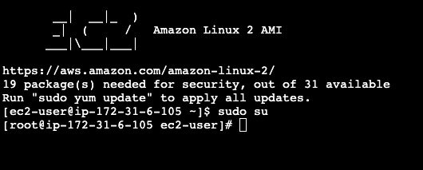
   
2.yum update -y 명령어를 입력하여 리눅스 업데이트

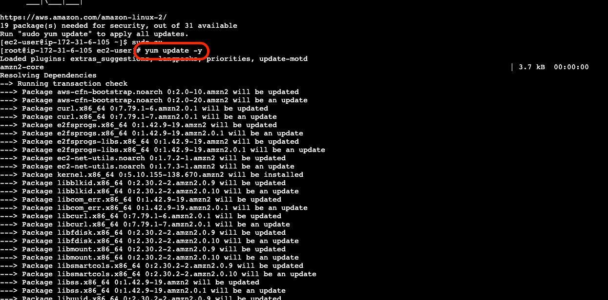

3. yum install httpd -y 명령어를 입력하여 웹서버 설치

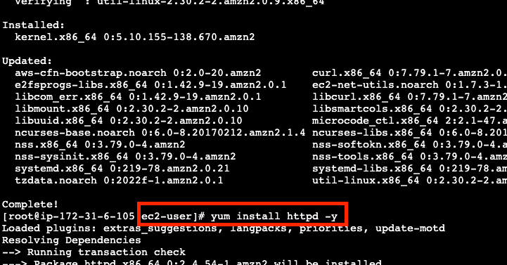

4. service httpd start 명령어를 입력하여 웹서버 시작

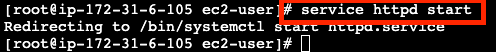

5. chkconfig httpd on 명령어를 입력하여 웹서버 오토스타트 설정

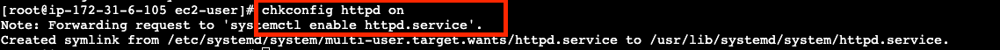

6. cd /var/www/html 명령어를 입력하여 웹서버 디렉토리로 이동

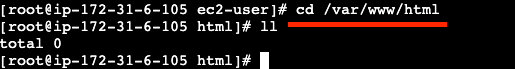

index.html 파일을 생성하여 웹서버에 접속하여 확인 할 수 있지만 현재 ip 주소로 먼저 접근을 해보자.

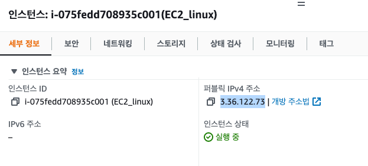
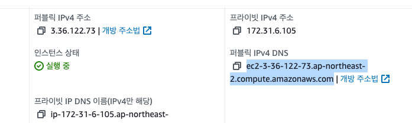

해당 주소를 url 에 입력하거나 이름으로 된 주소를 입력하면, 아파치 웹서버 화면이 나온다.

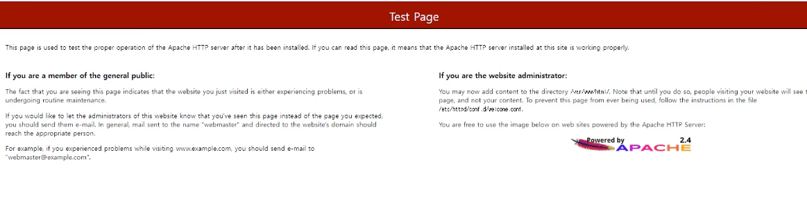

ec2 인스턴스로 연결 화면으로 돌아가서, index.html 파일을 생성하여 재접속 해보자

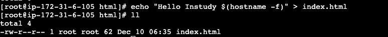

cat 명령어를 통해 index.html 파일을 확인해보면, 아래와 같은 내용이 출력된다

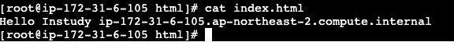

이제 url 에 인스턴스 주소, 혹은 ip 주소로 확인해보자. 아래와 같은 화면이 랜딩되는것을 볼 수 있다.

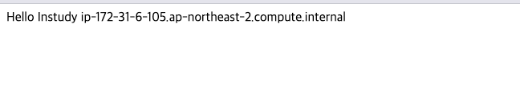

iam 에 접속해서 사용자의 계정을 생성하고 싶다는 니즈가 있다는 가정하에 아래 명령어를 확인해보자.

aws iam list-roles 명령어를 통해 현재 인스턴스에 연결된 역할을 확인

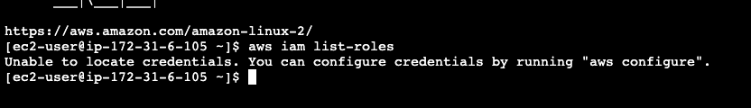

권한이 없다는 의미이다 그리하여, 권한을 추가해 줘보도록 하자.

iam 을 검색해도 되고, 즐겨 찾기로 등록해 놓았다면, 선택 후 역할 버튼 ! -> 역할 만들기를 선택 하자 . 

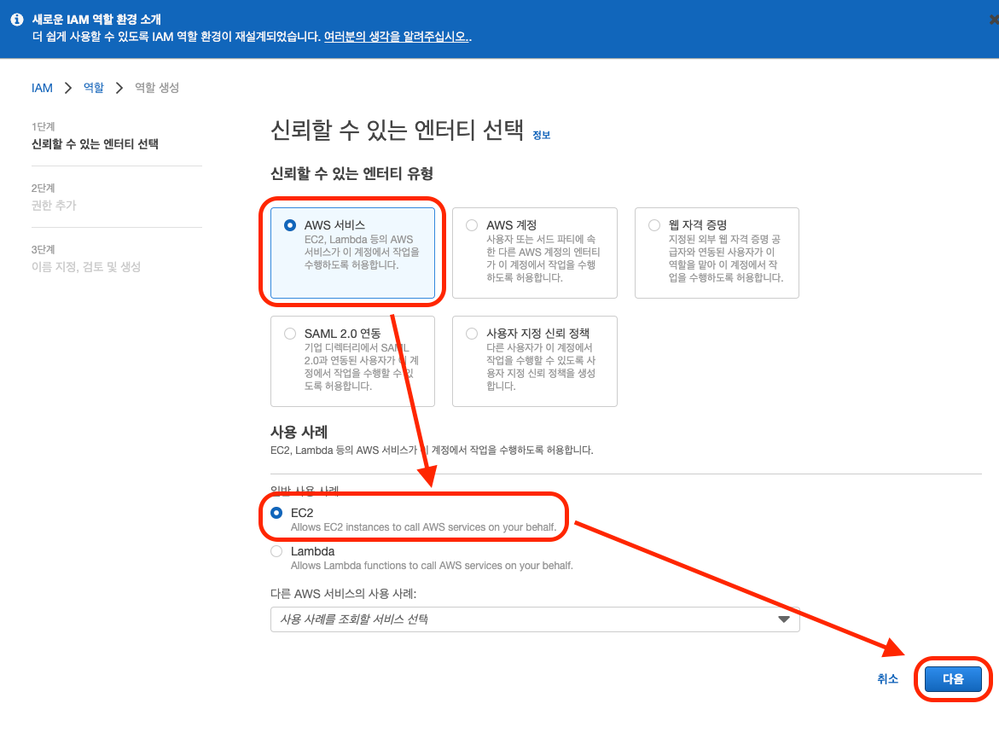

어떤 권한을 선택해 줄까 ? read only 권한을 선택해 주고 다음 버튼을 선택하자.

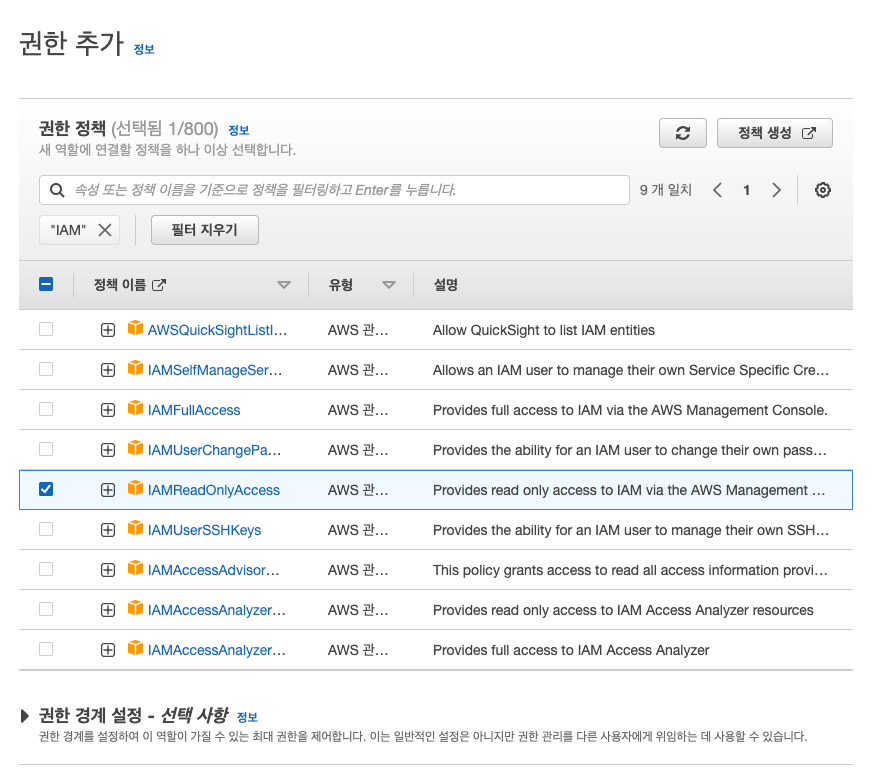

역할이 만들어 진 것을 볼 수 있다.

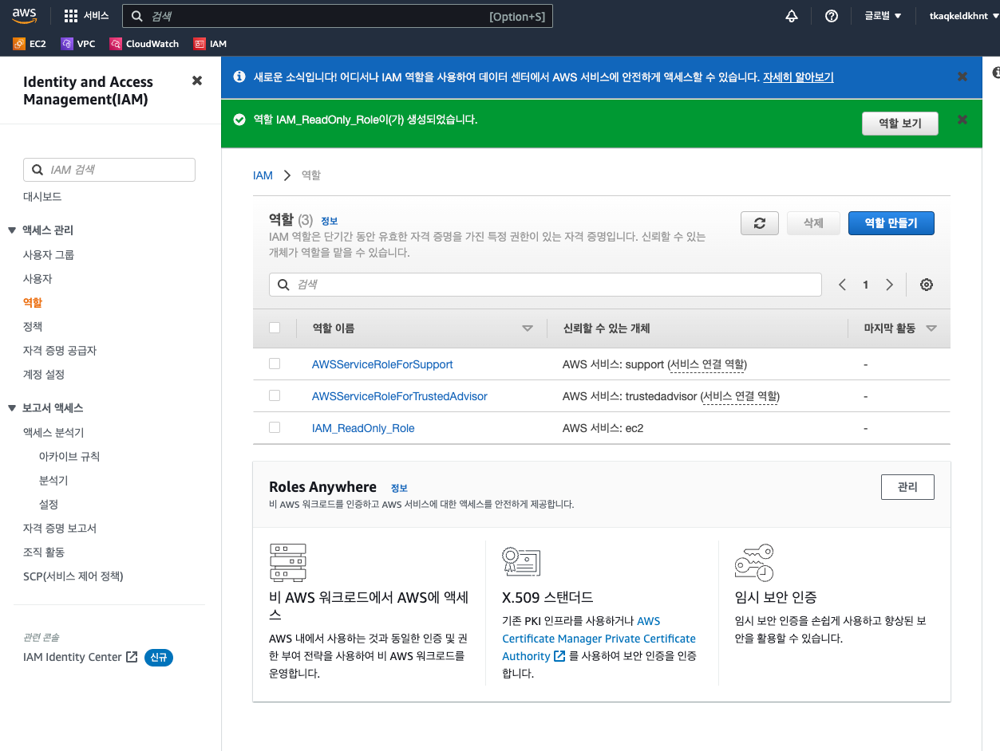

이 역할을 EC2 에 맥여보자.

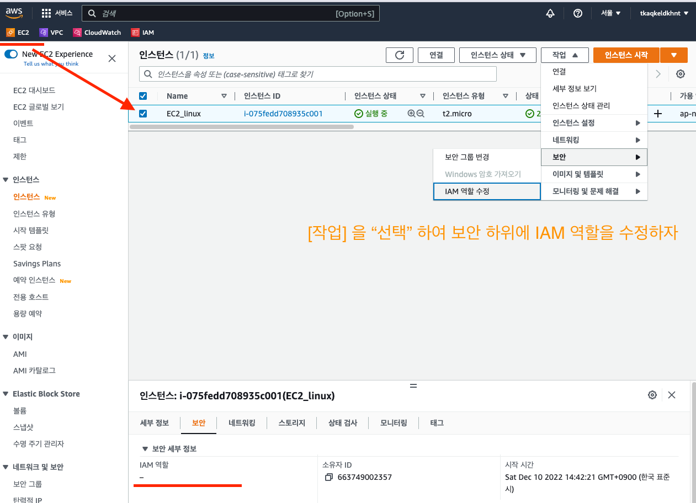

그런다음 방금 전에 생성한 ReadOnly 에 역할을 선택해준다음 [iam 역할 업데이트] 혹은 저장 버튼을 선택해준다.

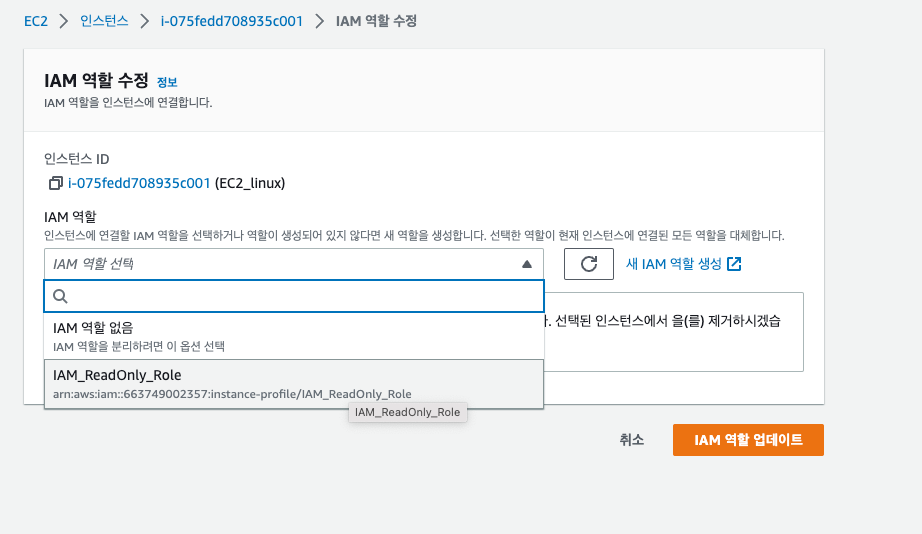

이제 권한이 선택되어 연결이 성공했다는 문구가 노출되는데 ! 

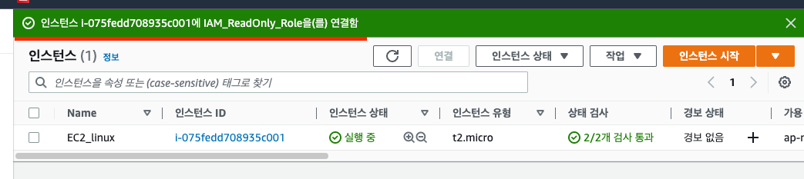

보안 텝을 열어보니 역시 적용이 잘 되었다.

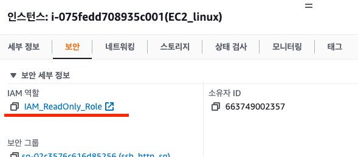

EC2 인스턴스로 돌아가서, 다시 명령어를 입력하여, aws iam list-roles 명령어를 통해 현재 인스턴스에 연결된 역할을 확인 해보자.

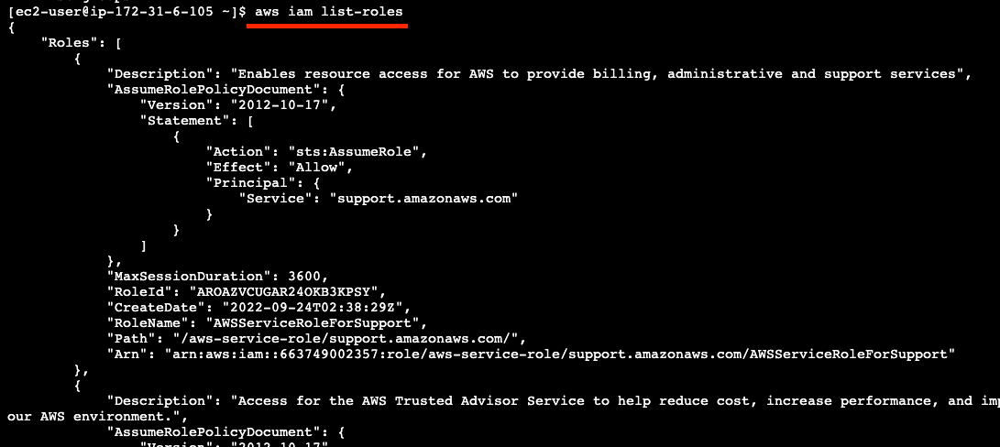

aws iam list-users 명령어를 통해 현재 인스턴스에 연결된 사용자를 확인 해보자.

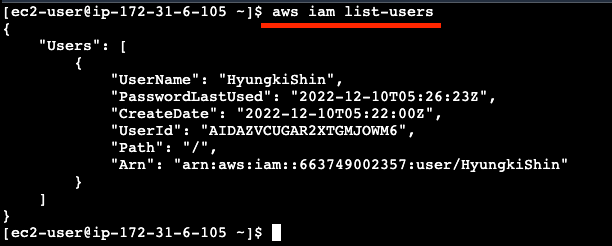

