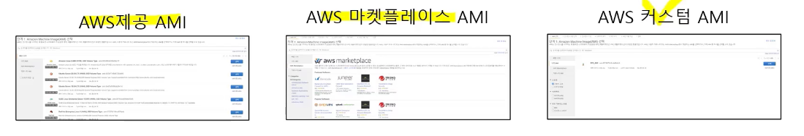
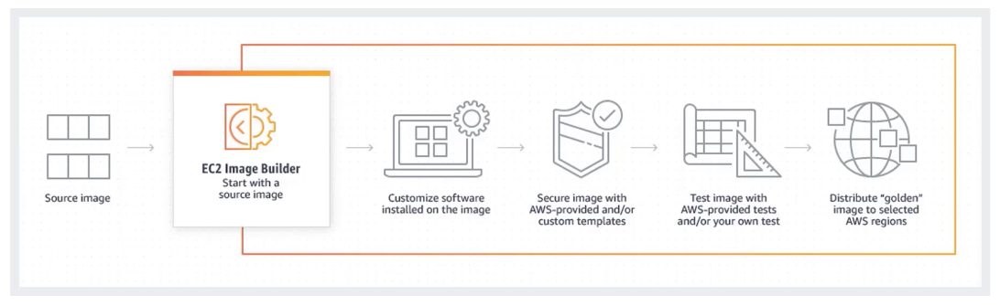
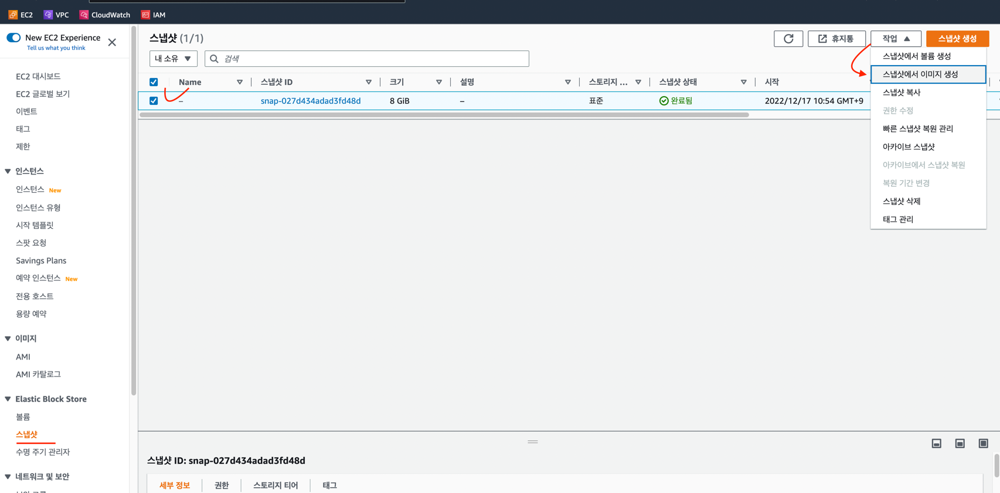
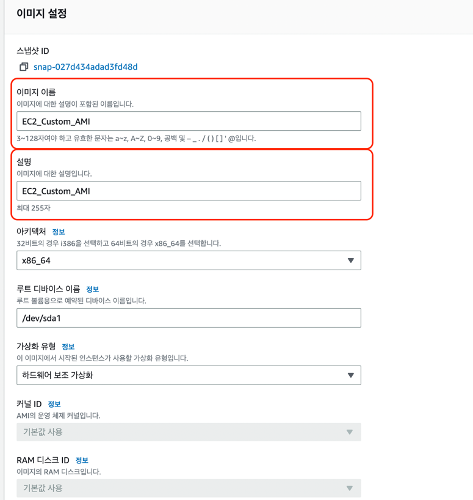
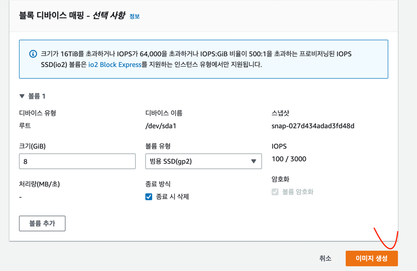
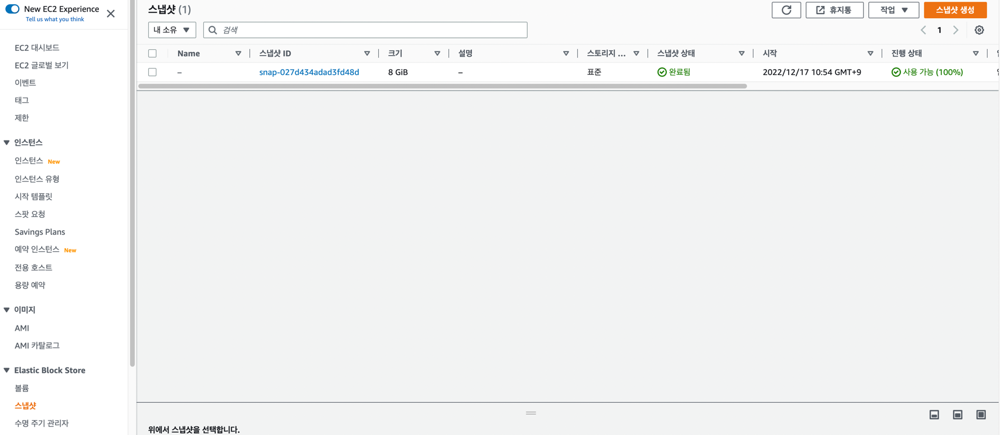
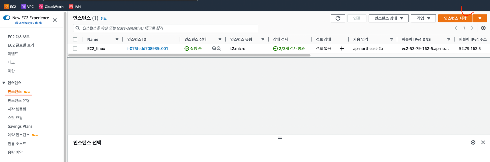
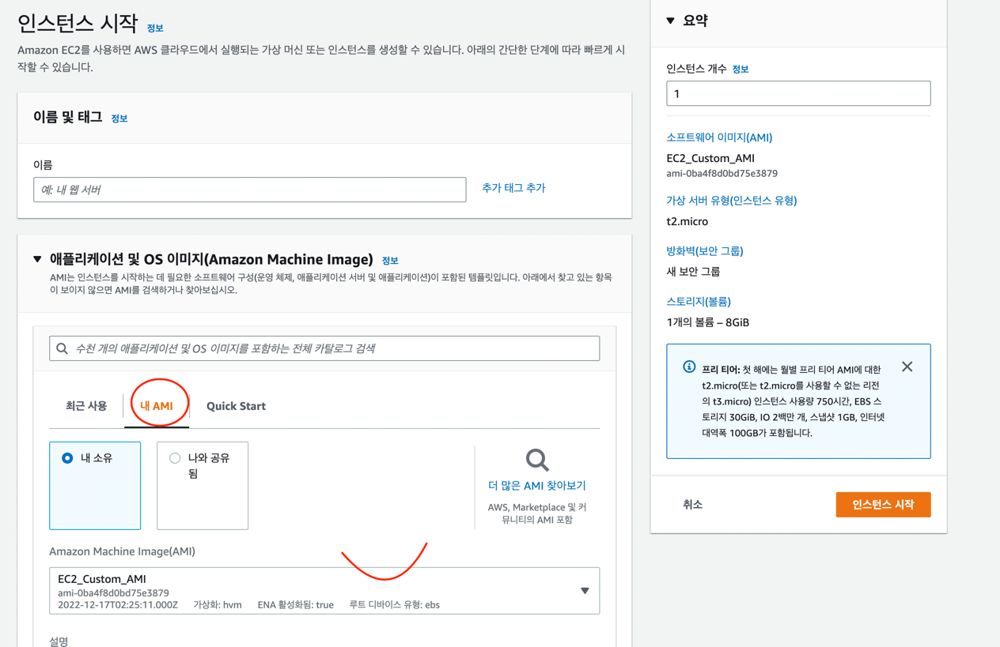
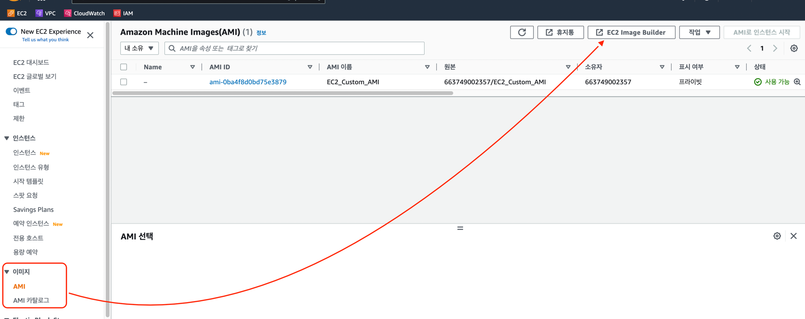
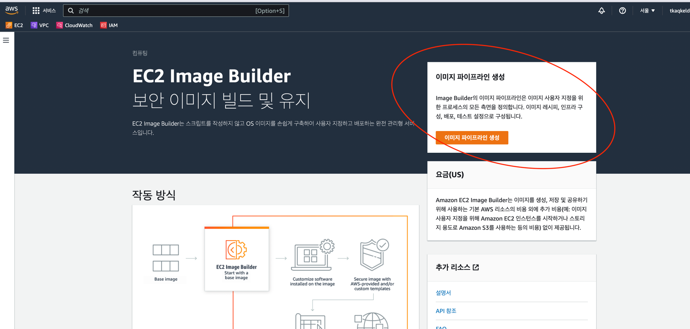

### Amazon Machine Image (AMI) & EC2 Image Builder
- Amazon Machine Image (AMI)는 EC2 인스턴스를 생성하기 위한 템플릿이다.
- OS 나 애플리케이션, 서버 프로그램 설정 등이 미리 구성된 이미지
- EC2 인스턴스를 시작하는데 AMI 사용하여 EC2 시작 시 OS 설치나 서버 소프트웨어 설정 등을 별도로 할 필요가 없음.
- AMI 3가지 유형

- 운영중인 EC2 인스턴스를 커스텀 AMI 로 만들어서 동일한 환경으로 구성된 EC2 를 빠르게 시작 가능

### EC2 Image Builder 
- Amazon EC2 및 온프레미스에서 사용할 Linux 또는 Windows 이미지의 생성, 유지 관리, 검증, 공유 및 배포를 간소화 하는 서비스
- 소프트웨어 업데이트가 제공되면 일정에 따라 EC2 AMI 등의 새 이미지를 생성하고 테스트 한 후 AWS 리전으로 배포 가능

### 스냅샷 을 이미지로 

### 이제 커스텀 이미지 AMI 로 시작할 준비가 되었다.

방금 만들어준 스냅샷 이미지를 EC2 를 생성할때 적용해보자.

1. 먼저 인스턴스 탭으로 들어와서 인스턴스 시작을 선택한다.

2. 인스턴스 시작을 선택하면 우리가 스냅샷을 이미지로 만든 AMI 로 인스턴스를 생성 할 수 있다.

### 이미지 생성및 유지관리 배포를 간소화 하는 서비스가 EC2 Image Builder 이다.

