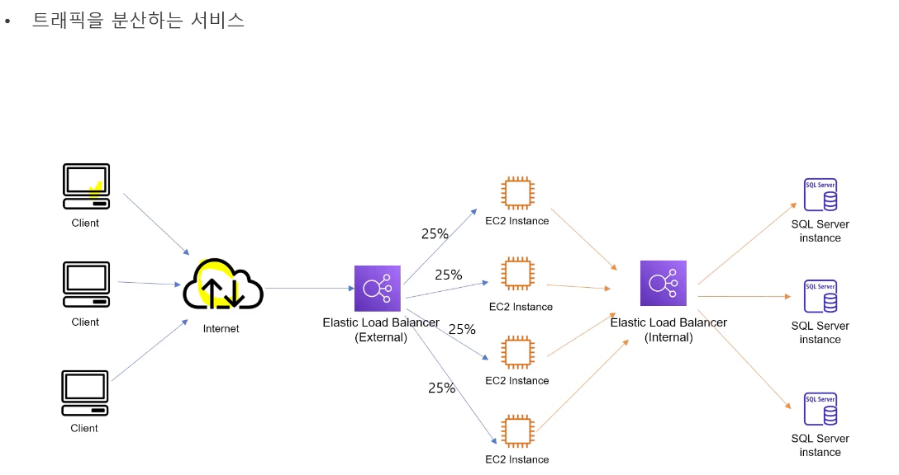
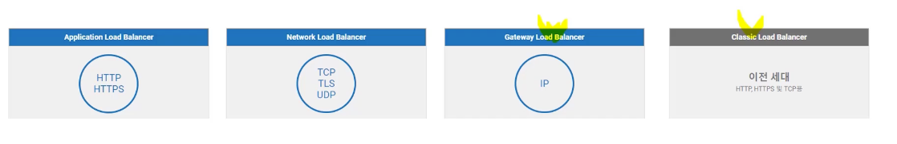
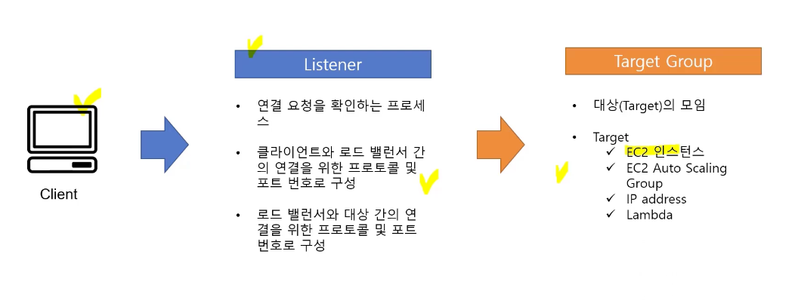

# Load Balancer 개요

- EC2 인스턴스, 컨테이너, IP 주소 등 여러 대상으로 자동으로 분산 가능
- 비정상 대상을 감지하면, 해당 대상으로 트래픽 라우팅을 중단하고 대상이 다시 정상으로 감지되면 트래픽을 해당 대상으로 다시 라우팅.

### Load Balancer 종류

### Application Load Balancer
- Layer 7 에서 동작
- HTTP/HTTPS
- HTTP Header Content 를 사용해 라우팅 요청 처리
- 웹 애플리케이션, 서비스에 적합

### Network Load Balancer
- Layer 4 에서 동작
- TCP/UDP/TLS
- Protocol, Port Number 를 사용해 라우팅 요청 처리
- 수백만의 대용량 트래픽 처리에 적합 (게임에서 사용)

### Gateway Load Balancer 
- Layer 3, Layer 4 에서 동작
- GENEVE protocol 을 사용하여 encapsulation 트래픽 전송
- TransParency 한 네트워크 게이트웨이를 제공하므로 방화벽, IPS, IDS 등의 원본 패킷의 데이터가 중요한 가상 어플라이언스에 적합

### Classic Load Balancer
- Layer 4, Layer 7 에서 동작
- HTTP/HTTPS/TCP/TLS
- 이전 세대 EC2-Classic 네트워크에서 사

### Elastic Load Balancer 구성
