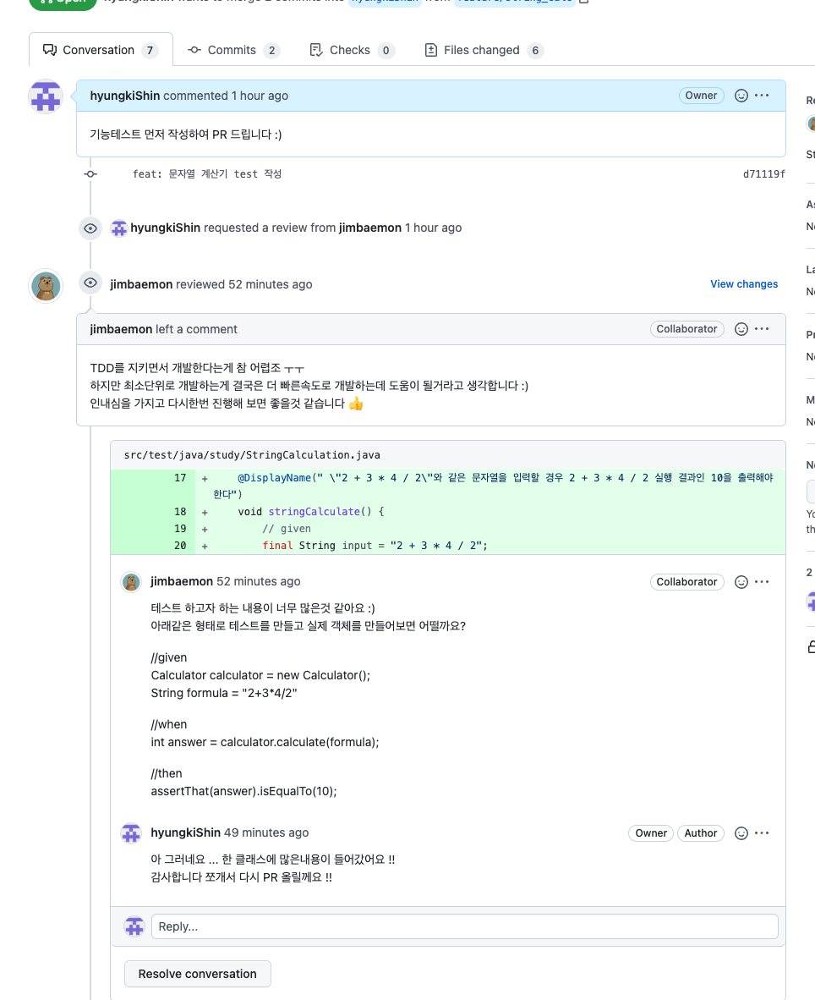
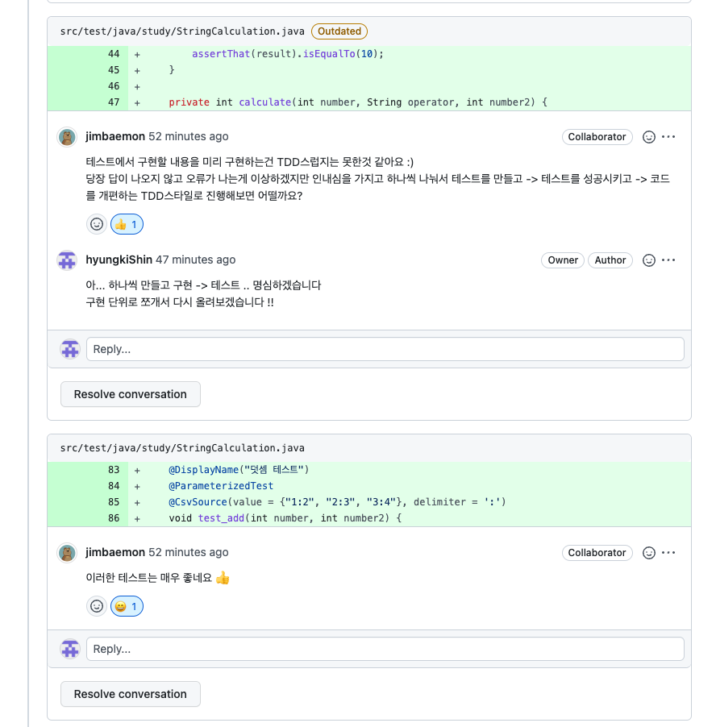
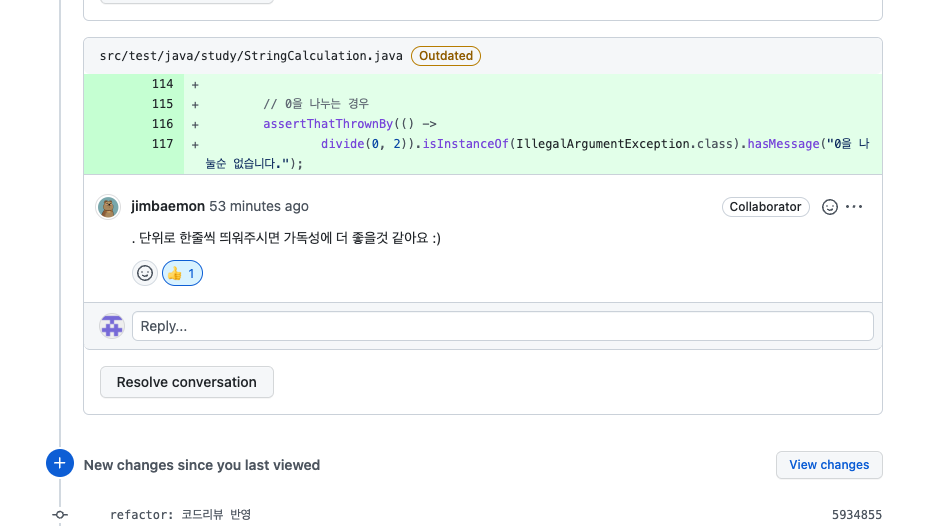

### bdd 방식으로 구현

- tdd 가 생활화 되지 않아, 구현한 코드
```java
package study;

import org.junit.jupiter.api.DisplayName;
import org.junit.jupiter.api.Test;
import org.junit.jupiter.params.ParameterizedTest;
import org.junit.jupiter.params.provider.CsvSource;

import java.util.ArrayList;

import static org.assertj.core.api.Assertions.assertThat;
import static org.assertj.core.api.Assertions.assertThatThrownBy;

class StringCalculation {


    @Test
    @DisplayName(" \"2 + 3 * 4 / 2\"와 같은 문자열을 입력할 경우 2 + 3 * 4 / 2 실행 결과인 10을 출력해야 한다")
    void stringCalculate() {
        // given
        final String input = "2 + 3 * 4 / 2";

        final String[] parseString = input.split(" ");

        final ArrayList<String> operator = new ArrayList<>();

        final ArrayList<Integer> numbers = new ArrayList<>();

        // when
        for (final String s : parseString) {
            if (s.equals("+") || s.equals("-") || s.equals("*") || s.equals("/")) {
                operator.add(s);
            } else {
                numbers.add(Integer.parseInt(s));
            }
        }

        Integer result = numbers.get(0);

        for (int i = 0; i < operator.size(); i++) {
            result = calculate(result, operator.get(i), numbers.get(i + 1));
        }

        // then
        assertThat(result).isEqualTo(10);
    }

    private int calculate(int number, String operator, int number2) {

        switch (operator) {
            case "+":
                return add(number, number2);
            case "-":
                return subtract(number, number2);
            case "*":
                return multiply(number, number2);
            case "/":
                return divide(number, number2);
            default:
                throw new IllegalArgumentException("사칙연산 기호가 아닙니다.");
        }
    }

    private static int add(int number, int number2) {
        return number + number2;
    }

    private static int subtract(int number, int number2) {
        return number - number2;
    }

    private static int multiply(int number, int number2) {
        return number * number2;
    }

    private static int divide(int number, int number2) {
        if (number == 0) {
            throw new IllegalArgumentException("0을 나눌순 없습니다.");
        }
        return number / number2;
    }


    @DisplayName("덧셈 테스트")
    @ParameterizedTest
    @CsvSource(value = {"1:2", "2:3", "3:4"}, delimiter = ':')
    void test_add(int number, int number2) {
        // given & when & then
        assertThat(add(number, 1)).isEqualTo(number2);
    }

    @DisplayName("뺄셈 테스트")
    @ParameterizedTest
    @CsvSource(value = {"1:0", "2:1", "3:2"}, delimiter = ':')
    void test_subtract(int number, int number2) {
        // given & when & then
        assertThat(subtract(number, 1)).isEqualTo(number2);
    }

    @DisplayName("곱셈 테스트")
    @ParameterizedTest
    @CsvSource(value = {"1:2", "2:4", "3:6"}, delimiter = ':')
    void test_multiply(int number, int number2) {
        // given & when & then
        assertThat(multiply(number, 2)).isEqualTo(number2);
    }

    @DisplayName("나눗셈 테스트")
    @Test
    void test_divide() {
        // given & when & then

        // 일반적인 나눗셈 테스트
        assertThat(divide(2, 2)).isEqualTo(1);

        // 0을 나누는 경우
        assertThatThrownBy(() ->
                divide(0, 2)).isInstanceOf(IllegalArgumentException.class).hasMessage("0을 나눌순 없습니다.");

    }
}
```

---

### refactor 이후




### Calculate.class

--- calculate.class 는 계산만 담당
```java

public class Calculator {

    private String[] input;

    public Calculator(final String[] input) {
        this.input = input;
    }

    public int calculate() {
        int result = Integer.parseInt(input[0]);

        for (int i = 1; i < input.length; i += 2) {
            result = Operator.of(input[i]).operate(result, Integer.parseInt(input[i + 1]));
        }

        return result;
    }

}
```

### Formula.class
- Formula.class 는 문자열을 받아 파싱과 validator 만 담당

```java
public class Formula {

    private static final String DELIMITER = " ";

    public static String[] split(String input) {
        if (validator(input)) {
            throw new IllegalArgumentException("입력값이 null 이거나 빈 공백 문자입니다.");
        }
        return input.split(DELIMITER);
    }

    private static boolean validator(String input) {
        return input == null || input.isEmpty() || input.startsWith(DELIMITER);
    }
}
```

### Operator.class
- Operator.class 는 파싱된 문자열을 받아 계산 부분을 담당

```java
public enum Operator {
    PLUS("+", (first, second) -> first + second),
    MINUS("-", (first, second) -> first - second),
    MULTIPLY("*", (first, second) -> first * second),
    DIVIDE("/", (first, second) -> {
        if (second == 0) throw new IllegalArgumentException("0으로 나눌 수 없습니다.");
        return first / second;
    });

    private String symbol;

    private BiFunction<Integer, Integer, Integer> operation;

    Operator(String symbol, BiFunction<Integer, Integer, Integer> operation) {
        this.symbol = symbol;
        this.operation = operation;
    }

    // 캐싱해서 순회 피하기
    private static final Map<String, Operator> SYMBOL_MAP = new HashMap<>();

    static {
        for (Operator oper : values()) {
            SYMBOL_MAP.put(oper.symbol, oper);
        }
    }

    public static Operator of(final String param) {
        if (SYMBOL_MAP.containsKey(param) == false) {
            throw new IllegalArgumentException("사칙연산 기호가 아닙니다.");
        }
        return SYMBOL_MAP.get(param);

    }

    public int operate(int first, int second) {
        return operation.apply(first, second);
    }

}
```

### 느낀점
- 뭔가 처음엔 잘못된 tdd 방식을 진행했던것 같다.
- 기능 테스트를 먼저 끝내야겠다는 유혹이 test.class 에 몽땅 때려넣은후 -> class 를 만들어 나가는게 아니라,
- 머릿속에 구상해 놓은 구현방식을 test 파일에 옮겨 구현후 -> class 를 만들어 나가면서 test 활동을 하는것이 핵심인것 같다.


