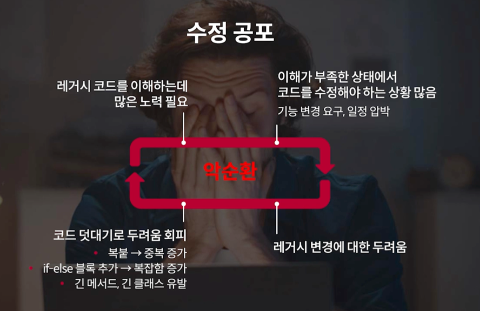
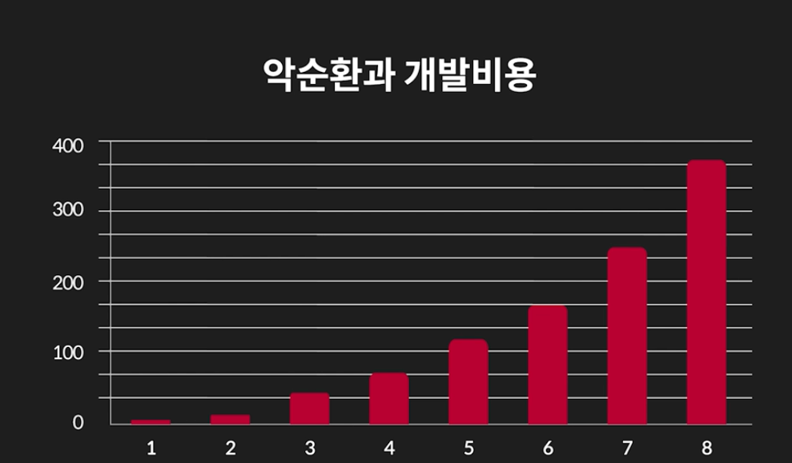

### 레거시 코드
- 몇 가지 정의 
  - 오래되었지만 여전히 사용되는 것
  - 테스트가 없는 코드
  - 모든 코드가 레거시
- 레거시에 대한 느낌
  - 하기 싫음, 부담됨
- 월급 원천

### 레거시의 흔한 특징
- 긴 메서드, 긴 클래스
- 복잡한 코드
- 이상한 이름
- 많은 중복
- 테스트 없음

### 악순환 줄이기
- [x] 악순환을 줄이려면 코드 변경 비용을 낮춰야함
- [x] 변경 비용을 낮추려면 변경하기 쉬운 구조로 점진적으로 리팩토링 해야함
- [x] 리팩토링해도 이전과 동일하게 동작해야함
- [x] 이전과 동일하게 동작하는지 확인할 수 있는 테스트가 필요함
- [x] 테스트를 만들려면 기능이 어떻게 동작하는지 분석해야 함
- [x] 악순환을 줄이려면 레거시를 분석하고 테스트를 만들고 리팩토링 해야 함
