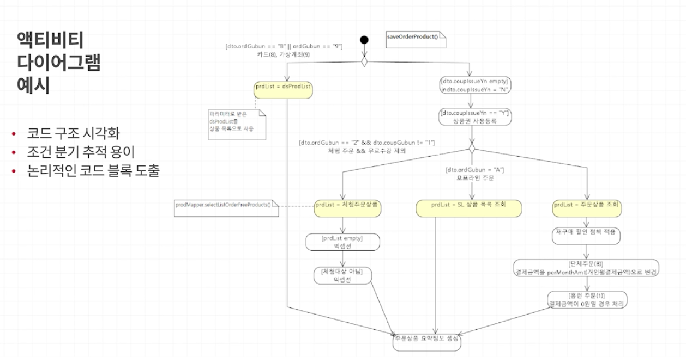
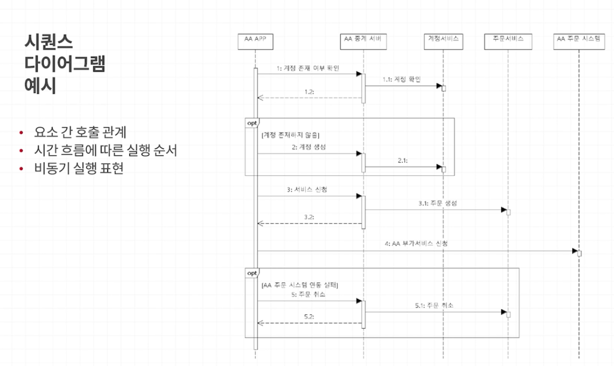
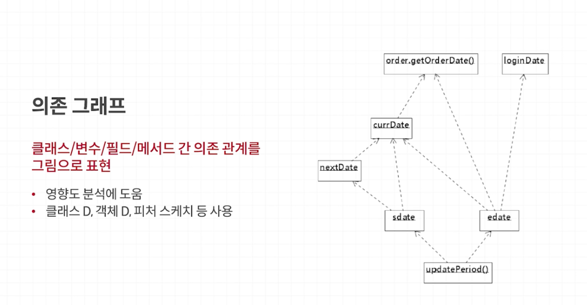

### 한계
- 코드 전반을 머릿속에 보관하기 어려움
- 모니터로 긴 코드를 보는것도 어려움
- 코드를 이해하기 위한 보조 수단 필요

### 코드 분석에 도움이 되는 보조 수단
- 코드 시각화 
- 코드 출력 + 형광펜
- 함께 코드 보기
- 스크래치 리펙토링

### 코드 시각화
- 다이어그램을 사용해서 코드 흐름을 시각화
- 실행 흐름 이해에 많은 도움을 줘
---
시각화를 위한 몇 가지 표기법
- 액티비티 다이어그램: 단계적인 코드 실행 흐름
- 시퀀스 다이어그램: 구성 요소간 연동 흐름
- 의존/호출 관계 그래프: 구조와 영향도 분석

### 액티비티 다이어그램 예시

### 시퀀스 다이어그램 예시

### 의존 그래프

