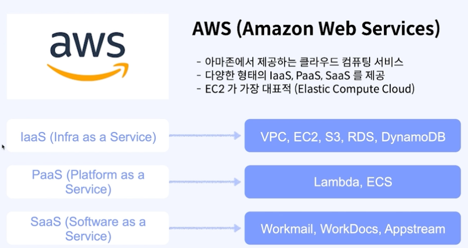
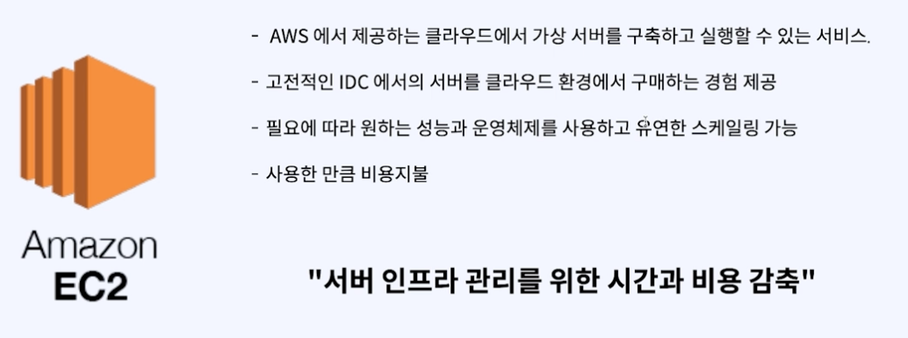
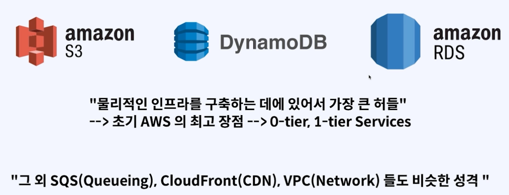

# 예전 부터 있었다면서 ? 

`많은 불편함 들이 있었고, 많은 사람들이 불편함을 호소했지만 그렇다고 마법같은 해결 방법이 있는게 아니였어`

- 일반적으로, Cloud 라는 개념 자체가 별로 없었어
- IDC 를 사용하는게 너무나 당연한 문화이고, 많은 SI 업체들이 이렇게 사용했어
- 모놀리식 환경에성의 개발 노하우들을 쉽게 버리고, 새로운 것을 받아들이기 쉽지 않았어
- 무엇보다, 많은 서버들에 다양한 서비스들을 배포한다 라는 개념은 굉장한 리소스를 수반한다라고 생각했어.

새로운 서비스를 개발하는데 제일큰 리소스가 뭘까 ?
> 인프라, 서버 를 관리하는 리소스가 제일크다

### 그런데, AWS 가 등장하면서 많은게 달라졌어.

- 인프라를 서비스로 제공하겠다 -> Iaas
- 플랫폼 을 서비스로 제공하겠다 -> Paas
- 솔루션을 서비스로 제공하겠다 -> Saas

### EC2

### 그외 것들

