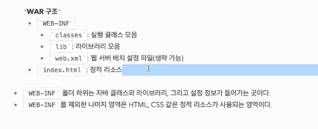

### 와르 (WAR) 란 ?
- 웹 어플리케이션 아카이브 (Web Application Archive)
- 웹 어플리케이션을 압축한 파일
- JAR 파일의 확장판
- JAR 파일과 마찬가지로 자바 클래스, 리소스, 설정 파일을 포함
- WAR 파일은 웹 어플리케이션을 실행하는데 필요한 모든 것을 가지고 있다.

### 구조 

### 톰캣에 배포
- 톰캣에 war 파일을 배포하면 톰캣이 알아서 war 파일을 풀어서 실행한다.
- 톰캣이 알아서 war 파일을 풀어서 실행한다.