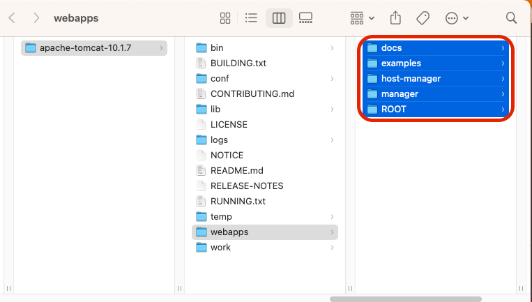
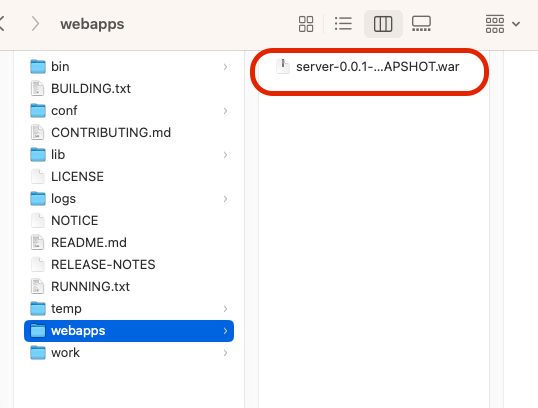
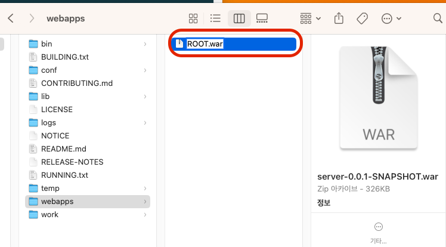
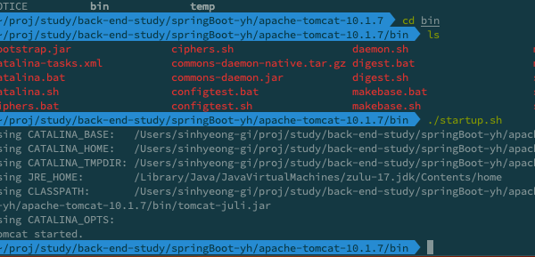

### 와르 (WAR) 란 ?
- 웹 어플리케이션 아카이브 (Web Application Archive)
- 웹 어플리케이션을 압축한 파일
- JAR 파일의 확장판
- JAR 파일과 마찬가지로 자바 클래스, 리소스, 설정 파일을 포함
- WAR 파일은 웹 어플리케이션을 실행하는데 필요한 모든 것을 가지고 있다.

### 구조 

### 톰캣에 배포
- 톰캣에 war 파일을 배포하면 톰캣이 알아서 war 파일을 풀어서 실행한다.
- 톰캣이 알아서 war 파일을 풀어서 실행한다.

### 먼저 webapps 몽땅 지워주기 (default 로 생성되어있다.)
### 1. 먼저 예제용으로 생성되어있던 친구들 삭제. 

### 2. war 로 묶어 놓았던 build 된 war 파일을 webapps 에 복사 붙여넣기

### 3. 이름을 바꿔주기 -> ROOT.war

### 4. 그다음 bin 폴더로 이동해서 sh 실행
