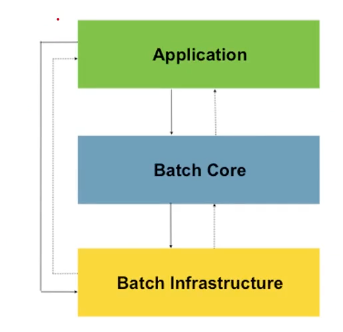

# 스프링 배치 탄생 배경

- 자바 기반 표준 배치 기술 부재
  - 표준의 기술들 (JSR : Java Specification Request [java 스펙 정의서]) 
    - IO 기술
    - Network 기술 (TCP/UDP)
    - Thread 기술
    - JDBC
- 배치 처리에서 요구하는 재사용 가능한 자바 기반 배치 아키텍처 표준의 필요성이 대두 되었다
  - 즉, 기본적으로 batch 에 대해서 제공 되고 있는 기술이 없었고, 이게 스프링 배치가 탄생된데, 맞물려있었다.

스프링 배치는 SpringSource (현재는 Pivotal) 와 Accenture 가 공동으로 개발한 오픈소스 프로젝트이다.
스프링 제단에서 단독으로 만든게 아니였고, Accenture 라는 회사가 원 소스를 개발을 했다.  

- Accenture - 배치 아키텍처를 구현하면서 쌓은 기술적인 경험과 노하우
- SpringSource - 깊이 있는 기술적 기반과 스프링의 프로그래밍 모델

Accenture 는 이전에 소유했던 배치 처리 아키텍처 프레임워크를 spring Batch 프로젝트에 기증함.

# 배치 핵심 패턴
- Read - 데이터베이스, 파일, 큐에서 다량의 데이터를 조회한다.
- Process - 특정 방법으로 데이터를 가공한다.
- Write - 데이터를 수정된 양식으로 다시 저장한다.

> 배치 핵심패턴의 Read, Process, Write 는 DB 의 ETL 과 유사하다.
> ETL : Extract (추출하다), Transform (변형하다), Load (적재하다)
> 읽고 -> 변형하고 -> 적재하는것

# 배치 시나리오
- 배치 프로세스를 주기적으로 커밋
- 동시 다발적인 Job 의 배치 처리, 대용량 병렬 처리
- 실패 후 수동 또는 스케줄링에 의한 재시작
- 의존관계가 있는 step 여러 개를 순차적으로 처리
- 조건적 Flow 구성을 통한 체계적이고 유연한 배치 모델 구성
- 반복, 재시도, Skip 처리

# 아키텍처

- Application Layer
  - 스프링 배치 프레임워크를 통해 개발자가 만든 모든 배치 Job 과 커스텀 코드를 포함
  - 개발자는 업무로직의 구현에만 집중하고 공통적인 기반기술은 프레임웍이 담당하게 한다
- Batch Core Layer
  - Job 을 실행, 모니터링, 관리하는 API 로 구성되어 있다
  - JobLauncher, Job, Step, Flow 등이 속한다
- Batch Infrastructure Layer
  - Application, Core 모두 공통 Infrastructure 위에서 빌드한다
  - Job 실행의 흐름과 처리를 위한 틀을 제공함
  - Reader, Processor Writer, Skip, Retry 등이 속한다
