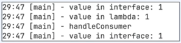
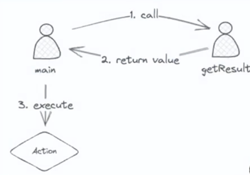
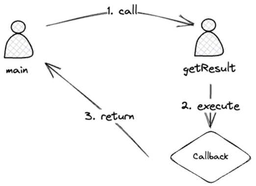

### Caller 와 Callee
- 함수가 다른 함수를 호출하는 상황
- Caller: 호출하는 함수
- Callee: 호출되는 함수
- 말 그대로 Caller 는 팀장님 나는 Callee . 이런 느낌이다.

### 함수형 인터페이스
- 함수형 프로그래밍을 지원하기 위해 java 8 부터 도입
- 1개의 추상 메서드를 갖고 있는 인터페이스
- 함수를 1급 객체로 사용할 수 있다.
  - 함수를 변수에 할당하거나 인자로 전달하고 반환값으로 사용가능
- Function, Consumer, Supplier, Runnable 등
- 함수형 인터페이스를 구현한 익명 클래스를 람다식으로 변경가능

### 함수형 인터페이스를 이해하기 위한 코드
```java

public static void main(String[] args) {
    var consumer = getConsumer();
    consumer.accept(1);
    
    var consumerAsLamda = getConsumerAsLamda();
    consumerAsLamda.accept(1);
    
    handleConsumer(consumer);
}

// 인터페이스 이기 때문에 익명 클래스를 만들수 있다.
public static Consumer<Integer> getConsumer() {
        // 일급 객체 이기 때문에 반환값으로 사용될 수 있다.
        Consumer<Integer> returnValue = new Consumer<Integer>(){
          @Override
          public void accept(Integer integer){
              log.info("value in interface: {}",integer);
          }
        };
        return returnValue;
    }

public static Consumer<Integer> getConsumerAsLamda() {
    // 인자가 있고 동작 으로만 이루어진 함수를 람다식으로 표현할 수 있다.
    return integer -> log.info("value in interface: {}",integer);
}

// 함수형 인터페이스를 인자로 넘기는것도 가능하다.
public static void handleConsumer(Consumer<Integer> consumer) {
    log.info("handleConsumer");
    consumer.accept(1);
}
```

### 실행결과 
- 
- 주목할 점은 모두 메인 스레드에서 실행 되었다는점 이다.
- 실행 하는 쓰레드에서 함수형 인터페이스가 동작하게 되는게 핵심이고 이게 callback 과 연관이 있다.

### 준비 운동을 마쳤으니, 본격적인 모델로 동기와 비동기를 나눠보자.
```text
@Slf4j
public class A {
    public static void main(String[] args) {
        log.info("main start");
        var result = getResult();
        var nextValue = result + 1;
        assert nextValue == 1;
        log.info("Finish main");
    }
    
    public static int getResult() {
        log.info("Start getResult");
        try {
        
        } catch (InterruptedException e) {
            throw new RuntimeException(e);
        }
        
        var result = 0;
        try {
            return result; 
        } finally {
            log.info("Finish getResult");
        }
    }
}
```


- main 이 caller 
- getResult 가 callee


### B 모델
```text
@Slf4j
public class B {
    public static void main(String[] args) {
        log.info("Start main");
        getResult (new Consumer<Integers ) {
            @override
            public void accept(Integer integer) {
                var nextValue = integer + 1;
                assert nextValue = 1;
            });
            log.info("Finish main");
        }
    
    public static void getResult (Consumer<Integer> cb) {
        log.info("Start getResult");
        try {
            Thread. sleep (1000);
        } catch (InterruptedException e) {
            throw new RuntimeException(e);
        }
        
        var result = 0;
        cb.accept(result);
        log.info("Finish getResult");
    }
  }
```

- main 이 caller
- getResult 가 callee
- caller 가 callee 를 호출하고 함수형 인터페이스를 실행하고 나서, main 이 종료된다.
- callee 한테 action 을 위임한게 핵심

- A 모델은 main 이 getResult 를 직접 호출해서 결과를 받아서 처리하는 방식이고
- B 모델은 getResult 가 main 에게 결과를 전달하는 방식이다.

- 액션을 누가 가져가냐 차이가 있다.

### A 모델
- main 은 getResult 의 결과에 관심이 있다.
- main 은 결과를 이용해서 다음 코드를 실행한다.

### B 모델
- main 은 getResult 의 결과에 관심이 없다.
- getResult 는 결과를 이용해서 함수형 인터페이스를 실행한다.

### 동기
- caller 는 callee 의 결과에 관심이 있다.
- caller 는 결과를 이용해서 action 을 수행한다.

### 비동기
- caller 는 callee 의 결과에 관심이 없다.
- callee 는 결과를 이용해서 callback 을 수행한다.


