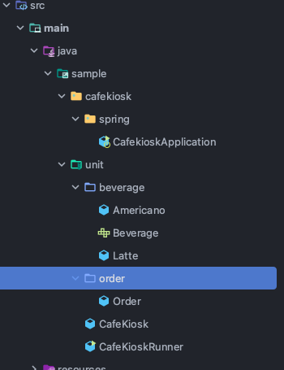

# 요구사항 

- [ ] 주문 목록에 음료 추가 / 삭제 기능
- [ ] 주문 목록 전체 지우기
- [ ] 주문 목록 총 금액 계산하기
- [ ] 주문 생성하기


### 1. 수동 테스트

- 주문 목록에 음료 추가 / 삭제 기능 을 만든다 가정



- 정신없이 코드를 쭈우욱 만들다가 테스트를 해보다가 main 에서 확인한다.

```java

public class CafeKioskRunner {

    public static void main(String[] args) {
        CafeKiosk cafeKiosk = new CafeKiosk();

        cafeKiosk.add(new Americano());
        System.out.println(" 아메리카노 추가 >>>>> ");

        cafeKiosk.add(new Latte());
        System.out.println("라떼 추가 >>>>> " );

        int price = cafeKiosk.calculateTotalPrice();
        System.out.println("총 주문 가격 = " + price);

    }

}

```

- 결과 를 콘솔로. 즉 테스트 확인의 주최자가 사람인 경우 
- 이런경우는 자동화라 볼 수 없다. 
- 최종 단계에서 사람이 직접 확인 한 경우는 수동 테스트라고 볼 수 있다.

- 이런경우는 다른 사람이 봤을때 어떤 상황에서 테스트 했는지 알 수 없다.
- 그리고 해피케이스 ( 무조건 성공하는 케이스 ) 라고 볼 수 있겠다.
