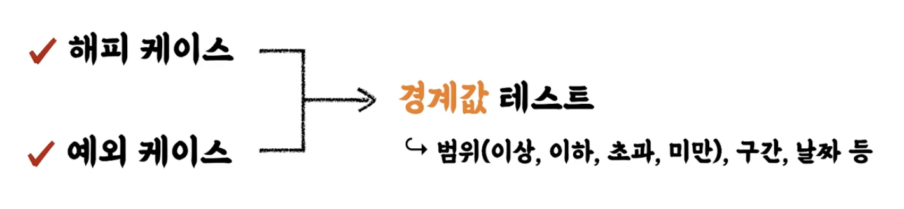

# 새로운 요구사항

- 질문하기 : 암묵적이거나, 아직 드러나지 않은 요구사항이 있는가 ? 

- 테스트 케이스 세분화 하기
  - 해피 케이스
  - 예외 케이스
  - 경계값 테스트



ex ) 

```java
    @Test
    @DisplayName("음료를 추가한다.")
    void addTest() {
        CafeKiosk cafeKiosk = new CafeKiosk();
        cafeKiosk.add(new Americano());

        assertEquals(1, cafeKiosk.getBeverages().size());
        assertEquals("아메리카노", cafeKiosk.getBeverages().get(0).getName());
    }

    @Test
    @DisplayName("음료를 여러개 추가한다.")
    void addServeralBeverages() {
        CafeKiosk cafeKiosk = new CafeKiosk();
        cafeKiosk.add(new Americano(), 2);

        assertEquals(2, cafeKiosk.getBeverages().size());

         assertThat(cafeKiosk.getBeverages().get(0).getName())
                .isEqualTo( "아메리카노");

         assertThat(cafeKiosk.getBeverages().get(1).getName())
                .isEqualTo( "아메리카노");
    }
    
    @Test
    @DisplayName("음료 갯수가 1개 미만일 경우 예외를 발생한다.")
    void addZeroBeverages() {

        CafeKiosk cafeKiosk = new CafeKiosk();
        Americano americano = new Americano();

        assertThatThrownBy(() -> cafeKiosk.add(americano, 0))
                .isInstanceOf(IllegalArgumentException.class);
    }
```

```java
    public void add(final Beverage beverage) {
        beverages.add(beverage);
    }

    public void add(final Beverage beverage, int count) {
        if(count <= 0) {
            throw new IllegalArgumentException("음료 개수는 1개 이상이어야 합니다.");
        }

        for (int i = 0; i < count; i++) {
            beverages.add(beverage);
        }
    }
```

