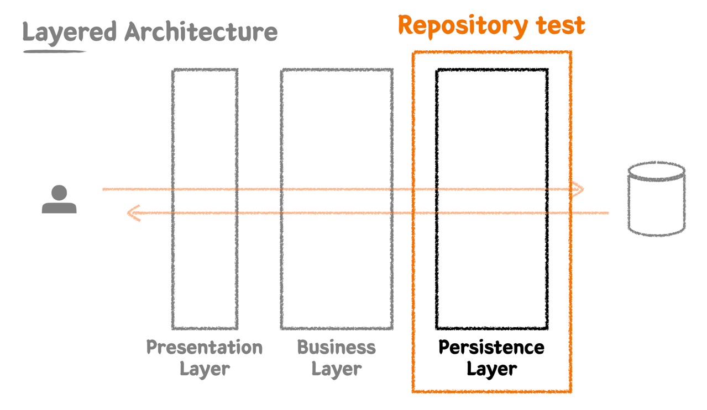
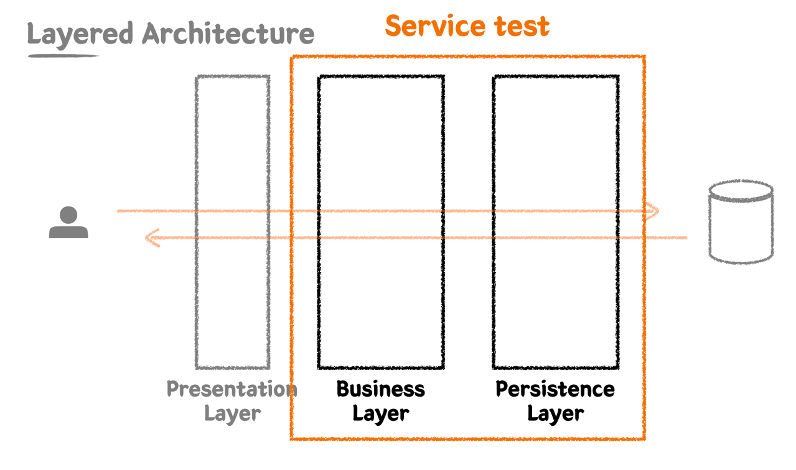
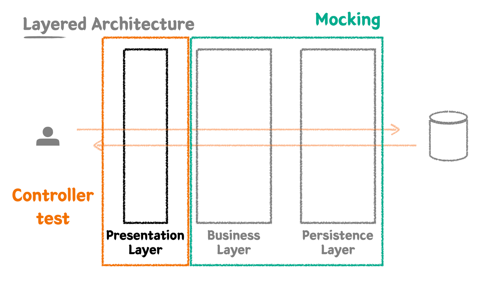
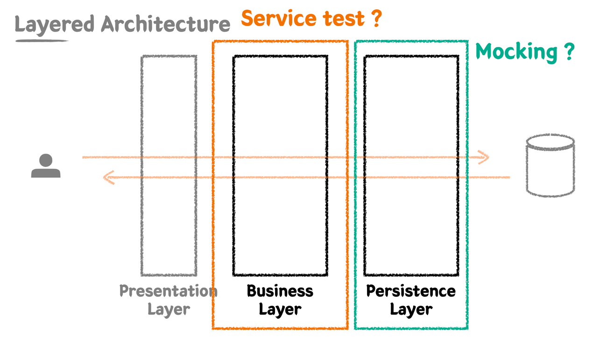
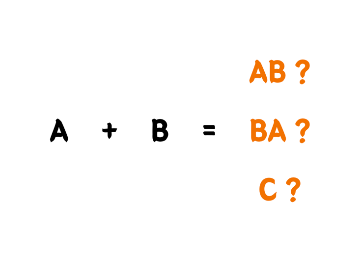
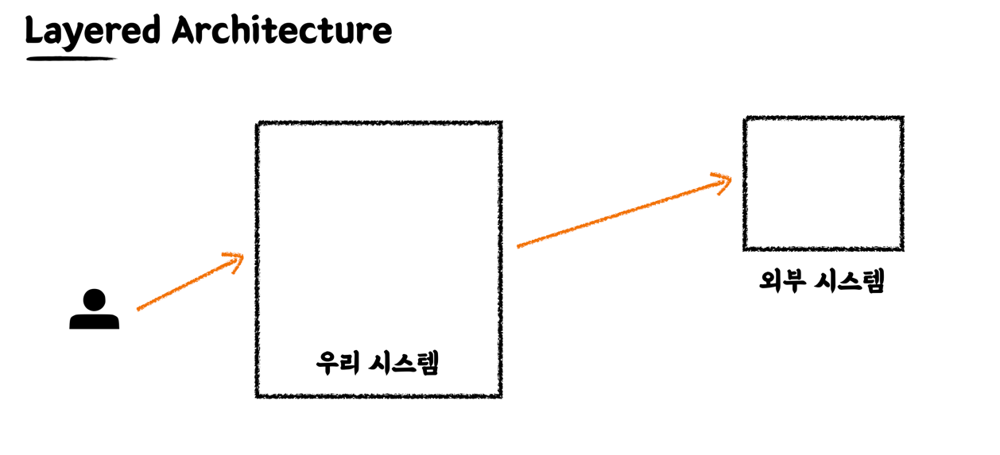
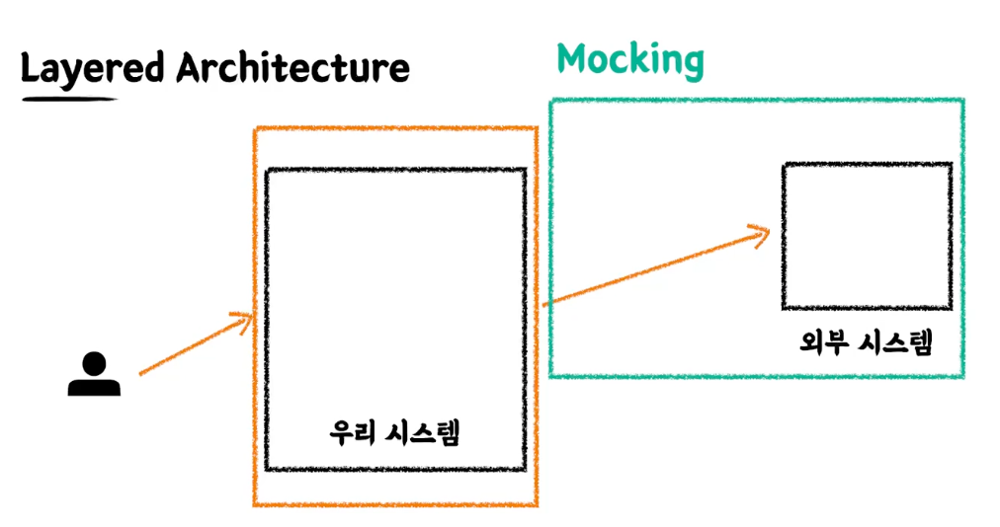

### Classicist vs Mockist

# Mockist 
- 모든걸 mocking 위주로 하자
- 각각 Test 잘했으니까, 통합테스트 할때는 기능보장된 것들은 mocking 처리 하고 통합테스트 하자

# Classicist
- 모든걸 mocking 해버리면 진짜 객체들이 협업을 하는것은 어떻게 보장할것이냐.
- 진짜 객체 위주로 테스트를 해야한다.

### 생각 
- 뭐가 더 나은걸까 ? 
  - 꼭 필요한 경우 mocking 을 하자 !

### 그림

- 레포지토리 테스트

- 비즈니스 테스트를 진행할때는 통합테스트로

- Controller 테스트를 할때는 Service 테스트 부터는 mocking 을 하고 테스트
- 외부에서 들어온 파라미터만 검증하는 역할이다.
- 그 하위는 mocking 처리.

### Mock 의 입장

- mock 의 입장에서보면
- Service 테스트도 하위 레이어를 mocking 하고 싶다.
- 테스트에서 보장이 됬는데, 비용적으로 프러덕션 코드를 더 짜는게 맞지 않냐
- mocking 할수있으면 짧게 짧게 짤라서 테스트진행하자.

### 통합테스트 입장

- 두 모듈을 연합했을때, 어떤 시너지, 어떤 사이드 이펙트가 날것인지.
- 전혀 다른 C 로 동작을 할것인가 ?

### 어떨때가 적절한 mocking 인가 ? 

- 외부시스템을 mocking ? 
- 마일리지 시스템 이 외부에서 개발한것이라고 가정하자.
  - 우리가 개발한게 아니야. 외부시스템이지.
  - 항상 잘 동작할것이라 기대해야한다. (남의 시스템이니까 우리가 잘못한게 아닐때)
- 이럴땐, 시스템 "계" 의 구분을 기준으로 mocking 을 하는것이다.

### 100 % 구현체의 재현 ?

- 그런 리스크를 안고 갈 바에는, 실제 구현체를 불러와서 
- 최대한 넓은 범위에서 테스트 하는것이 훨씬 낫다 -> classicist test