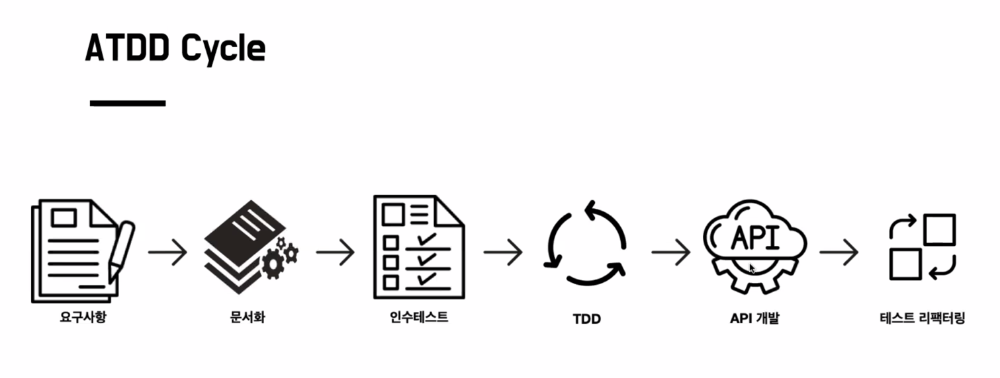
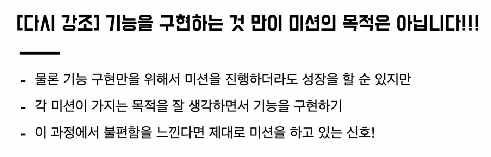
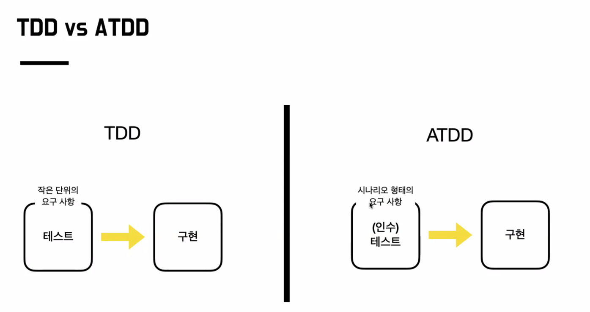
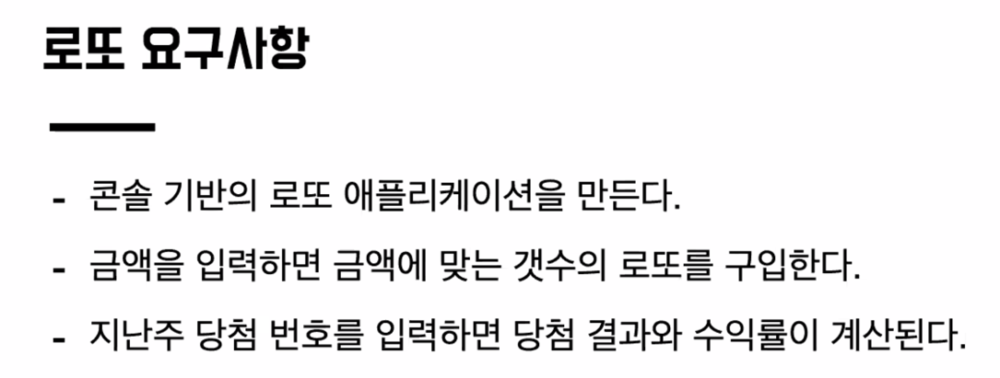
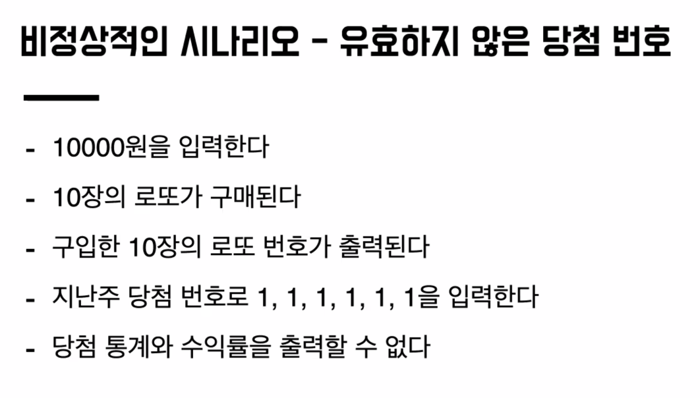
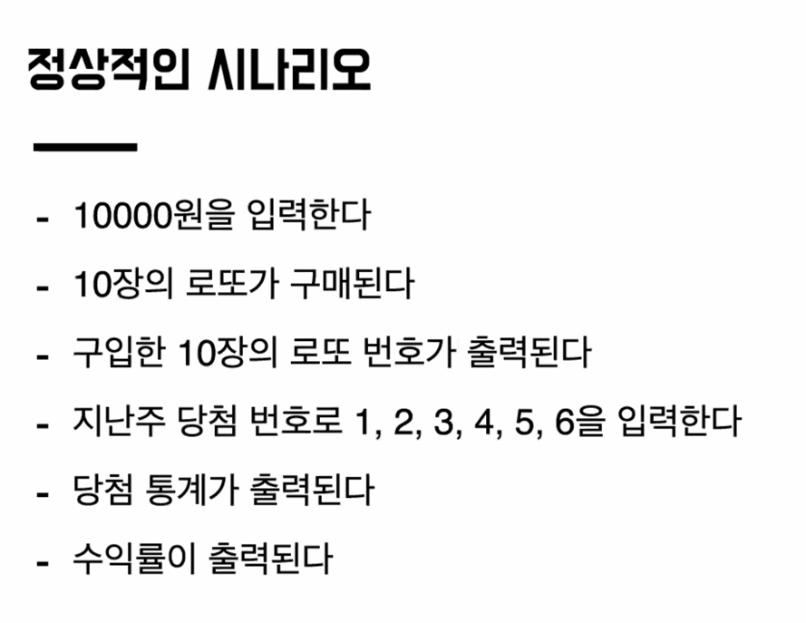
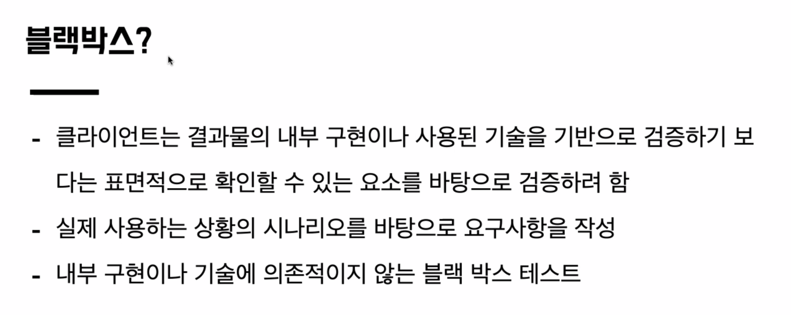
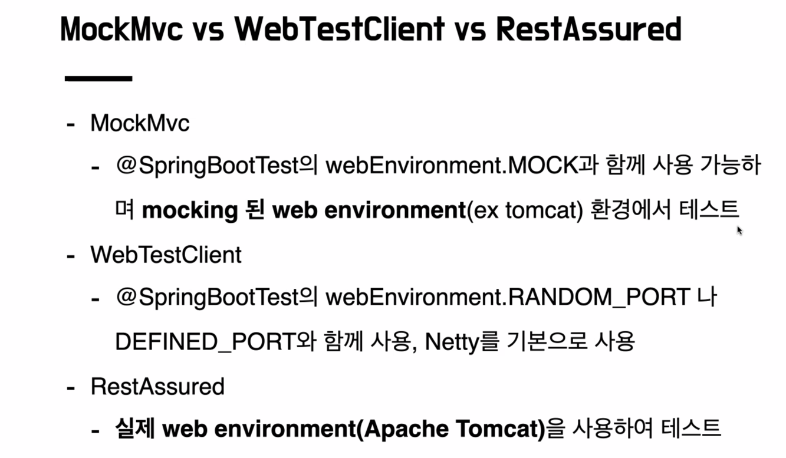
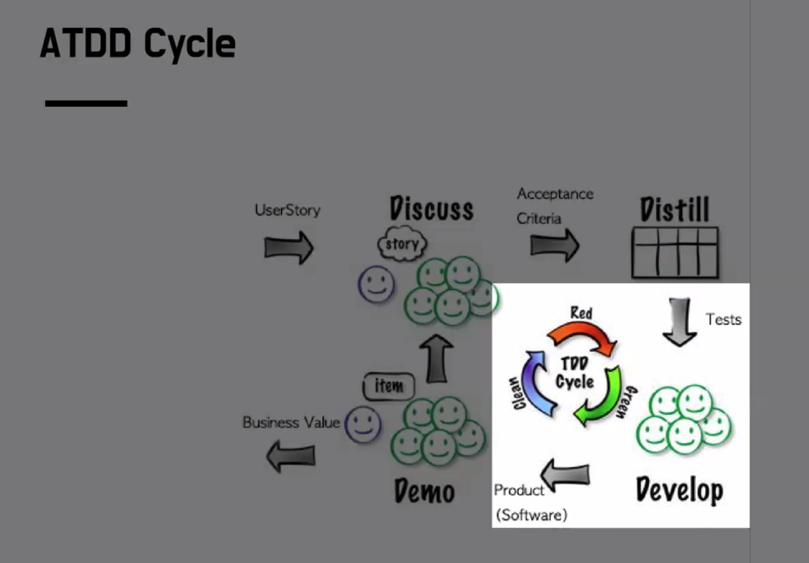

### ATDD Cycle 

# 드디어 시작 (강사님게서 엄~청 강조 하시는 부분)

- 실무의 개발과 학습의 개발과는 다르니, 미션이 가지는 목적을 잘 생각할것.

# 음...

# 단위 테스트

- 기능의 의도대록 동작하는가 ? X 
- 구현한 대로 동작하는가 ? O 

# ATDD 는 기획에서 의도한대로 동작하는가 이다.

> 행동주도 BDD랑 ATDD가 다른점이 무엇일까 ? 
> - 통합테스트와 인수테스트의 차이는 시나리오 기반이다

# ATDD 를 하는 이유
- 왜 하는가 ?
  - 생산성 증가
    - 구현 전에 인수 테스트를 수행하는 경우 팀의 생산성이 두 배가 되는 것을 확인 - 제프 서덜런드 ( 스크럼 공동 제작자 )
    - 명확한 요구사항이 불필요한 전체 개발 프로세스를 줄여준다
    - 작업의 명확한 시작과 끝을 제시
  - TDD 가 부족한 부분이 있을수 있는데 ATDD 가 보완을 해 줄 수가 있다.
  - 빠른 피드백
    - 구현한 기능을 배포하지 않고 테스트로 확인 가능
    - 기능을 건드리다가 다른 기능을 건드리진 않았나 확인하면서 개발 가능
  - 귀찮은 작업 프로세스로 강제
    - 테스트 코드 작성과 문서화는 귀찮은 작업
    - 전체 기능을 검증하는 테스트가 만들어짐
    - 회기 테스트 역할을 수행

### 인수 테스트 ? 
- Acceptance Test in extreme programming 
- 사용자 스토리를 검증하는 기능 테스트
- 사용자 스토리로 테스트할 시나리오를 지정

### 테스트 종류 와 목적
- 단위 -> 작은 단위
- 통합 -> 단위와 단위가 통합이 되는지
- E2E -> 처음과 끝

### 인수 테스트
- 사용자 스토리를 검증하는 기능 테스트
- 명세나, 계약의 요구 사항이 충족되는지 확인하기 위해 수행되는 테스트 (수용 테스트)
- 제일 마지막 단계에서 수행하는 테스트를 의미

### 테스트 주도 개발로 배우는 객체 지향 설계와 실천
- 우리는 기능을 구현할 때, 만들고자 하는 기능을 수행하는 인수 테스트를 작성하는 것으로 시작한다.

# 콘솔 애플리케이션 개발을 위한 시나리오 기반 인수 테스트 만들기 Ex )

> 비 정상 시나리오 부터 정상 시나리오를 개발할수록 완성도가 높아짐

### 인수테스트는 그럼 정체가 뭘까 ?
- api test ? 
- e2e test ?
- 통합 test ? 

> 테스트의 의도에 따라 구현 방법이 달라진다

1. 요구사항을 시나리오화 한다.
2. 시나리오를 작은 단위로 쪼갠다
   1. 작은 단위를 테스트 한다 -> 단위테스트 
3. 작은 단위를 모은다 -> 통합 테스트
4. 사용자 관점 처음부터 테스트 -> E2E 테스트

Q )
- API 의 Request 와 Response 정보 이외 내부 정보는 최대한 가리는 블랙박스 형식의 테스트
- 결국엔 인수테스트에서는 내부 동작이 어떻게 돌아가는지는 관심 없고 요청 값을 줄 때 요구사항에 맞는 응답이 오는 것만을 목적으로 한 테스트.
- 테스트의 형태가 무엇이냐보다는, 설정한 시나리오를 검증할 수 있다면 인수테스트로 볼 수 있다.

### 블랙박스 테스트

- 만약에 서비스 단의 로직 중 일부를 mocking 해서 강제로 response 응답을 내려준 결과를 테스트하는 경우는 단위테스트 인가요 ?? -> 예
- 예를 들어 외부 통신 api 통신 실패에 대한 시나리오를 검증하기 위해 사용했다면 이건 인수테스트가 되는건가요 ?? -> 예
- fixture 용 객체 하나 만들면 편하더라구요 -> good

### MockMvc vs TestClient vs RestAssured

# 미션간 중점적으로 볼 Focus

### 인수 조건
- 시나리오 형태
- 인수 조건은 시나리오를 통과하기 위한 조건
