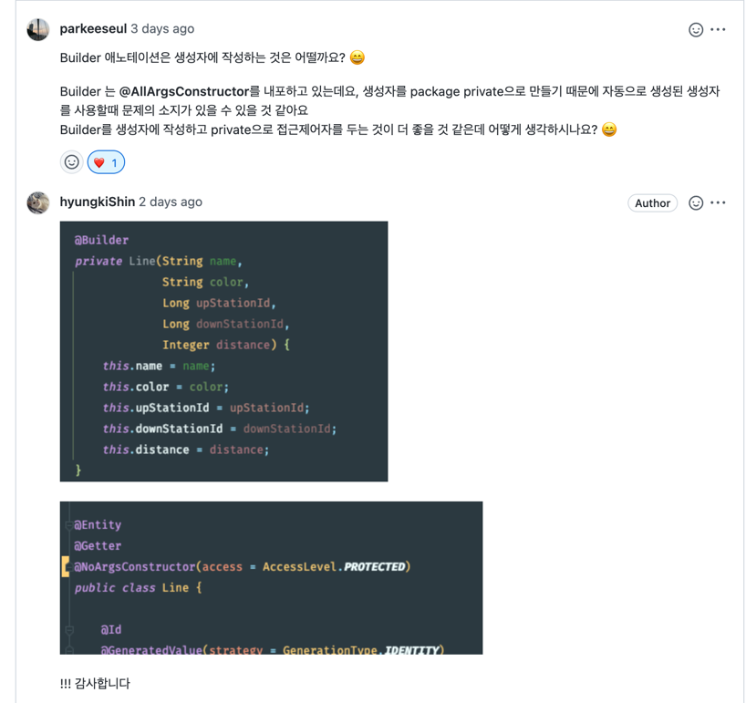

### 문득 Entity 에 Builder 를 붙이지 않는 방법 ? 에 대해서
```java

@Entity
@Getter
@NoArgsConstructor(access = AccessLevel.PROTECTED) // 기본생성자가 protected 로 생성되고 -> new 로 생성 불가능
public class Line {

    @Id
    @GeneratedValue(strategy = GenerationType.IDENTITY)
    private Long id;

    @Comment("노선 이름")
    @Column(length = 20)
    private String name;

    @Comment("노선 색상")
    @Column(length = 20)
    private String color;

    @Comment("상행 종점역")
    private Long upStationId;

    @Comment("하행 종점역")
    private Long downStationId;

    @Comment("노선 간 거리")
    private Integer distance;

    @Builder // Builder 를 사용하는 쪽에서만 열어두게 변경
    private Line(String name,
                 String color,
                 Long upStationId,
                 Long downStationId,
                 Integer distance) {
        this.name = name;
        this.color = color;
        this.upStationId = upStationId;
        this.downStationId = downStationId;
        this.distance = distance;
    }

    public void update(final String name, final String color) {
        this.name = name;
        this.color = color;
    }
}
```

### 음 ... 이로써 하나배움 :) 무분별한 생성을 막게.
- 근데 Entity 를 무분별하게 생성하는 사람은.... 귀싸대기를 맞지 않을까 ???