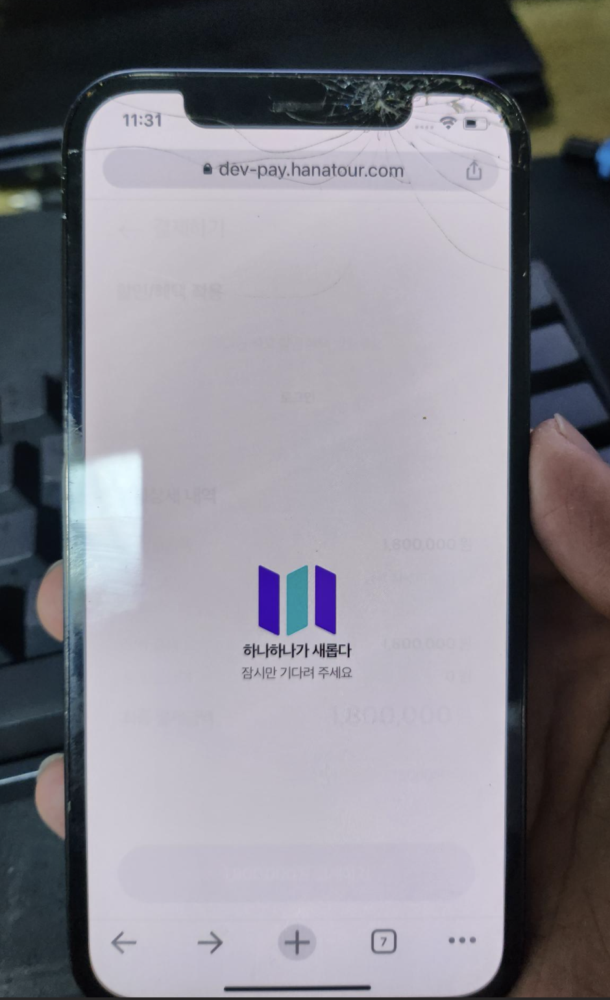

### 어느날 마주한 Vue 프로젝트에서의 무한로딩...
- ios 에서만 발생하였다. App 과 safari 에서 아래와 같은 이슈 발생


### 해결책 은 BFCache 때문이라고 ?
- 뒤로가기시 BFCache 로 동작하였기 때문에 네트워크 요청도 없고, Page Load 시의 페이지를 만드는 스크립트 동작도 이루어지지 않는 경우.
- 아이폰(IOS) Safari 브라우저에서 뒤로가기(history.back) 또는 동일 페이지 등으로 이동하는 경우 BF Cache 를 사용한다.
- BFCache 란 동일 세션내 브라우저에서 이전 페이지를 보다 빠르게 로딩하기 위해 이전에 저장한 캐싱된 페이지를 바로 로드하는 방법이라고 할 수 있을것 같다.

[참고 링크](https://dev-t-blog.tistory.com/9)
[참고 링크](https://ui.toast.com/weekly-pick/ko_20201201)

### 해결책은?

```javascript
if (process.client) { //
  window.onpageshow = (event) => {
    if (event.persisted || (window.performance && window.performance.navigation.type == 2)) {
      // Back Forward Cache로 브라우저가 로딩될 경우 혹은 브라우저 뒤로가기 했을 경우
      console.log("::Back Forward Cache::")
      this.$utils.showLoading(false)
    }
  }
}
```